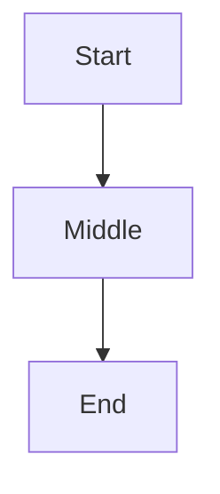

# moai-domain-edu-site

Domain knowledge for building Nextra 4.x educational documentation sites with Korean content standards.

---

## 1. Curriculum Spec File Format

Standard format for the curriculum specification file users create before starting:

```markdown
# [Course Name] Curriculum Spec

## Target Audience
[e.g., Korean-speaking beginners with zero programming experience]

## Tech Stack
[e.g., Next.js 15, Nextra 4.x, TypeScript, Korean language]

## Content Structure
| Week | Session | Title | 3 Key Concepts | Learning Goal |
|------|---------|-------|----------------|---------------|
| W1   | S1      | [title] | concept1, concept2, concept3 | [goal] |

## Quality Standards
- "왜 필요한가?" (Why is this needed?) blockquote for each key concept
- One Mermaid big-picture diagram per session ("이번 세션 전체 그림")
- "📎 연결 포인트" callouts linking to future sessions
- "흔한 오해" (Common Misconceptions) correction section
- Mentor tone: friendly, respectful, non-condescending
```

---

## 2. Standard MDX Session Template

```mdx
# [N]회차: [Title]

## 학습 목표

이 세션을 마치면 다음을 할 수 있습니다:
- [Goal 1]
- [Goal 2]
- [Goal 3]

---

## 이번 세션 전체 그림



---

## 핵심 개념

### 1. [Concept 1]

> **왜 필요한가?** [Explanation of why this concept exists and matters]

[Concept explanation...]

> **📎 연결 포인트 → [N]회차**: [Connection to future session]

### 2. [Concept 2]
...

---

## 흔한 오해

> **흔한 오해**: "[Common misconception]"
> **실제로는**: [Correct explanation]

---

## 실습

### 기본 실습: [Exercise title]
[Instructions...]

### 도전 실습: [Challenge title]
[Instructions...]

---

## 요약

- **[Term]**: [Definition]
- **[Term]**: [Definition]
```

---

## 3. Mermaid Safe Syntax Guide

ALLOWED in Mermaid diagrams:
- `graph TD` — top-down flowchart
- `graph LR` — left-right flowchart
- `sequenceDiagram` — sequence diagrams
- `stateDiagram-v2` — state machines
- `erDiagram` — entity relationship

FORBIDDEN characters in Mermaid labels:
- `'` (apostrophe/single quote) — causes NEWLINE parse error in Note and label contexts
- In `stateDiagram-v2`: `+` in transition labels — causes INVALID token error

Safe alternatives:
- `Let's Encrypt` → `Lets Encrypt` (remove apostrophe)
- `cleanup + re-run` → `cleanup and re-run` (replace + with and)
- `'use client'` → `use client` (remove quotes from directive strings)
- `name:'Alice'` → `name:Alice` (remove single quotes in data examples)

Node label best practices:
- Use double-quoted labels `["text"]` for labels with special characters
- Use `\n` for line breaks within labels
- Avoid parentheses directly around apostrophes: `(Let's)` → `(Lets)`

---

## 4. SPEC Batch Split Strategy

Context window limit: ~180K tokens per run phase.
One MDX session generates ~500-800 lines = ~8K-15K tokens.
Recommended: 3-4 sessions per SPEC for comfortable execution.

Naming convention:
- `SPEC-INFRA-[SLUG]`: Technical infrastructure (Nextra setup, navigation, layout)
- `SPEC-CONTENT-W[N]`: Content generation per week/batch
- `SPEC-ENHANCE-[SLUG]`: Cross-cutting quality improvements (add after pilot review)

Order of execution:
1. SPEC-INFRA first — establishes file structure, `_meta.js`, navigation
2. SPEC-CONTENT-W1 pilot — generate 1 session, review, approve
3. SPEC-CONTENT-W1 remaining — generate rest of batch after pilot approval
4. SPEC-CONTENT-W2~WN — parallel batches
5. SPEC-ENHANCE (optional) — if quality issues found after review

---

## 5. Optimal MoAI Commands for Educational Sites

Step 1 — Project init (first time only):
```
/moai project
```

Step 2 — Infrastructure SPEC:
```
/moai plan "Nextra 4.x educational site infrastructure for [Course Name]
Curriculum file: [path/to/curriculum.md]
Structure: [W1-W4, 3 sessions each / or custom structure]
Standard MDX sections: 학습목표, 핵심개념, 빅픽처다이어그램, 실습, 요약"
```

Step 3 — Content SPEC (per batch, 3-4 sessions):
```
/moai plan "Content generation for Week [N] sessions [S1-S3]
Curriculum file: [path] Week [N] section
Quality standards from moai-domain-edu-site skill:
- Include 왜/맥락 explanations in generation (do NOT generate flat content and enhance separately)
- Mermaid safe syntax only (no apostrophes, no + in stateDiagram-v2)
- One pilot session first, then batch on approval"
```

Step 4 — Fix any Mermaid errors:
```
/moai loop [paste browser console error]
```

---

## 6. Content Quality Checklist

Per session validation:
- [ ] At least 3 "왜 필요한가?" blockquotes
- [ ] At least 2 "📎 연결 포인트" callouts
- [ ] At least 1 "흔한 오해" section
- [ ] Exactly 1 Mermaid big-picture diagram (graph TD/LR or sequenceDiagram)
- [ ] No apostrophes in Mermaid blocks
- [ ] No `+` in stateDiagram-v2 transition labels
- [ ] All content in Korean (technical terms in English with Korean explanation)
- [ ] No JSX imports (`<Callout>` etc.) — use blockquote `>` syntax instead

---

## Works Well With

- manager-spec: SPEC document creation for educational site infrastructure and content batches
- expert-frontend: Nextra configuration, MDX rendering, and navigation setup
- manager-ddd: Content generation execution following curriculum spec
- moai-library-nextra: Advanced Nextra configuration patterns
