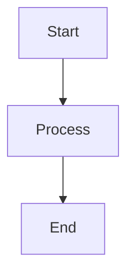

# Technology Stack

## Overview

| Technology | Version | Purpose |
|------------|---------|---------|
| Nextra | 4.6.x | Documentation framework (nextra-theme-docs) |
| Next.js | 15.x | React meta-framework with App Router |
| React | 19.x | UI component library |
| TypeScript | 5.x | Type-safe JavaScript |
| Mermaid | Built-in (Nextra) | Diagram rendering in MDX content |
| Pagefind | Built-in (Nextra) | Static full-text search with Korean support |
| Vercel | N/A | Production hosting and deployment |
| Node.js | 20.x+ | JavaScript runtime |
| npm | 10.x+ | Package manager |

## Framework Choice Rationale

### Why Nextra 4.x

Nextra was selected as the documentation framework for the following reasons:

1. **Purpose-built for documentation sites**: Nextra provides sidebar navigation, search, dark mode, breadcrumbs, and table of contents out of the box, which are all requirements for a learning platform.

2. **MDX-first content model**: All curriculum content is authored in MDX, allowing seamless mixing of Markdown prose with React components, Mermaid diagrams, and interactive code examples.

3. **File-system routing**: The content directory structure directly maps to URL paths and sidebar navigation. Adding a new session is as simple as creating a new `.mdx` file -- no routing configuration needed.

4. **Built-in Mermaid support**: Nextra renders Mermaid diagrams natively in MDX fenced code blocks, eliminating the need for external plugins or custom components.

5. **Built-in Pagefind search**: Full-text search with Korean language support is included without additional configuration, providing instant content discovery for bootcamp participants.

6. **Minimal configuration**: Nextra requires only a few configuration files to produce a professional documentation site, reducing setup complexity and maintenance overhead.

7. **Next.js 15 App Router**: Nextra 4.x is built on the latest Next.js App Router, providing modern React 19 features, server components, and optimized performance.

8. **Vercel-native deployment**: As a Next.js-based framework, Nextra deploys to Vercel with zero configuration, providing automatic previews, CDN, and serverless functions.

## Key Configuration Details

### `next.config.mjs`

The Next.js configuration file integrates the Nextra plugin with the docs theme. Key settings:

- **Nextra plugin**: Wraps the Next.js config with `nextra()` to enable MDX processing and file-system routing.
- **Content directory**: Points to `./content` as the source directory for documentation pages (Nextra 4.x content directory convention).
- **Theme**: Uses `nextra-theme-docs` for the documentation layout with sidebar, search, and navigation.

### `app/layout.tsx`

The root layout configures the Nextra docs theme with these settings:

- **`defaultMenuCollapseLevel: 1`**: Collapses sidebar sections by default, showing only week-level items.
- **`autoCollapse: true`**: Automatically collapses other sections when one is expanded.
- **Dark mode**: Enabled with a toggle in the navigation bar.
- **Korean UI text**: Interface labels (search placeholder, table of contents header, etc.) configured in Korean.
- **Footer**: Custom footer with copyright and attribution.
- **Table of contents**: Enabled on all pages for in-page navigation.
- **Navigation links**: Previous/next page links at the bottom of each page.

### `_meta.js` Files

Navigation metadata files at each level of the content hierarchy. Each file exports a default object:

- **Top-level `content/_meta.js`**: Defines the four week sections with Korean display labels and ordering.
- **Per-week `content/week{N}/_meta.js`**: Defines session ordering and Korean display labels within each week.

Keys in the object correspond to file or directory names (without extensions). Values are either strings (display labels) or objects with additional properties like `title`, `href`, and `type`.

### `mdx-components.tsx`

Required by Nextra 4.x for MDX component customization. Exports a function that returns the default component mappings. Can be extended to override default HTML elements with custom React components.

## Development Environment Requirements

### Runtime

- **Node.js**: Version 20.x or later (LTS recommended).
- **npm**: Version 10.x or later (ships with Node.js 20.x).

### Development Commands

| Command | Purpose |
|---------|---------|
| `npm install` | Install project dependencies |
| `npm run dev` | Start development server with hot reload |
| `npm run build` | Generate production build |
| `npm run start` | Serve production build locally |

### System Requirements

- Any operating system supported by Node.js (macOS, Linux, Windows).
- Modern web browser for local development preview (Chrome, Firefox, Safari, Edge).
- Git for version control.

## Build and Deployment Configuration

### Vercel Deployment

The project deploys to Vercel with zero configuration:

- **Framework detection**: Vercel automatically detects the Next.js framework.
- **Build command**: `npm run build` (auto-detected).
- **Output directory**: `.next` (auto-detected).
- **Node.js version**: Configured in Vercel project settings or `package.json` engines field.
- **Preview deployments**: Automatic for every pull request.
- **Production deployment**: Automatic on push to the `main` branch.

### Pagefind Integration

Pagefind is Nextra's built-in static search solution:

- **Indexing**: Runs automatically during `npm run build` to create a search index from all MDX content.
- **Korean support**: Pagefind includes CJK (Chinese, Japanese, Korean) tokenization for accurate Korean full-text search.
- **Client-side search**: The search UI is embedded in the Nextra theme navigation bar with no server-side component required.
- **Zero configuration**: No additional setup is needed beyond the standard Nextra build process.

### Build Output

The production build generates:

- Static HTML pages for all MDX content (SSG by default).
- Optimized JavaScript bundles with code splitting.
- Pagefind search index files.
- Pre-rendered Mermaid diagrams.

## Mermaid Diagram Integration

Mermaid diagrams are rendered natively in Nextra MDX content using fenced code blocks with the `mermaid` language identifier. No additional packages or plugins are required.

### Supported Diagram Types

The curriculum uses the following Mermaid diagram types across sessions:

| Diagram Type | Use Case | Example Sessions |
|--------------|----------|------------------|
| Flowchart | Process flows, decision trees | Session 1 (setup flow), Session 10 (Docker build) |
| Sequence Diagram | Client-server interactions | Session 3 (HTTP request/response), Session 9 (OAuth flow) |
| ER Diagram | Database schemas | Session 7 (PostgreSQL tables), Session 8 (MongoDB collections) |
| State Diagram | Application states | Session 4 (React component lifecycle), Session 12 (CI/CD pipeline) |

### Authoring Convention

Mermaid diagrams are authored directly in MDX files using standard fenced code blocks:

````

````

Nextra handles rendering, theming (including dark mode adaptation), and responsive scaling automatically.

## Content Directory Convention

Nextra 4.x introduces the **content directory convention** as the recommended approach for App Router projects:

1. The `content/` directory is designated as the documentation source in `next.config.mjs`.
2. The catch-all route at `app/[[...mdxPath]]/page.tsx` maps URL paths to files in `content/`.
3. MDX files in `content/` are processed by Nextra's MDX pipeline with theme components injected.
4. The `_meta.js` files provide sidebar navigation metadata without polluting the `app/` directory.
5. This separation keeps the App Router directory clean (only layout and route files) while the content directory holds all documentation.

This convention differs from Nextra 3.x, which used the `pages/` directory for both routing and content. The 4.x approach provides cleaner separation of concerns between application routing and documentation content.
