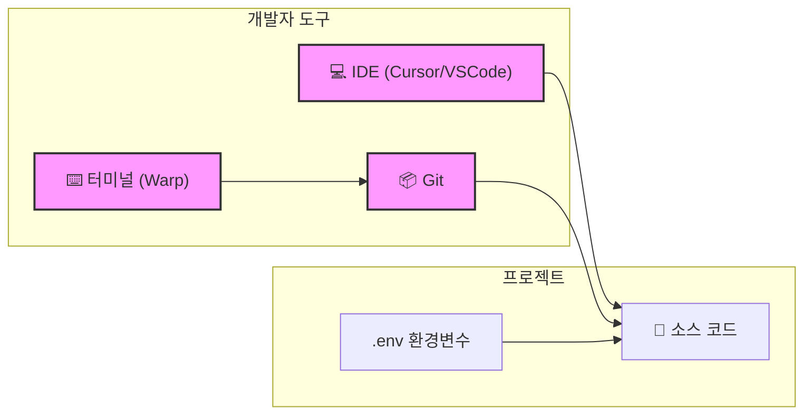

# SPEC-CONTENT-ENHANCE: 콘텐츠 심화 — "왜?"와 맥락 설명 추가

## HISTORY

| 버전 | 날짜 | 작성자 | 변경 내용 |
|------|------|--------|-----------|
| 1.0.0 | 2026-02-21 | MoAI | 초기 SPEC 작성 |

---

## 1. Environment (환경)

### 1.1 프로젝트 컨텍스트

- **프로젝트**: Vibe Coding 1-Month Bootcamp — Nextra 4.x 기반 한국어 문서 사이트
- **대상 독자**: 프로그래밍 경험이 전혀 없는 주니어 개발자 (한국어 사용자)
- **기술 스택**: Nextra 4.6.x, Next.js 15.x, React 19.x, TypeScript 5.x
- **콘텐츠 형식**: MDX (Markdown + React Components)
- **다이어그램 도구**: Mermaid (Nextra 내장 지원)

### 1.2 대상 파일 (총 12개 세션)

| 주차 | 파일 경로 | 세션 제목 |
|------|-----------|-----------|
| Week 1 | `content/week1/session1.mdx` | 개발환경 올인원 세팅 |
| Week 1 | `content/week1/session2.mdx` | Frontend/Backend + Node.js 기초 |
| Week 1 | `content/week1/session3.mdx` | HTTP/REST, JSON, CORS |
| Week 2 | `content/week2/session4.mdx` | React 기초 |
| Week 2 | `content/week2/session5.mdx` | Next.js 기초 |
| Week 2 | `content/week2/session6.mdx` | 비동기 프로그래밍 + 디버깅 |
| Week 3 | `content/week3/session7.mdx` | Database + PostgreSQL/Supabase |
| Week 3 | `content/week3/session8.mdx` | MongoDB + ElasticSearch |
| Week 3 | `content/week3/session9.mdx` | OAuth + JWT + AI API |
| Week 4 | `content/week4/session10.mdx` | Docker |
| Week 4 | `content/week4/session11.mdx` | AWS EC2 + Nginx |
| Week 4 | `content/week4/session12.mdx` | CI/CD + Domain |

### 1.3 기존 SPEC 참조 (선행 구현 완료)

| SPEC ID | 내용 | 상태 |
|---------|------|------|
| SPEC-CONTENT-W1 | 1주차 Session 1~3 MDX 콘텐츠 생성 | implemented |
| SPEC-CONTENT-W2 | 2주차 Session 4~6 MDX 콘텐츠 생성 | implemented |
| SPEC-CONTENT-W3 | 3주차 Session 7~9 MDX 콘텐츠 생성 | implemented |
| SPEC-CONTENT-W4 | 4주차 Session 10~12 MDX 콘텐츠 생성 | implemented |
| SPEC-INFRA-001 | Nextra 프로젝트 인프라 (layout, _meta.js 등) | implemented |

---

## 2. Assumptions (가정)

- **A1**: 기존 12개 세션 MDX 파일은 이미 구현 완료되어 있으며, 이 SPEC은 **추가(Addition)** 작업만 수행한다. 기존 콘텐츠를 재작성하거나 삭제하지 않는다.
- **A2**: 추가되는 모든 내용은 **한국어**로 작성한다. 기술 용어(Term)는 영어를 우선 사용하되, 첫 등장 시 한국어 설명을 병기한다.
- **A3**: 추가되는 Mermaid 다이어그램은 Nextra의 내장 fenced code block 렌더링으로 정상 표시된다.
- **A4**: 독자는 프로그래밍 경험이 전혀 없어, "당연하다"고 여겨지는 기초 개념도 명시적으로 설명할 필요가 있다.
- **A5**: 멘토 어조(Mentor Tone)는 독자를 존중하는 동시에 친근하게 접근한다. 비하적이거나 지나치게 학문적인 표현을 피한다.
- **A6**: 추가 콘텐츠는 기존 섹션 흐름에 자연스럽게 삽입(inline)되거나 섹션 직후에 배치(contextual callout)된다. 파일 맨 아래에 일괄 추가하는 방식은 금지한다.
- **A7**: 빅 픽처 다이어그램은 세션 상단(학습 목표 바로 아래 또는 핵심 개념 섹션 시작 전)에 배치한다.

---

## 3. Requirements (요구사항)

### REQ-01: "왜 필요한가?" 설명 추가 (Ubiquitous)

> 시스템(콘텐츠)은 **항상** 각 주요 개념 섹션에 해당 개념이 존재하는 이유, 즉 "왜 필요한가?"를 설명하는 내용을 포함해야 한다.

**적용 규칙**:

- 각 주요 개념(H3 수준 이상)의 첫 번째 또는 두 번째 단락에 "왜 이 개념이 등장했는가?", "어떤 문제를 해결하는가?"를 명시한다.
- 형식 예시:
  ```
  > **왜 필요한가?** Git이 없던 시절, 개발자들은 파일 이름에 날짜를 붙여
  > `프로젝트_최종_진짜최종_230101.zip`처럼 관리했습니다. 팀 협업에서는
  > 이 방식이 금방 혼란으로 이어졌고, 이를 해결하기 위해 버전 관리 시스템이 탄생했습니다.
  ```
- 또는 인라인 설명:
  ```
  **왜 린터(Linter)가 필요할까요?** 인간은 코드를 작성하다 보면 실수를 합니다...
  ```

**적용 범위**: 12개 세션 전체 — 각 세션의 주요 개념 섹션마다 최소 1개 이상.

---

### REQ-02: 맥락 연결 콜아웃 (Event-Driven)

> **WHEN** 한 세션의 개념이 다른 세션/주차의 개념과 직접 연결될 때,
> **THEN** "연결 포인트" 콜아웃 블록을 해당 위치에 삽입해야 한다.

**적용 규칙**:

- Nextra의 callout(blockquote 또는 `<Callout>` 컴포넌트) 형식 사용.
- 제목 예시: `📎 연결 포인트`, `이전 세션과의 연결`, `다음 세션에서 이어집니다`.
- 형식 예시:
  ```mdx
  > **📎 연결 포인트 — Session 5 (Next.js)**
  > 여기서 배운 `fetch()`는 Session 6의 비동기 프로그래밍과 직접 연결됩니다.
  > async/await 패턴을 사용하면 이 코드가 훨씬 간결해집니다.
  ```
- 주차 간 연결(예: Week 1 → Week 2)과 세션 내 연결(예: Session 4 → Session 5) 모두 포함.

**적용 범위**: 자연스러운 개념 연결이 존재하는 모든 위치. 세션당 최소 1개, 최대 3개.

---

### REQ-03: 진화 흐름 설명 (State-Driven)

> **IF** 특정 개념이 이전 방식(구식 패턴)을 대체하거나 개선한 것이라면,
> **THEN** 이전 방식 → 현재 방식의 진화 과정과 그 이유를 설명해야 한다.

**적용 규칙**:

- 진화 흐름은 짧은 서사(narrative) 또는 간단한 비교 예시로 표현한다.
- Mermaid flowchart를 활용하여 시각적으로 표현하는 것을 권장한다.
- 형식 예시:
  ```
  **왜 async/await가 등장했을까요?**
  처음에는 콜백(Callback) 함수로 비동기를 처리했습니다. 그런데 중첩이 깊어질수록
  이른바 "콜백 지옥(Callback Hell)"이 발생했고, 이를 해결하기 위해 Promise가 등장했습니다.
  그러나 Promise도 `.then().then().then()` 체인이 길어지면 가독성이 떨어졌습니다.
  결국 async/await가 등장하여 비동기 코드를 동기 코드처럼 읽을 수 있게 되었습니다.
  ```
- **진화 흐름이 명확한 주요 토픽**:
  - Session 6: 콜백 → Promise → async/await
  - Session 7: 파일 기반 저장 → 관계형 DB
  - Session 9: 세션 기반 인증 → JWT → OAuth
  - Session 10: 의존성 지옥 → 가상환경 → Docker

**적용 범위**: 진화 맥락이 있는 개념에만 선택적으로 적용 (억지 적용 금지).

---

### REQ-04: 오해 교정 패턴 (Unwanted Behavior 대응)

> 시스템(콘텐츠)은 **항상** 기존 실수 설명에 단순 경고만 제공하지 않아야 한다.
> 실수의 **인지적 원인(root cause)** — 왜 초보자의 뇌가 그렇게 생각하는지 — 을 함께 설명해야 한다.

**적용 규칙**:

- 기존 "흔한 실수" 또는 "주의 사항" 섹션이 있는 경우, 그 아래에 오해 교정 설명을 추가한다.
- 새로운 실수 패턴이 식별되면 해당 개념 설명 직후에 삽입한다.
- 형식 예시:
  ```
  > **왜 이런 실수를 하게 될까요?**
  > 처음 JavaScript를 배우면 `var`, `let`, `const`가 모두 "변수를 선언하는 방법"으로 보입니다.
  > 우리 뇌는 비슷해 보이는 것들을 같다고 처리하려는 경향이 있거든요.
  > 하지만 `var`는 함수 스코프(Function Scope), `let`과 `const`는 블록 스코프(Block Scope)로
  > 동작하는 방식이 다릅니다. "어디서든 접근 가능"이라고 외우던 `var`의 기억이
  > 이 차이를 인식하는 것을 방해합니다.
  ```
- 어조는 절대 비판적이거나 야단치는 느낌이 아니어야 한다.
  - 금지: "이런 실수는 초보자들이 흔히 저지르는..."
  - 권장: "이렇게 생각하는 게 완전히 자연스러워요. 왜냐하면..."

**적용 범위**: 12개 세션 전체 — 실수/주의 사항 섹션이 존재하는 모든 위치.

---

### REQ-05: 빅 픽처 시각화 (Ubiquitous)

> 시스템(콘텐츠)은 **항상** 각 세션에 해당 세션의 핵심 개념이 전체 풀스택 아키텍처에서 어디에 위치하는지를 보여주는 시각적 다이어그램을 포함해야 한다.

**적용 규칙**:

- 배치 위치: 학습 목표(`## 학습 목표`) 섹션 바로 다음, 핵심 개념(`## 핵심 개념`) 섹션 시작 전.
- 다이어그램 형식: Mermaid `graph TD` 또는 `graph LR` 사용.
- 다이어그램 내 현재 세션과 직접 관련된 구성 요소는 **굵게(bold)** 또는 별도 스타일(`style`)로 강조한다.
- 다이어그램 아래에 2~3문장의 간략한 설명을 추가한다.

**예시 (Session 1 — 개발 환경)**:



**각 세션별 빅 픽처 초점**:

| 세션 | 빅 픽처 초점 |
|------|-------------|
| Session 1 | 개발자 도구 생태계 전체 (IDE, 터미널, Git) |
| Session 2 | Client ↔ Server ↔ Node.js 관계 |
| Session 3 | HTTP Request/Response 사이클 전체 |
| Session 4 | React 컴포넌트 트리와 상태 흐름 |
| Session 5 | Next.js App Router 구조 |
| Session 6 | 비동기 실행 흐름 (Call Stack, Event Loop) |
| Session 7 | 풀스택 데이터 흐름 (Client → API → DB) |
| Session 8 | SQL vs NoSQL 비교 아키텍처 |
| Session 9 | 인증 흐름 전체 (OAuth → JWT → API) |
| Session 10 | 컨테이너 레이어 구조 |
| Session 11 | Cloud 배포 아키텍처 (EC2, Nginx, SSL) |
| Session 12 | CI/CD 파이프라인 전체 흐름 |

**적용 범위**: 12개 세션 전체 — 각 세션에 정확히 1개의 빅 픽처 다이어그램.

---

### REQ-06: 멘토 어조 적용 (Ubiquitous)

> 시스템(콘텐츠)은 **항상** 추가되는 모든 설명과 콜아웃에서 친근하고 공감적인 멘토 어조를 사용해야 한다.

**멘토 어조 가이드라인**:

- **공감 우선**: 독자의 혼란을 당연한 것으로 인정한다.
  - "이 부분은 처음에 헷갈리는 게 정상이에요."
  - "이해가 안 가는 게 당연해요, 왜냐하면..."
- **비유 활용**: 추상적 개념을 일상 경험에 비유한다.
  - "Git은 마치 게임의 세이브 포인트와 같아요."
- **격려**: 학습 과정의 어려움을 인정하고 격려한다.
  - "처음엔 이렇게 생각하기 쉬운데, 연습하다 보면 자연스럽게 이해됩니다."
- **과도한 겸손 금지**: "어려울 수도 있지만...", "조금 복잡할 수도..."처럼 소극적인 표현 대신 자신감 있게 설명한다.

**적용 범위**: 이 SPEC에 의해 추가되는 모든 텍스트.

---

## 4. Non-Functional Requirements (비기능 요구사항)

### NFR-01: 기존 콘텐츠 보존 (Additive Only)

> 기존 12개 세션 MDX 파일의 어떠한 텍스트, 코드 블록, 다이어그램, 구조도 **삭제하거나 재작성하지 않는다**. 오직 **추가(Edit with new content)** 만 허용한다.

- 실행 방법: Edit 도구를 사용하여 기존 내용을 `old_string`으로 유지하고, 새 내용을 `new_string`에 추가하여 기존 내용을 포함시킨다.
- 검증: 구현 후 diff를 확인하여 기존 텍스트가 손실되지 않았음을 확인한다.

### NFR-02: 자연스러운 통합

> 추가되는 콘텐츠는 기존 콘텐츠 흐름에 자연스럽게 녹아들어야 하며, "나중에 덧붙인 것"처럼 느껴져서는 안 된다.

- 추가 내용은 기존 섹션 바로 앞/뒤에 위치하거나 관련 문단 사이에 삽입한다.
- 파일 맨 아래에 모아서 추가하는 방식은 금지한다.

### NFR-03: 언어 일관성

> 모든 추가 콘텐츠는 **한국어**로 작성하며, 기술 용어는 영어 원어를 우선 사용하되 첫 등장 시 한국어 설명을 병기한다.

- 예시: `비동기(Asynchronous)`, `컴포넌트(Component)`, `인증(Authentication)`
- 영어 전용 표현, 일본어, 중국어 등 다른 언어는 사용하지 않는다.

### NFR-04: MDX 문법 유효성

> 추가되는 모든 MDX 코드는 Nextra 4.x에서 오류 없이 렌더링되어야 한다.

- Mermaid 코드 블록은 ` ```mermaid ` 펜스(fence) 형식을 사용한다.
- JSX 컴포넌트 사용 시 Nextra에서 지원하는 컴포넌트만 사용한다.
- 특수문자(`<`, `>`, `{`, `}`)는 MDX 문법과 충돌하지 않도록 주의한다.

---

## 5. Acceptance Criteria (인수 기준)

각 세션에 대해 다음 조건을 모두 충족해야 한다:

| 조건 | 설명 |
|------|------|
| AC-01 | 빅 픽처 Mermaid 다이어그램이 학습 목표 직후에 존재한다 |
| AC-02 | 주요 개념마다 "왜 필요한가?" 설명이 최소 1개 존재한다 |
| AC-03 | 세션당 최소 1개의 맥락 연결 콜아웃이 존재한다 |
| AC-04 | 실수/주의 섹션에 오해 교정 설명이 존재한다 |
| AC-05 | 진화 흐름이 있는 개념에 진화 설명이 존재한다 |
| AC-06 | 모든 추가 내용이 멘토 어조를 사용한다 |
| AC-07 | 기존 콘텐츠가 변경/삭제되지 않았다 (diff 검증) |
| AC-08 | MDX 파일이 Nextra에서 오류 없이 렌더링된다 |

---

## 6. Implementation Approach (구현 방식)

### 6.1 실행 전략

각 세션을 구현하기 전 반드시 해당 세션 파일 전체를 읽은 후 추가 내용을 결정한다.

**단계별 절차**:

1. **읽기 (Read-First)**: 세션 파일 전체를 읽어 기존 구조와 내용을 파악한다.
2. **분석**: REQ-01~REQ-06 각각에 대해 추가가 필요한 위치와 내용을 식별한다.
3. **작성**: Edit 도구를 사용하여 각 요구사항에 맞는 내용을 적절한 위치에 삽입한다.
4. **검증**: 추가 후 파일의 MDX 문법과 기존 내용 보존 여부를 확인한다.

### 6.2 병렬 처리 전략

주차(Week) 단위로 병렬 처리가 가능하다. 단, 동일 파일에 대한 동시 편집은 금지한다.

```
병렬 그룹 A: Session 1, Session 4, Session 7, Session 10
병렬 그룹 B: Session 2, Session 5, Session 8, Session 11
병렬 그룹 C: Session 3, Session 6, Session 9, Session 12
```

### 6.3 파일럿 세션 (Pilot)

**Session 1 (session1.mdx) 을 파일럿으로 먼저 처리한다.**

파일럿 목적:
- 추가 패턴과 어조가 올바른지 사용자 검증
- 빅 픽처 다이어그램 스타일 확정
- 오해 교정 패턴의 적절성 확인

파일럿 승인 후 나머지 11개 세션에 동일한 패턴을 적용한다.
