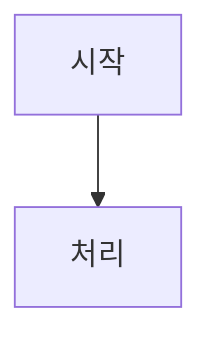

# 바이브 코딩 1개월 부트캠프

> **코딩을 처음 배우는 주니어 개발자를 위한 4주 풀스택 웹 개발 커리큘럼**

바이브 코딩 1개월 부트캠프는 프로그래밍 경험이 없는 분도 4주(12회 세션) 만에 풀스택 웹 개발의 핵심을 익힐 수 있도록 설계된 학습 사이트입니다. [Nextra](https://nextra.site/) 기반으로 제작되어 깔끔한 문서 형태로 커리큘럼을 제공합니다.

---

## 주요 특징

- **단계별 학습 구조** — 개발환경 설정부터 실서버 배포까지 12회 세션이 자연스럽게 이어집니다
- **시각적 다이어그램** — 각 세션마다 Mermaid 다이어그램으로 개념을 직관적으로 설명합니다
- **한국어 전용** — 모든 콘텐츠와 UI가 한국어로 제공됩니다
- **전문 자료 연동** — 세션마다 강사 자료 섹션에서 심화 학습 자료로 바로 이동할 수 있습니다
- **전문 학습 자료** — AI 도구, 심화 학습, 언어별 가이드를 담은 부록 섹션이 포함됩니다
- **다크 모드** — 라이트/다크 테마를 자유롭게 전환할 수 있습니다
- **전체 텍스트 검색** — Pagefind 기반으로 한국어 검색을 지원합니다
- **모바일 반응형** — 데스크탑, 태블릿, 모바일 모두 최적화되어 있습니다

---

## 커리큘럼

총 4주, 12회 세션으로 구성됩니다. 수업 전 준비를 위한 Week 0과 심화 학습을 위한 부록도 포함됩니다.

### Week 0: 시작 전 준비

| 주제 | 내용 |
|------|------|
| 바이브 코딩 소개 | AI 시대의 코딩, 바이브 코딩이란 무엇인가 |
| 개발환경 설정 | IDE 설치, 필수 Extension, 환경 구성 방법 |
| 터미널 기초 | 명령줄 사용법, 파일 시스템 탐색, 기본 명령어 |

### Week 1: 웹 개발 기초

| 세션 | 제목 | 주요 내용 |
|------|------|----------|
| Session 1 | 개발환경 올인원 세팅 | IDE 설치, 터미널, Git 설정, 프로젝트 초기화 |
| Session 2 | 프론트엔드/백엔드 + Node.js 기초 | 클라이언트-서버 구조, HTML/CSS/JS 개요, Node.js 런타임, npm |
| Session 3 | HTTP/REST, JSON, CORS | HTTP 메서드, REST API 설계, JSON 데이터 형식, CORS 설정 |

### Week 2: React와 Next.js

| 세션 | 제목 | 주요 내용 |
|------|------|----------|
| Session 4 | React 기초 | 컴포넌트, JSX, props, state, hooks, 이벤트 처리 |
| Session 5 | Next.js 기초 | 파일 기반 라우팅, SSR/SSG, API Routes, 레이아웃 |
| Session 6 | 비동기 프로그래밍 + 디버깅 | Promise, async/await, fetch API, 브라우저 DevTools |

### Week 3: 데이터베이스, 인증, AI

| 세션 | 제목 | 주요 내용 |
|------|------|----------|
| Session 7 | 데이터베이스 + PostgreSQL/Supabase | 관계형 DB, SQL 기초, Supabase 설정, CRUD |
| Session 8 | MongoDB + ElasticSearch | NoSQL 개념, MongoDB 연산, ElasticSearch 인덱싱 및 검색 |
| Session 9 | OAuth + JWT + AI API | 인증 흐름, JWT 토큰, OAuth 제공자, AI API 연동 |

### Week 4: DevOps와 배포

| 세션 | 제목 | 주요 내용 |
|------|------|----------|
| Session 10 | Docker | 컨테이너, Dockerfile, Docker Compose, 이미지 관리 |
| Session 11 | AWS EC2 + Nginx | 클라우드 호스팅, EC2 인스턴스, Nginx 리버스 프록시, SSL |
| Session 12 | CI/CD + 도메인 | GitHub Actions, 자동화 배포, 커스텀 도메인 설정 |

### 부록 (Appendix)

| 섹션 | 내용 |
|------|------|
| AI 도구 가이드 | Claude Code 명령어, AI 코딩 운영 규칙, 프롬프트 작성법 등 |
| 심화 학습 자료 | Node.js 핵심, Git 고급, 성능 최적화, 보안 등 깊이 있는 주제 |
| 언어별 가이드 | Python, JavaScript, TypeScript 등 언어 문법 및 생태계 정리 |

---

## 기술 스택

| 기술 | 버전 | 역할 |
|------|------|------|
| [Nextra](https://nextra.site/) | 4.6.x | 문서 사이트 프레임워크 |
| [Next.js](https://nextjs.org/) | 15.x | React 메타 프레임워크 (App Router) |
| [React](https://react.dev/) | 19.x | UI 컴포넌트 라이브러리 |
| [TypeScript](https://www.typescriptlang.org/) | 5.x | 타입 안전 JavaScript |
| Mermaid | Nextra 내장 | MDX 내 다이어그램 렌더링 |
| Pagefind | Nextra 내장 | 한국어 지원 전체 텍스트 검색 |
| Node.js | 20.x+ | JavaScript 런타임 |

---

## 프로젝트 구조

```
vibeclass-coding-1-month/
├── app/                          # Next.js App Router
│   ├── layout.tsx                # 루트 레이아웃 (Nextra 테마 설정)
│   └── [[...mdxPath]]/
│       └── page.tsx              # MDX 콘텐츠 렌더링 catch-all 라우트
├── content/                      # 모든 MDX 문서 (Nextra 콘텐츠 디렉토리)
│   ├── _meta.js                  # 최상위 사이드바 네비게이션
│   ├── index.mdx                 # 홈페이지
│   ├── week0/                    # Week 0: 시작 전 준비 (3개 파일)
│   ├── week1/                    # Week 1: 웹 개발 기초 (Session 1-3)
│   ├── week2/                    # Week 2: React와 Next.js (Session 4-6)
│   ├── week3/                    # Week 3: 데이터베이스, 인증, AI (Session 7-9)
│   ├── week4/                    # Week 4: DevOps와 배포 (Session 10-12)
│   └── appendix/                 # 부록 (ai-tools, deep-dive, language-guides)
├── public/                       # 정적 에셋 (favicon, logo)
├── contents/                     # 수업 커리큘럼 원본 개요
├── vibeclass-materials/          # 강사 원본 자료 모음
├── next.config.mjs               # Next.js + Nextra 플러그인 설정
├── tsconfig.json                 # TypeScript 컴파일러 설정
└── mdx-components.tsx            # MDX 컴포넌트 커스터마이징 (Nextra 4.x 필수)
```

각 `content/week{N}/` 디렉토리는 동일한 구조를 따릅니다:

```
week1/
├── _meta.js          # 사이드바 표시 순서 및 이름 설정
├── index.mdx         # 주차 개요 페이지
├── session1.mdx      # 세션 1
├── session2.mdx      # 세션 2
└── session3.mdx      # 세션 3
```

---

## 로컬 개발 환경 설정

### 사전 요구 사항

- **Node.js** 20.x 이상 ([다운로드](https://nodejs.org/))
- **npm** 10.x 이상 (Node.js와 함께 설치됨)
- **Git** ([다운로드](https://git-scm.com/))

### 시작하기

```bash
# 1. 저장소 클론
git clone https://github.com/bjw202/coding-basic.git
cd coding-basic

# 2. 의존성 설치
npm install

# 3. 개발 서버 실행
npm run dev
```

브라우저에서 [http://localhost:3000](http://localhost:3000) 을 열면 사이트를 확인할 수 있습니다.

### 빌드 및 프리뷰

```bash
# 프로덕션 빌드 생성 (정적 페이지 + 검색 인덱스 생성)
npm run build

# 빌드된 결과물 로컬에서 확인
npm run start
```

---

## 콘텐츠 작성 가이드

### 세션 파일 구조

모든 세션 MDX 파일은 일관된 구조를 따릅니다:

```mdx
# 세션 제목

## 학습 목표
- 이 세션을 통해 배울 내용...

## 핵심 개념
개념 설명...



## 코드 예시
\`\`\`javascript
// 예시 코드
\`\`\`

## 실습
실습 과제...

## 요약
핵심 내용 정리...

## 강사 자료
심화 학습을 위한 부록 자료 링크...
```

### 새 세션 추가 방법

1. `content/week{N}/` 디렉토리에 `session{N}.mdx` 파일을 생성합니다
2. 해당 주차의 `_meta.js`에 파일명과 표시 이름을 추가합니다
3. 위의 세션 구조 템플릿을 따라 내용을 작성합니다

### Mermaid 다이어그램 작성

지원하는 다이어그램 유형:

| 유형 | 사용 세션 | 용도 |
|------|----------|------|
| `flowchart` | Session 1, 10 | 프로세스 흐름, 의사결정 트리 |
| `sequenceDiagram` | Session 3, 9 | 클라이언트-서버 상호작용 |
| `erDiagram` | Session 7, 8 | 데이터베이스 스키마 |
| `stateDiagram-v2` | Session 4, 12 | 애플리케이션 상태 전환 |

> **주의**: `stateDiagram-v2`의 전환 레이블에 줄바꿈(`\n`)을 사용하면 파싱 오류가 발생합니다. 대신 `, `(쉼표+공백)을 사용하세요.

---

## 배포

이 프로젝트는 [Vercel](https://vercel.com/)로 배포됩니다.

### Vercel 배포 설정

1. [Vercel](https://vercel.com/)에 로그인합니다
2. GitHub 저장소를 Import합니다
3. Framework는 **Next.js**로 자동 감지됩니다
4. **Deploy** 버튼을 클릭합니다

Vercel이 자동으로 다음을 처리합니다:
- `main` 브랜치 push 시 프로덕션 자동 배포
- Pull Request 시 미리보기 배포 자동 생성
- 전 세계 CDN을 통한 빠른 콘텐츠 제공

---

## 라이선스

이 프로젝트는 학습 목적으로 제작되었습니다.

---

*바이브 코딩 1개월 부트캠프 — 누구나 코딩을 시작할 수 있습니다* 🚀
