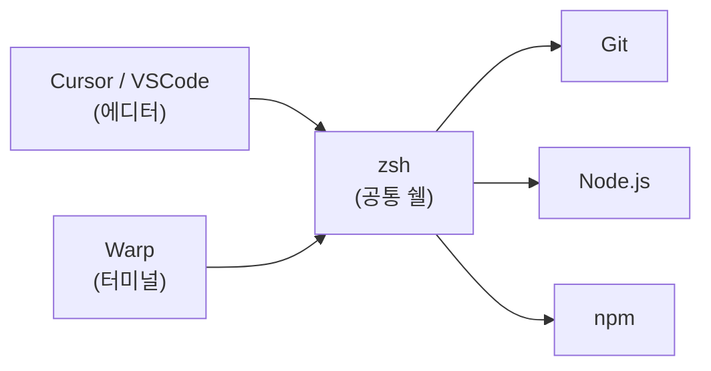

# 개발환경 준비

## 학습 목표

이 페이지를 마치면 다음을 할 수 있습니다.

- Cursor 또는 VSCode를 설치하고 기본 설정을 완료할 수 있습니다.
- Warp 터미널을 설치하고 실행할 수 있습니다.
- 에디터와 터미널을 연동하여 하나의 작업 환경으로 사용할 수 있습니다.
- Node.js와 Git이 제대로 설치됐는지 확인할 수 있습니다.

---

## 설치할 도구 목록

| 도구 | 역할 | 다운로드 |
|------|------|----------|
| **Cursor** | AI 기능이 내장된 코드 에디터 (추천) | [cursor.sh](https://cursor.sh) |
| **VSCode** | Microsoft의 무료 코드 에디터 (대안) | [code.visualstudio.com](https://code.visualstudio.com) |
| **Warp** | AI 기능이 내장된 차세대 터미널 | [warp.dev](https://www.warp.dev) |
| **Node.js** | JavaScript 실행 환경 (백엔드 개발에 필수) | [nodejs.org](https://nodejs.org) |
| **Git** | 버전 관리 도구 | [git-scm.com](https://git-scm.com) |

> **추천 조합**: Cursor(에디터) + Warp(터미널). 둘 다 AI 기능이 내장되어 있어 바이브코딩에 최적화되어 있습니다.

---

## 에디터 설치 및 설정

### Cursor 설치 (추천)

Cursor는 VSCode를 기반으로 AI 기능을 추가한 에디터입니다. VSCode 사용법을 그대로 쓰면서 AI 코딩 기능을 활용할 수 있습니다.

**설치 방법:**
- macOS: `.dmg` 다운로드 → Applications로 드래그
- Windows: `.exe` 실행 → 설치

**최초 실행 설정:**
1. Cursor 실행
2. GitHub 또는 Google 계정으로 로그인
3. `Settings → AI Model` 확인
4. 핵심 단축키 익히기: `Cmd + K` (AI 명령), `Cmd + L` (코드 설명 요청)

### VSCode 설치 (대안)

**필수 확장 프로그램 (Extension):**

| 확장 이름 | 역할 |
|-----------|------|
| **ESLint** | 코드에서 잠재적 오류를 미리 발견 |
| **Prettier** | 코드를 자동으로 깔끔하게 정렬 |
| **GitLens** | Git 이력을 코드 내에서 바로 확인 |
| **Korean Language Pack** | UI를 한국어로 변경 |

**기본 설정 (settings.json):**

`Cmd + Shift + P` (Mac) 또는 `Ctrl + Shift + P` (Windows)를 누르고 "Open User Settings (JSON)"을 검색하여 아래 내용을 추가합니다.

```json
{
  "editor.defaultFormatter": "esbenp.prettier-vscode",
  "editor.formatOnSave": true,
  "editor.tabSize": 2,
  "editor.fontSize": 14,
  "editor.wordWrap": "on",
  "files.autoSave": "onFocusChange",
  "terminal.integrated.fontSize": 13
}
```

`"editor.formatOnSave": true` 설정이 핵심입니다. 파일을 저장할 때마다 코드가 자동으로 정리됩니다.

---

## Warp 터미널 설치 및 설정

Warp는 AI 기능이 내장된 현대적인 터미널입니다. 명령어를 기억하지 못해도 자연어로 설명하면 올바른 명령어를 제안해줍니다.

**설치 방법:**
1. [warp.dev](https://warp.dev) 에서 다운로드
2. macOS / Windows 모두 지원
3. 계정 생성 및 로그인

**기초 설정:**
- 기본 쉘: zsh 권장
- 테마: Dark 권장

---

## 에디터와 터미널 연동

### 개념 이해

> **왜 연동이 필요한가?** 코드를 에디터에서 작성하고, 터미널에서 실행합니다. 이 두 도구가 같은 환경(같은 zsh, 같은 환경변수)을 공유해야 작업이 자연스럽게 연결됩니다.

핵심 개념: Warp는 "UI(껍데기)", zsh는 "엔진(속 내용)"입니다. 에디터는 엔진(zsh)을 실행할 뿐입니다. 엔진을 통일하면 Warp와 VSCode 터미널은 하나처럼 동작합니다.

### VSCode에서 터미널 설정

1. `Cmd + ,` (설정) 열기
2. 검색: `terminal.integrated.defaultProfile.osx`
3. `zsh` 선택

이렇게 하면 VSCode의 내장 터미널과 Warp가 동일한 환경을 공유합니다.

### 에디터에서 터미널 열기

- **VSCode**: `` Ctrl + ` `` (백틱)
- **Cursor**: `` Ctrl + ` `` (백틱) 또는 메뉴 → Terminal → New Terminal
- **외부에서 Warp 직접 열기**: `Cmd + Shift + P` → "Terminal: Open New External Terminal"

### 최종 확인 구조



에디터와 Warp가 동일한 zsh 환경을 사용하므로, 어디서 명령어를 실행해도 같은 결과가 나옵니다.

---

## 설치 후 체크리스트

터미널을 열고 아래 명령어들을 실행해보세요.

```bash
# Git 설치 확인
git --version
# 결과 예시: git version 2.39.3

# Node.js 설치 확인
node -v
# 결과 예시: v20.11.0

# npm 설치 확인
npm -v
# 결과 예시: 10.2.4
```

모두 버전 번호가 출력되면 준비 완료입니다.

---

## 추천 도구 조합 정리

바이브코딩을 위한 최적 도구 조합:

| 역할 | 도구 |
|------|------|
| 설계/대화 | Claude / ChatGPT |
| 코드 작성 | Cursor (또는 VSCode) |
| 터미널 | Warp |
| 버전 관리 | Git + GitHub |

---

## 핵심 포인트 정리

| 도구 | 역할 | 핵심 설정 |
|------|------|-----------|
| **Cursor/VSCode** | 코드를 작성하는 에디터 | `formatOnSave: true` |
| **Warp** | 명령어를 실행하는 터미널 | zsh를 기본 쉘로 설정 |
| **연동** | 에디터와 터미널이 같은 환경 공유 | zsh 통일이 핵심 |
| **확인** | 설치 완료 검증 | `git --version`, `node -v` |

---

> **다음 단계**: [터미널과 IT 기초](/week0/terminal-basics)에서 터미널 명령어와 개발 용어를 정리합니다.
