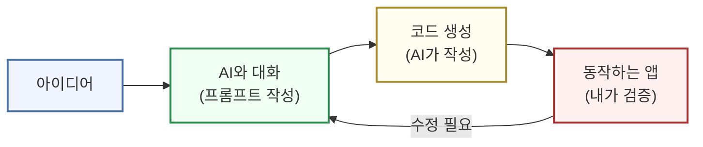

# 바이브코딩과 AI 도구 입문

## 학습 목표

이 페이지를 마치면 다음을 할 수 있습니다.

- 바이브코딩이 기존 코딩과 어떻게 다른지 설명할 수 있습니다.
- 터미널을 두려워하지 않고 기본 개념을 이해할 수 있습니다.
- AI에게 좋은 프롬프트를 작성하는 3가지 핵심 원칙을 적용할 수 있습니다.

---

## 바이브코딩이란?

> **한 줄 요약**: "AI에게 말로 설명하면, AI가 코드를 대신 써주는 것"

바이브코딩(Vibe Coding)은 코딩을 몰라도 AI와 대화하며 프로그램을 만드는 새로운 방식입니다. "바이브(Vibe)"는 분위기, 느낌을 뜻합니다. 코드 한 줄 한 줄을 정확히 몰라도 전체적인 방향과 느낌만 전달하면 AI가 알아서 처리합니다. 마치 인테리어 디자이너에게 "모던하고 따뜻한 느낌으로 해주세요"라고 말하는 것처럼요.

### 기존 코딩 vs 바이브코딩

| 구분 | 기존 코딩 | 바이브코딩 |
|------|-----------|------------|
| 방식 | 문법 암기 → 직접 타이핑 | AI에게 설명 → AI가 작성 |
| 진입장벽 | 높음 (6개월~1년 학습) | 낮음 (바로 시작 가능) |
| 필요 역량 | 프로그래밍 언어 숙달 | 명확한 의사소통 |
| 에러 해결 | 구글링, 스택오버플로우 | AI에게 물어보기 |

### 바이브코딩으로 할 수 있는 것

- **웹사이트 만들기**: 포트폴리오 사이트, 랜딩 페이지, 블로그
- **업무 자동화**: 엑셀 반복 작업 자동화, 이메일 자동 발송, 데이터 정리
- **간단한 앱**: 할 일 관리 앱, 메모 앱, 계산기
- **데이터 분석**: 차트 만들기, 통계 분석, 리포트 생성

### 바이브코딩의 핵심 마인드셋

1. **완벽하지 않아도 된다**: 처음부터 완벽한 코드는 없습니다. 일단 만들고, 수정하고, 개선합니다.
2. **질문이 답이다**: 모르면 AI에게 물어봅니다. "이거 왜 안 돼?"도 좋은 질문입니다.
3. **작게 시작하기**: 처음부터 큰 프로젝트가 아니라 "버튼 하나 만들기"부터 시작합니다.

### 흔한 오해

| 오해 | 실제로는 |
|------|---------|
| "코딩을 완전히 몰라도 되나요?" | 기본 개념은 알면 좋지만, 몰라도 시작 가능합니다 |
| "AI가 다 해주면 내가 뭘 배우는 건가요?" | 문제 정의, 기획, 검증 능력을 배웁니다 |
| "실무에서 쓸 수 있나요?" | 간단한 업무 자동화, 프로토타입에 충분히 활용 가능합니다 |
| "AI가 틀리면 어떡하나요?" | 틀립니다. 그래서 검증이 중요하며, 이것도 배웁니다 |

### 전체 흐름 이해하기



바이브코딩 = AI에게 말로 설명 → AI가 코드 작성 → 내가 검증. 이 사이클을 반복하며 완성도를 높여갑니다.

---

## 컴퓨터와 대화하는 방법

> **핵심**: 터미널은 무섭지 않습니다. "글로 명령하는 창"일 뿐입니다.

### GUI vs CLI

컴퓨터와 대화하는 방법에는 두 가지가 있습니다.

| 방식 | 특징 | 비유 |
|------|------|------|
| **GUI** (그래픽 인터페이스) | 마우스로 클릭, 폴더 아이콘 더블클릭 | 식당에서 메뉴판 보고 손가락으로 가리키며 주문 |
| **CLI** (명령줄 인터페이스) | 글자로 명령 입력, `cd 폴더명`으로 이동 | 주방에 직접 들어가서 말로 주문 |

바이브코딩에서 터미널(CLI)이 필요한 순간은 명확합니다: 프로젝트 폴더 만들기, AI 도구 실행하기, 만든 프로그램 실행하기, 패키지 설치하기.

### 터미널 여는 법

**Mac**: `Cmd + Space` → "터미널" 검색 → Enter

**Windows**: `Win + R` → "cmd" 입력 → Enter

**에디터 내장 터미널**: `` Ctrl + ` `` (백틱) — 이걸 가장 많이 사용하게 됩니다.

### 꼭 기억할 기본 명령어 5개

```bash
# 1. 현재 위치 확인 (Print Working Directory)
pwd
# 결과: /Users/내이름/Documents

# 2. 목록 보기 (List)
ls
ls -la  # 숨김 파일까지 자세히 보기

# 3. 폴더 이동 (Change Directory)
cd 폴더명    # 해당 폴더로 이동
cd ..        # 상위 폴더로 이동
cd ~         # 홈 폴더로 이동

# 4. 폴더 만들기 (Make Directory)
mkdir 새폴더  # "새폴더"라는 이름의 폴더 생성

# 5. 화면 정리
clear
```

### 두려움 극복하기

"잘못 입력하면 컴퓨터 망가지나요?" — 대부분의 명령어는 안전합니다. 정말 위험한 건 `rm -rf /` 같은 것인데, AI도 이런 명령어는 경고해줍니다.

"외워야 하나요?" — 외울 필요 없습니다. 이 문서를 북마크해두고 참고하면 되고, 자주 쓰다 보면 자연스럽게 익숙해집니다.

---

## AI와 효과적으로 대화하기

> **핵심**: AI는 똑똑한 앵무새입니다. 잘 시키면 잘 하고, 못 시키면 엉뚱한 답을 합니다.

### AI란 무엇인가?

AI는 엄청난 양의 글을 학습해서 "이런 질문엔 보통 이렇게 대답하더라"를 조합하는 기계입니다. AI는 "이해"하는 것이 아니라 패턴 매칭을 할 뿐입니다. 그래서 가끔 그럴듯하지만 틀린 답을 합니다. 검증은 항상 필요합니다.

### 주요 AI 서비스 비교

| 회사 | 서비스 | 대표 모델 | 특징 |
|------|--------|-----------|------|
| Anthropic | Claude | Opus, Sonnet, Haiku | 코딩 1위, 안전성 |
| OpenAI | ChatGPT | GPT-4o, o3 | 가장 유명, 범용성 |
| Google | Gemini | 2.5 Pro, Flash | 검색 연동, 무료 강력 |
| Meta | Llama | Llama 4 | 오픈소스, 무료 |

### 프롬프트란?

프롬프트(Prompt)는 AI에게 뭘 해달라고 말하는 것, 즉 지시문입니다. **프롬프트의 품질 = 결과의 품질**입니다.

나쁜 프롬프트 vs 좋은 프롬프트를 비교해보면:

| 상황 | 나쁜 프롬프트 | 좋은 프롬프트 |
|------|---------------|---------------|
| 글쓰기 | "좋은 글 써줘" | "20대 직장인 대상, 친근한 말투로, 월요병 극복 팁 3가지 알려줘" |
| 코딩 | "코드 짜줘" | "Python으로 숫자 1~10까지 출력하는 코드 짜줘. 주석도 달아줘" |
| 분석 | "이거 분석해줘" | "이 매출 데이터에서 월별 트렌드를 분석하고, 차트로 시각화해줘" |

### 좋은 프롬프트의 핵심 3요소

1. **명확함**: 뭘 해달라는 건지 한눈에 알 수 있게, 애매한 표현 피하기
2. **구체적**: 범위, 조건, 형식 명시. "대충"이 아니라 "정확히"
3. **예시 포함**: "이런 식으로 해줘" 보여주기, 원하는 결과물의 모습 제시

### 5요소 프롬프트 (더 정교하게)

| 요소 | 설명 | 예시 |
|------|------|------|
| 페르소나 | AI의 역할 | "너는 10년차 마케터야" |
| 목적 | 뭘 해달라는지 | "블로그 글 써줘" |
| 배경 | 왜 필요한지 | "신제품 출시 홍보용" |
| 형식 | 결과물 모양 | "3문단, 각 100자 내외" |
| 제약 | 하면 안 되는 것 | "전문용어 쓰지 마" |

매번 5가지 다 넣을 필요는 없습니다. 상황에 따라 필요한 것만 넣으면 됩니다.

### 실전 꿀팁 3가지

**꿀팁 1: AI에게 질문하게 시키기**

```
나: "블로그 글 쓰려는데, 뭘 알아야 잘 써줄 수 있어? 질문해줘"
AI: "어떤 주제인가요? 대상 독자는? 글 길이는? 말투는?"
나: (하나씩 답해줌)
AI: (맞춤형 좋은 글 씀)
```

내가 미처 생각 못한 것들을 AI가 물어봐서 결과물 퀄리티가 올라갑니다.

**꿀팁 2: 단계별로 나눠서 시키기**

한 번에 "쇼핑몰 만들어줘"가 아니라:
1. "쇼핑몰 만들려는데, 어떤 순서로 만들면 좋을지 계획 세워줘"
2. (계획 확인 후) "1단계인 폴더 구조 만들어줘"
3. (확인 후) "2단계인 상품 목록 페이지 만들어줘"

**꿀팁 3: 예시 보여주기**

"이메일 써줘" 대신:
```
"이런 형식으로 이메일 써줘:

안녕하세요 [이름]님,

[본문 내용]

감사합니다.
[서명]"
```

### AI의 기억력 이해하기

AI는 현재 대화창에서만 기억합니다. 대화가 길어지면 앞부분을 잊어버리고, 새 대화를 시작하면 완전히 리셋됩니다. 마치 화이트보드에 적은 메모처럼, 대화하는 동안만 유효합니다.

그래서: 중요한 정보는 대화 초반에 제공하고, 대화가 길어지면 요약해서 새 대화를 시작하세요.

### 자주 하는 실수

| 실수 | 원인 | 해결 |
|------|------|------|
| 너무 긴 요청 | AI가 중간부터 까먹음 | 나눠서 요청하기 |
| 맥락 없이 이어서 질문 | "아까 그거" - AI는 모름 | 핵심 맥락 다시 언급 |
| AI 답변 맹신 | AI도 틀림 | 항상 검증하기 |

---

## 핵심 포인트 정리

| 주제 | 핵심 내용 |
|------|-----------|
| 바이브코딩 | AI에게 말로 설명 → AI가 코드 작성 → 내가 검증 |
| 터미널 | 글로 명령하는 창. 5개 명령어(`pwd`, `ls`, `cd`, `mkdir`, `clear`)만 알면 충분 |
| 프롬프트 | 명확하게 + 구체적으로 + 예시와 함께. AI도 틀리니 검증 필수 |

---

> **다음 단계**: [개발환경 준비](/week0/dev-environment)에서 실제 도구를 설치합니다.
