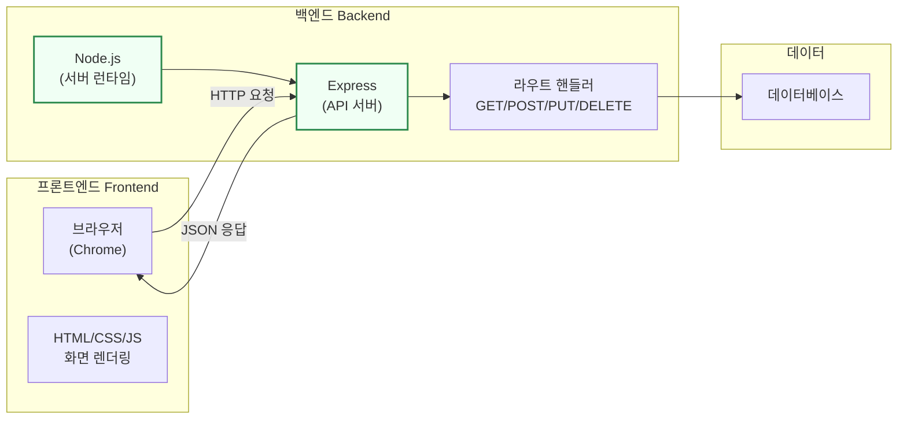
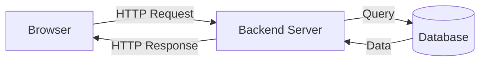
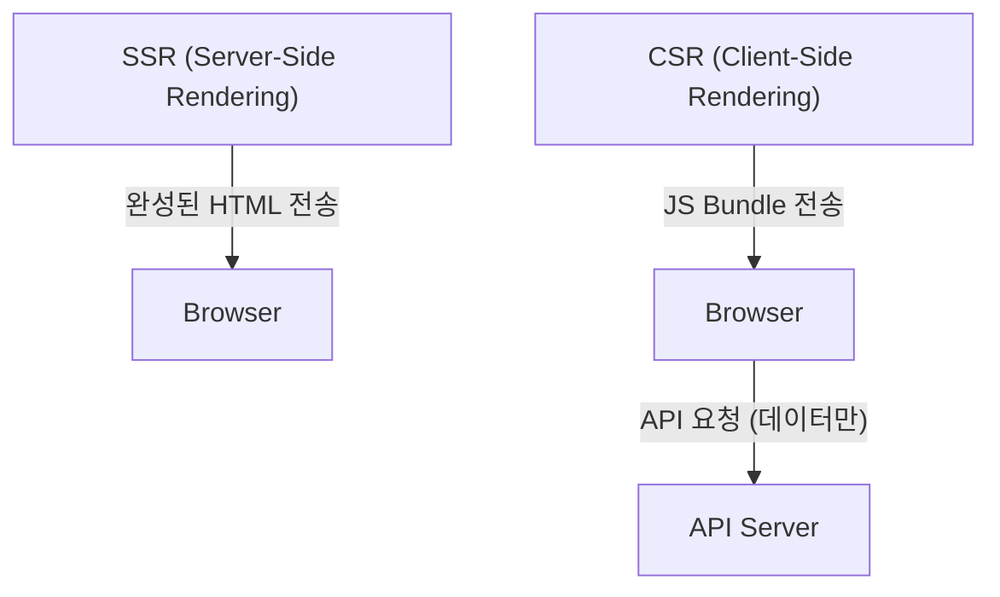
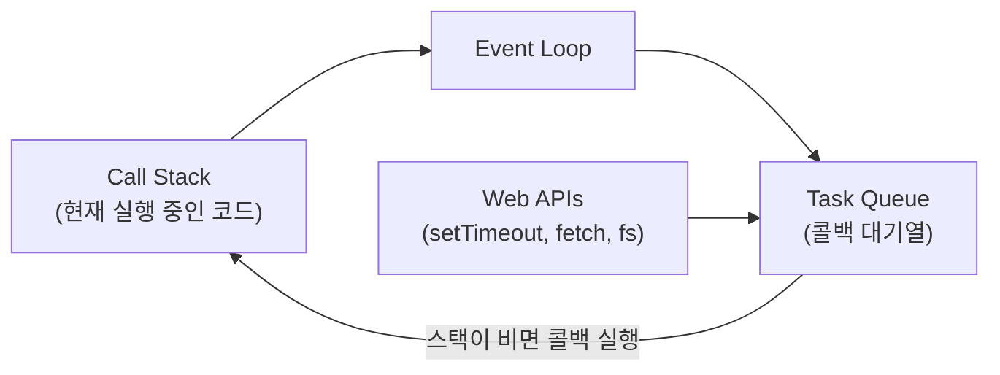

# 2회차: 프론트엔드/백엔드 개념 + Node.js 기초

## 학습 목표

이번 회차를 마치면 다음과 같은 것들을 할 수 있습니다.

- 프론트엔드(Frontend)와 백엔드(Backend)의 역할 차이를 명확히 이해하고 설명할 수 있습니다.
- SSR(서버 사이드 렌더링)과 CSR(클라이언트 사이드 렌더링)의 차이점을 비교하여 설명할 수 있습니다.
- Node.js 런타임의 주요 특성과 이벤트 루프(Event Loop)의 개념을 이해할 수 있습니다.
- CommonJS(`require`)와 ESM(`import`) 모듈 시스템의 차이를 구분할 수 있습니다.
- Express.js를 사용하여 기본 HTTP 서버를 생성하고 실행할 수 있습니다.

---

## 이번 세션 전체 그림



프론트엔드는 사용자 화면을 담당하고, 백엔드는 데이터와 비즈니스 로직을 처리합니다. Node.js로 백엔드 서버를 만들고, Express로 HTTP 요청을 처리하는 API를 구성하는 것이 이 세션의 핵심입니다.

---

## 핵심 개념

### 1. 프론트엔드 vs 백엔드 역할

웹 서비스는 크게 두 영역으로 나뉩니다.

> **왜 필요한가?** 프론트엔드와 백엔드를 분리하지 않으면 비즈니스 로직(가격 계산, 재고 확인, 보안 검증)이 사용자 브라우저에 노출됩니다. 브라우저의 "소스 보기"를 누르면 모든 코드가 보이기 때문입니다. 민감한 로직은 반드시 백엔드 서버에서 처리해야 합니다.

**프론트엔드(Frontend)**는 사용자가 직접 보고 상호작용하는 부분입니다. 브라우저(Browser)에서 실행되며, HTML, CSS, JavaScript로 만들어집니다. 버튼을 클릭하면 반응하고, 데이터를 입력할 수 있는 폼이 보이고, 사진이 표시되는 모든 것이 프론트엔드의 영역입니다.

**백엔드(Backend)**는 사용자 눈에 보이지 않는 서버 쪽 처리를 담당합니다. 데이터베이스에 데이터를 저장하고 불러오며, 비즈니스 로직(예: 결제 처리, 인증)을 수행합니다. Node.js, Python, Java 등 다양한 언어로 만들 수 있습니다.

#### 실생활 비유

음식점을 생각해 보세요.

- **프론트엔드** = 홀(Hall): 손님이 앉아서 메뉴를 보고 주문하는 공간
- **백엔드** = 주방(Kitchen): 손님은 볼 수 없지만 실제 요리가 만들어지는 공간
- **API** = 주문서: 홀과 주방 사이에서 주문을 전달하는 역할

#### 프론트엔드와 백엔드 비교표

| 구분 | 프론트엔드 | 백엔드 |
|------|-----------|--------|
| 실행 위치 | 브라우저(사용자 컴퓨터) | 서버(원격 컴퓨터) |
| 주요 언어 | HTML, CSS, JavaScript | Node.js, Python, Java, Go |
| 역할 | UI 표시, 사용자 상호작용 | 데이터 처리, 비즈니스 로직 |
| 접근 | 누구나 소스코드 열람 가능 | 소스코드 비공개 |
| 프레임워크 | React, Vue, Angular | Express, FastAPI, Spring |

---

### 2. 렌더링 방식: SSR vs CSR

> **왜 필요한가?** 검색엔진(구글)은 JavaScript를 실행하지 않고 HTML만 읽습니다. 순수 CSR(Client-Side Rendering) 앱은 처음에 빈 HTML이 내려오기 때문에 검색엔진이 내용을 인식하지 못합니다. 블로그, 쇼핑몰처럼 검색 노출이 중요한 서비스는 SSR(Server-Side Rendering)이 필요합니다.

**렌더링(Rendering)**은 코드를 화면에 보이는 HTML로 변환하는 과정입니다.

#### CSR (Client-Side Rendering, 클라이언트 사이드 렌더링)

브라우저(클라이언트)에서 JavaScript가 HTML을 생성하는 방식입니다. React, Vue 등 현대적인 SPA(Single Page Application) 프레임워크가 이 방식을 사용합니다.

**동작 과정:**
1. 서버가 거의 비어있는 HTML 파일과 JavaScript 번들(Bundle)을 전송합니다.
2. 브라우저가 JavaScript를 실행하여 화면을 구성합니다.
3. 이후 데이터가 필요하면 API 서버에 요청합니다.

**장점:** 페이지 이동 시 빠른 반응, 풍부한 인터랙션
**단점:** 초기 로딩이 느림, 검색엔진 최적화(SEO)에 불리

#### SSR (Server-Side Rendering, 서버 사이드 렌더링)

서버에서 완성된 HTML을 생성하여 브라우저에 전송하는 방식입니다. Next.js가 대표적인 SSR 프레임워크입니다.

**동작 과정:**
1. 브라우저가 페이지를 요청합니다.
2. 서버가 데이터를 가져와 완성된 HTML을 생성합니다.
3. 완성된 HTML을 브라우저에 전송합니다.

**장점:** 초기 로딩 빠름, SEO 유리, 소셜 미디어 공유에 유리
**단점:** 서버 부하 증가, 페이지 이동마다 서버 요청 필요

실제 서비스에서는 두 방식을 혼합하여 사용하는 경우가 많습니다.

---

### 3. Node.js 런타임 및 이벤트 루프

> **왜 필요한가?** JavaScript는 원래 브라우저에서만 실행되는 언어였습니다. Node.js는 Chrome V8 엔진을 서버에서도 실행할 수 있게 해줍니다. 덕분에 프론트엔드와 백엔드를 같은 언어(JavaScript/TypeScript)로 개발할 수 있어 팀이 코드를 공유하고 맥락을 유지하기 쉬워집니다.

**Node.js**는 브라우저 밖에서 JavaScript를 실행할 수 있게 해주는 **런타임 환경(Runtime Environment)**입니다. Chrome 브라우저의 V8 엔진을 사용하며, 2009년에 처음 출시되었습니다.

Node.js가 등장하기 전에는 JavaScript는 오직 브라우저에서만 실행할 수 있었습니다. Node.js 덕분에 JavaScript로 서버, 데스크톱 앱, CLI 도구 등을 만들 수 있게 되었습니다.

#### Node.js의 특징

- **단일 스레드(Single-threaded)**: 하나의 작업 흐름으로 동작합니다.
- **비동기(Asynchronous)**: 결과를 기다리는 동안 다른 작업을 처리합니다.
- **논블로킹 I/O(Non-blocking I/O)**: 파일 읽기, 네트워크 요청 등에서 블로킹이 발생하지 않습니다.
- **이벤트 기반(Event-driven)**: 이벤트가 발생하면 콜백 함수를 실행합니다.

#### 이벤트 루프(Event Loop)란?

Node.js가 단일 스레드임에도 많은 동시 요청을 처리할 수 있는 핵심 원리가 **이벤트 루프**입니다.

예를 들어, 파일을 읽는 작업이 발생하면 Node.js는 해당 작업을 운영체제에 위임하고, 완료될 때까지 기다리지 않고 다음 작업을 처리합니다. 파일 읽기가 완료되면 이벤트 루프가 콜백 함수를 호출합니다.

---

### 4. 모듈 시스템: CommonJS require vs ESM import

> **왜 필요한가?** 파일 하나에 수천 줄의 코드를 넣으면 유지보수가 불가능해집니다. 모듈 시스템은 코드를 파일 단위로 나누고, 필요한 것만 불러와(import/require) 사용하는 방법입니다. 재사용성과 가독성, 두 가지를 동시에 해결합니다.

> **진화 맥락 — CommonJS → ESM**: Node.js 탄생 시(2009년) 브라우저 표준 모듈이 없었기 때문에 자체 방식인 CommonJS(`require/module.exports`)를 만들었습니다. ES2015에서 브라우저 표준 모듈(ESM, `import/export`)이 등장했고, Node.js도 ESM을 지원하게 되었습니다. 현재는 두 방식이 공존하며 점진적으로 ESM으로 전환 중입니다.

Node.js에서 코드를 여러 파일로 나누어 재사용하기 위한 시스템이 **모듈 시스템(Module System)**입니다.

#### CommonJS (구버전 방식)

Node.js가 처음 만들어졌을 때부터 사용된 방식입니다. `require()`로 가져오고 `module.exports`로 내보냅니다.

```javascript
// math.js - 모듈 내보내기
function add(a, b) {
  return a + b;
}

function subtract(a, b) {
  return a - b;
}

module.exports = { add, subtract };
```

```javascript
// main.js - 모듈 가져오기
const { add, subtract } = require('./math');

console.log(add(10, 5));      // 출력: 15
console.log(subtract(10, 5)); // 출력: 5
```

#### ESM (ES Module, 현대적 방식)

ES2015(ES6)부터 JavaScript 표준으로 도입된 모듈 시스템입니다. `import`/`export` 키워드를 사용합니다.

```javascript
// math.mjs - 모듈 내보내기
export function add(a, b) {
  return a + b;
}

export function subtract(a, b) {
  return a - b;
}

export default { add, subtract };
```

```javascript
// main.mjs - 모듈 가져오기
import { add, subtract } from './math.mjs';

console.log(add(10, 5));      // 출력: 15
console.log(subtract(10, 5)); // 출력: 5
```

#### 어떤 방식을 사용해야 할까?

현재(2024~2025년)는 **ESM 방식을 권장**합니다. 브라우저와 Node.js 모두에서 동작하는 표준 방식이기 때문입니다. 다만 오래된 프로젝트나 일부 패키지는 여전히 CommonJS를 사용하므로 두 방식 모두 이해하는 것이 중요합니다.

`package.json`에 `"type": "module"`을 추가하면 Node.js 프로젝트에서 ESM을 기본으로 사용할 수 있습니다.

---

### 5. Express.js 기본 서버

> **왜 필요한가?** Node.js의 기본 `http` 모듈로 서버를 만들면 URL 파싱, 메서드 분기, 에러 처리를 모두 직접 구현해야 합니다. Express는 이를 추상화하여 라우팅을 간결하게 정의하고 미들웨어로 기능을 확장할 수 있게 합니다. 프로토타입에서 실제 서비스까지 널리 쓰이는 이유입니다.

> **📎 연결 포인트 → 3회차 (HTTP/REST)**: Express의 라우트(`app.get`, `app.post`)가 3회차에서 배울 HTTP 메서드와 REST API 설계 원칙을 직접 구현합니다.

> **📎 연결 포인트 → 5회차 (Next.js)**: Next.js의 Route Handler는 Express와 비슷하지만 Next.js 프레임워크에 통합되어 있습니다. Express를 이해하면 Next.js의 API 구조가 왜 그렇게 설계되었는지 이해하기 쉽습니다.

**Express.js**는 Node.js 기반의 가장 인기 있는 웹 프레임워크입니다. 최소한의 코드로 HTTP 서버를 만들 수 있습니다.

**미들웨어(Middleware)**는 요청이 서버에 도착한 후, 응답을 보내기 전에 실행되는 함수입니다. 인증 확인, 로그 기록, 데이터 파싱 등의 작업을 미들웨어로 처리합니다.

> **흔한 오해**: "Node.js는 싱글 스레드라서 여러 요청을 동시에 처리하지 못한다."
> **실제로는**: Node.js는 싱글 스레드지만 비동기 I/O를 통해 높은 동시성을 처리합니다. 파일 읽기, 데이터베이스 쿼리, 네트워크 요청은 이벤트 루프에 위임하고 다음 요청을 처리합니다. CPU를 많이 쓰는 작업(이미지 처리, 암호화)에는 약하지만, 대부분의 웹 API 서버 작업(I/O 중심)에는 충분히 강력합니다.

---

## 다이어그램

### 클라이언트-서버 아키텍처

웹 서비스에서 브라우저와 서버, 데이터베이스가 어떻게 통신하는지 살펴봅니다.



브라우저는 서버에 HTTP 요청을 보내고, 서버는 필요한 경우 데이터베이스에서 데이터를 가져와 응답합니다.

### SSR vs CSR 렌더링 비교



SSR은 서버에서 완성된 HTML을 만들어 전송하고, CSR은 JavaScript를 브라우저로 보내 브라우저가 화면을 구성합니다.

### Node.js 이벤트 루프



Node.js의 이벤트 루프는 콜 스택이 비어있을 때 태스크 큐에서 콜백을 가져와 실행합니다. 이 방식으로 단일 스레드에서도 동시에 여러 작업을 처리할 수 있습니다.

---

## 코드 예제

### 예제 1: CommonJS vs ESM 비교

```javascript
// CommonJS 방식 (구버전)
// require()로 가져오고 module.exports로 내보냄
const express = require('express');
const path = require('path');

function greet(name) {
  return `Hello, ${name}!`;
}

module.exports = { greet };
```

```javascript
// ESM 방식 (현대적 방식, 권장)
// import/export 키워드 사용
import express from 'express';
import path from 'path';

export function greet(name) {
  return `Hello, ${name}!`;
}

export default greet;
```

두 방식의 핵심 차이는 문법입니다. ESM은 더 명확하고 정적 분석이 가능하여 현대 JavaScript 개발에서 선호됩니다.

### 예제 2: Express 기본 서버

먼저 Express를 설치합니다.

```bash
# Express 설치
npm install express
```

기본 서버를 만듭니다.

```javascript
// server.js
const express = require('express');

// Express 앱 인스턴스 생성
const app = express();

// JSON 요청 파싱 미들웨어 등록
app.use(express.json());

// 기본 라우트 - GET /
app.get('/', (req, res) => {
  res.send('Hello from Express server!');
});

// 서버 시작
const PORT = 3000;
app.listen(PORT, () => {
  console.log(`Server is running on http://localhost:${PORT}`);
});
```

```bash
# 서버 실행
node server.js
# 출력: Server is running on http://localhost:3000
```

브라우저에서 `http://localhost:3000`에 접속하면 "Hello from Express server!" 메시지가 보입니다.

### 예제 3: 라우트 핸들러 (GET, POST)

```javascript
// routes.js - API 라우트 예시
const express = require('express');
const app = express();

// JSON 파싱 미들웨어
app.use(express.json());

// 임시 데이터 저장소 (실제로는 데이터베이스 사용)
let users = [
  { id: 1, name: '김철수', email: 'kim@example.com' },
  { id: 2, name: '이영희', email: 'lee@example.com' },
];

// GET /api/users - 모든 사용자 조회
app.get('/api/users', (req, res) => {
  res.json({
    success: true,
    data: users,
    count: users.length,
  });
});

// GET /api/users/:id - 특정 사용자 조회
app.get('/api/users/:id', (req, res) => {
  const userId = parseInt(req.params.id);
  const user = users.find((u) => u.id === userId);

  if (!user) {
    return res.status(404).json({
      success: false,
      message: '사용자를 찾을 수 없습니다.',
    });
  }

  res.json({ success: true, data: user });
});

// POST /api/users - 새 사용자 생성
app.post('/api/users', (req, res) => {
  const { name, email } = req.body;

  // 입력 값 검증
  if (!name || !email) {
    return res.status(400).json({
      success: false,
      message: 'name과 email은 필수입니다.',
    });
  }

  const newUser = {
    id: users.length + 1,
    name,
    email,
  };

  users.push(newUser);

  res.status(201).json({
    success: true,
    data: newUser,
    message: '사용자가 생성되었습니다.',
  });
});

// 서버 시작
app.listen(3000, () => {
  console.log('API Server running on http://localhost:3000');
});
```

---

## 실습

### 기본 실습: Node.js로 간단한 API 서버 띄우기

**1단계: 프로젝트 초기화**

```bash
mkdir my-api-server
cd my-api-server
npm init -y
npm install express
```

**2단계: server.js 파일 작성**

아래 코드를 `server.js` 파일에 작성합니다.

```javascript
const express = require('express');
const app = express();

app.use(express.json());

// 간단한 Todo 목록
let todos = [
  { id: 1, text: '개발환경 세팅하기', done: true },
  { id: 2, text: 'Express 서버 만들기', done: false },
  { id: 3, text: 'API 만들어보기', done: false },
];

// GET /todos - 전체 목록 조회
app.get('/todos', (req, res) => {
  res.json(todos);
});

// POST /todos - 새 항목 추가
app.post('/todos', (req, res) => {
  const { text } = req.body;
  const newTodo = {
    id: todos.length + 1,
    text,
    done: false,
  };
  todos.push(newTodo);
  res.status(201).json(newTodo);
});

app.listen(3000, () => {
  console.log('Todo API server running at http://localhost:3000');
});
```

**3단계: 서버 실행 및 테스트**

```bash
# 서버 실행
node server.js
```

터미널에서 새 탭을 열고 curl 명령어로 API를 테스트합니다.

```bash
# 전체 Todo 목록 조회
curl http://localhost:3000/todos

# 새 Todo 추가
curl -X POST http://localhost:3000/todos \
  -H "Content-Type: application/json" \
  -d '{"text": "새로운 할 일"}'
```

### 도전 실습: nodemon으로 자동 재시작 설정

서버 코드를 수정할 때마다 `node server.js`를 다시 실행하는 것은 번거롭습니다. **nodemon**을 사용하면 파일이 변경될 때마다 서버가 자동으로 재시작됩니다.

```bash
# nodemon 개발 의존성으로 설치
npm install --save-dev nodemon
```

`package.json`의 scripts에 dev 명령어를 추가합니다.

```json
{
  "scripts": {
    "start": "node server.js",
    "dev": "nodemon server.js"
  }
}
```

```bash
# dev 모드로 서버 실행 (파일 변경 시 자동 재시작)
npm run dev
```

이제 `server.js`를 수정하고 저장하면 서버가 자동으로 재시작됩니다.

---

## 요약

이번 회차에서 배운 핵심 내용을 정리합니다.

| 개념 | 설명 | 키워드 |
|------|------|--------|
| **프론트엔드** | 사용자 인터페이스, 브라우저에서 실행 | HTML, CSS, JavaScript, React |
| **백엔드** | 서버 로직, 데이터 처리 | Node.js, Express, 데이터베이스 |
| **SSR** | 서버에서 HTML 생성 후 전송 | Next.js, SEO 유리 |
| **CSR** | 브라우저에서 JavaScript로 화면 생성 | React SPA, 빠른 페이지 전환 |
| **Node.js** | 브라우저 밖에서 JavaScript 실행 | 런타임, 비동기, 이벤트 루프 |
| **CommonJS** | `require`/`module.exports` | Node.js 구버전 방식 |
| **ESM** | `import`/`export` | 현대적 표준, 권장 방식 |
| **Express** | Node.js 웹 프레임워크 | 라우트, 미들웨어, REST API |

### 핵심 키워드

- **Runtime(런타임)**: 프로그램이 실행되는 환경
- **Event Loop(이벤트 루프)**: 비동기 작업을 처리하는 Node.js의 핵심 메커니즘
- **Middleware(미들웨어)**: 요청과 응답 사이에 처리되는 함수
- **Route(라우트)**: URL 경로와 처리 함수를 연결하는 것
- **Module(모듈)**: 코드를 파일 단위로 나누어 재사용하는 단위

### 3회차 미리보기

다음 시간에는 HTTP 프로토콜의 메서드(GET, POST, PUT, DELETE)와 상태 코드(200, 404, 500 등), REST API 설계 원칙, 그리고 개발 중 반드시 마주치게 되는 **CORS 에러**의 원인과 해결 방법을 배웁니다.

---

## 강사 자료

이 세션 내용을 더 깊이 이해하고 싶다면 아래 자료를 참고하세요.

- [Express 완전정복](/appendix/deep-dive/express-complete): 이 세션에서 만든 간단한 서버를 실전 수준으로 확장합니다
