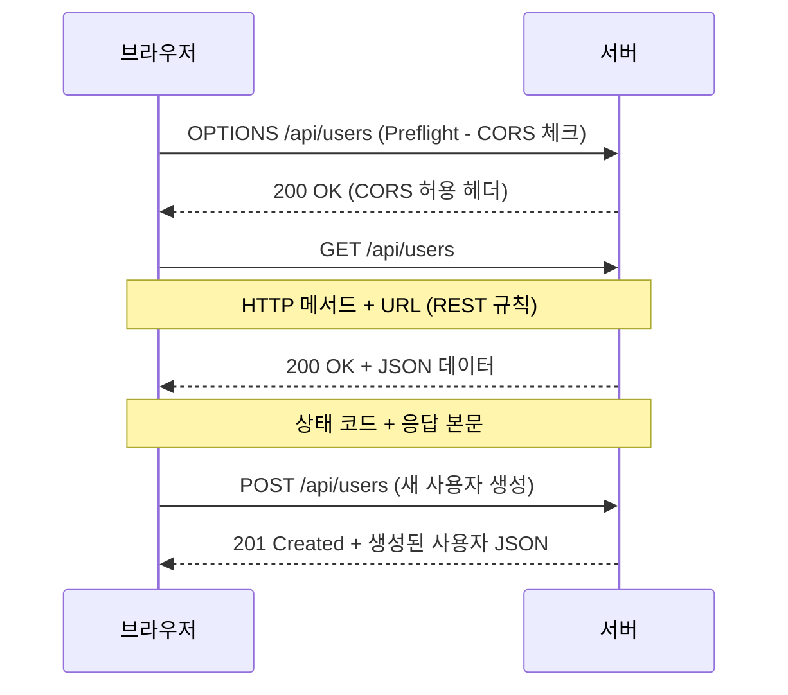
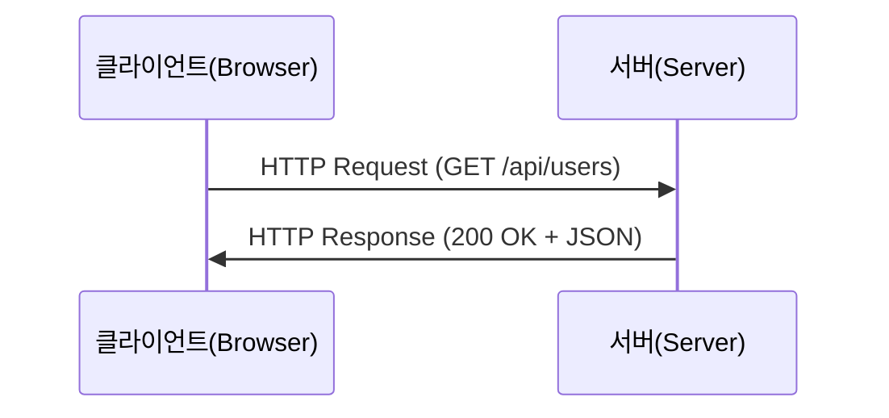
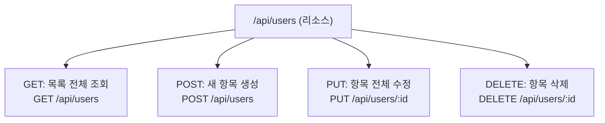
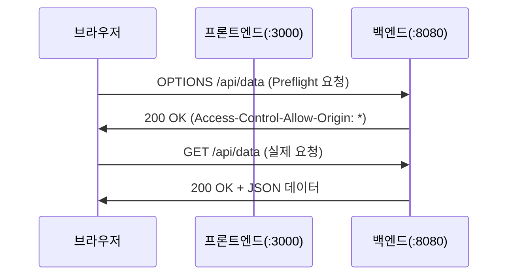

# 3회차: HTTP/REST, JSON, CORS 핵심

## 학습 목표

이번 회차를 마치면 다음과 같은 것들을 할 수 있습니다.

- HTTP 메서드(GET, POST, PUT, DELETE)와 상태 코드(Status Code)의 의미를 이해하고 설명할 수 있습니다.
- REST API 설계 원칙을 이해하고 리소스 기반 URL을 설계할 수 있습니다.
- JSON(제이슨) 형식의 요청과 응답을 파싱하고 처리할 수 있습니다.
- CORS(Cross-Origin Resource Sharing)의 동작 원리를 이해하고 Express에서 설정할 수 있습니다.
- `fetch` API를 사용하여 프론트엔드에서 백엔드 API에 HTTP 요청을 보낼 수 있습니다.

---

## 이번 세션 전체 그림



HTTP는 브라우저와 서버가 대화하는 규칙입니다. REST는 URL과 HTTP 메서드를 활용한 API 설계 패턴이고, CORS는 보안을 위한 브라우저 정책입니다. 이 세 가지가 모든 웹 API의 기반입니다.

---

## 핵심 개념

### 1. HTTP 메서드와 상태 코드

**HTTP(HyperText Transfer Protocol)**는 웹에서 데이터를 주고받기 위한 규약(프로토콜)입니다. 클라이언트와 서버가 어떻게 통신할지 정해놓은 약속이라고 생각하면 됩니다.

#### HTTP 메서드 (Method)

> **왜 필요한가?** URL은 리소스의 위치를 나타내고, HTTP 메서드는 그 리소스로 무엇을 할지를 나타냅니다. `/api/users`라는 URL 하나로 조회(GET), 생성(POST), 수정(PUT), 삭제(DELETE)를 모두 처리할 수 있습니다. 메서드 없이는 같은 URL이 어떤 작업인지 구분할 수 없습니다.

HTTP 메서드는 서버에 어떤 종류의 작업을 요청하는지 나타냅니다. CRUD(Create, Read, Update, Delete) 작업과 매핑됩니다.

| 메서드 | CRUD | 역할 | 예시 |
|--------|------|------|------|
| **GET** | Read | 데이터 조회 | `GET /api/users` - 사용자 목록 가져오기 |
| **POST** | Create | 데이터 생성 | `POST /api/users` - 새 사용자 등록 |
| **PUT** | Update | 데이터 전체 수정 | `PUT /api/users/1` - ID 1 사용자 전체 수정 |
| **PATCH** | Update | 데이터 일부 수정 | `PATCH /api/users/1` - ID 1 사용자 일부 수정 |
| **DELETE** | Delete | 데이터 삭제 | `DELETE /api/users/1` - ID 1 사용자 삭제 |

#### HTTP 상태 코드 (Status Code)

> **왜 필요한가?** HTTP 응답에는 항상 "이 요청이 어떻게 처리됐는지"를 알려주는 숫자 코드가 포함됩니다. 프론트엔드는 이 코드를 보고 성공인지 실패인지, 어떤 종류의 실패인지 판단합니다. 상태 코드 없이는 응답 본문 내용을 파싱해서 성공 여부를 파악해야 합니다.

상태 코드는 서버가 요청을 어떻게 처리했는지 클라이언트에게 알려주는 세 자리 숫자입니다.

**2xx - 성공:**
| 코드 | 의미 | 사용 상황 |
|------|------|-----------|
| `200 OK` | 요청 성공 | GET 요청 성공, 데이터 반환 |
| `201 Created` | 리소스 생성됨 | POST로 새 데이터 생성 성공 |
| `204 No Content` | 성공, 응답 데이터 없음 | DELETE 성공 후 내용 없음 |

**3xx - 리다이렉션:**
| 코드 | 의미 | 사용 상황 |
|------|------|-----------|
| `301 Moved Permanently` | 영구 이동 | URL이 영구적으로 변경됨 |
| `302 Found` | 임시 이동 | URL이 임시적으로 변경됨 |

**4xx - 클라이언트 오류:**
| 코드 | 의미 | 사용 상황 |
|------|------|-----------|
| `400 Bad Request` | 잘못된 요청 | 입력 값이 올바르지 않음 |
| `401 Unauthorized` | 인증 필요 | 로그인이 필요한 리소스 |
| `403 Forbidden` | 접근 금지 | 권한 없음 |
| `404 Not Found` | 찾을 수 없음 | 존재하지 않는 리소스 |
| `422 Unprocessable Entity` | 처리 불가 | 유효성 검사 실패 |
| `429 Too Many Requests` | 요청 횟수 초과 | 속도 제한(Rate Limiting) |

**5xx - 서버 오류:**
| 코드 | 의미 | 사용 상황 |
|------|------|-----------|
| `500 Internal Server Error` | 서버 내부 오류 | 예상치 못한 서버 오류 |
| `502 Bad Gateway` | 게이트웨이 오류 | 프록시 서버 오류 |
| `503 Service Unavailable` | 서비스 사용 불가 | 서버 점검 중 |

---

### 2. REST API 설계 원칙

> **왜 필요한가?** 팀원마다 API를 다르게 설계하면 "어떻게 호출해야 하지?"를 항상 물어봐야 합니다. REST는 URL과 HTTP 메서드를 조합하는 명확한 약속입니다. REST 규칙을 따르면 처음 보는 API도 예측 가능합니다. `/api/posts/123`은 123번 게시글, `DELETE /api/posts/123`은 삭제임을 바로 알 수 있습니다.

> **진화 맥락 — XML/SOAP → JSON/REST → GraphQL**: 2000년대 초반 웹 서비스는 XML과 SOAP(Simple Object Access Protocol)를 사용했습니다. XML은 표현력이 풍부하지만 복잡하고 무거웠습니다. 2000년 Roy Fielding의 논문으로 REST 개념이 제안되고, JSON의 간결함과 결합해 대세가 되었습니다. 최근 REST의 "오버 페칭(필요 이상의 데이터)" 문제를 해결하기 위해 GraphQL이 대안으로 사용되고 있습니다.

**REST(Representational State Transfer)**는 웹 서비스를 설계하는 아키텍처 스타일입니다. REST 원칙을 따르는 API를 **RESTful API**라고 합니다.

#### REST 설계의 핵심 원칙

**1. 리소스 기반 URL**

URL은 동작(행위)이 아니라 리소스(명사)를 표현해야 합니다.

```
좋지 않은 예시 (동작 중심):
GET /getUsers
POST /createUser
DELETE /deleteUser/1

좋은 예시 (리소스 중심):
GET /users
POST /users
DELETE /users/1
```

**2. HTTP 메서드로 동작 표현**

같은 URL에 대해 HTTP 메서드를 다르게 사용합니다.

```
GET    /users       - 전체 사용자 목록 조회
POST   /users       - 새 사용자 생성
GET    /users/1     - ID가 1인 사용자 조회
PUT    /users/1     - ID가 1인 사용자 전체 수정
PATCH  /users/1     - ID가 1인 사용자 일부 수정
DELETE /users/1     - ID가 1인 사용자 삭제
```

**3. 계층적 URL 구조**

관련 리소스는 계층 구조로 표현합니다.

```
/users/1/posts       - 사용자 1의 게시글 목록
/users/1/posts/5     - 사용자 1의 5번 게시글
/users/1/posts/5/comments  - 해당 게시글의 댓글 목록
```

**4. 상태 코드로 결과 표현**

성공, 실패, 오류를 적절한 상태 코드로 전달합니다.

---

### 3. JSON 요청/응답 형식

> **왜 필요한가?** 서버와 클라이언트가 다른 언어로 작성됐을 때 데이터를 교환하려면 공통 형식이 필요합니다. JSON은 JavaScript 객체를 텍스트로 표현한 형식으로, Python, Java, Go 어디서든 파싱할 수 있습니다. XML보다 가볍고 읽기 쉬워 웹 API의 사실상 표준이 되었습니다.

**JSON(JavaScript Object Notation)**은 데이터를 저장하고 전송하기 위한 경량 텍스트 형식입니다. 사람이 읽기 쉽고, 기계가 분석하기도 쉽습니다.

JSON은 키-값 쌍으로 이루어지며, 값으로는 문자열, 숫자, 불리언, 배열, 객체, null을 사용할 수 있습니다.

```json
{
  "id": 1,
  "name": "김철수",
  "email": "kim@example.com",
  "age": 25,
  "isActive": true,
  "address": {
    "city": "서울",
    "district": "강남구"
  },
  "skills": ["JavaScript", "React", "Node.js"],
  "profileImage": null
}
```

#### API 응답 패턴

일관된 API 응답 형식을 사용하면 프론트엔드에서 처리하기 쉬워집니다.

```json
{
  "success": true,
  "data": {
    "id": 1,
    "name": "김철수"
  },
  "message": "사용자를 성공적으로 조회했습니다.",
  "timestamp": "2025-01-01T12:00:00Z"
}
```

오류 응답:

```json
{
  "success": false,
  "error": {
    "code": "VALIDATION_ERROR",
    "message": "이메일 형식이 올바르지 않습니다.",
    "field": "email"
  },
  "timestamp": "2025-01-01T12:00:00Z"
}
```

---

### 4. CORS(Cross-Origin Resource Sharing) 동작 원리

> **왜 필요한가?** CORS 없이는 악성 사이트(evil.com)가 사용자 브라우저를 통해 은행 사이트(bank.com)에 요청을 보낼 수 있습니다. 이미 로그인된 쿠키가 자동으로 전송되므로 인증을 우회할 수 있습니다. 브라우저가 "출처(Origin)가 다른 요청은 서버 허락 없이 차단"하는 CORS 정책으로 이를 방어합니다.

> **흔한 오해**: "CORS 오류는 서버 문제다."
> **실제로는**: CORS는 **브라우저**의 보안 정책입니다. `curl`이나 Postman으로 같은 요청을 보내면 CORS 오류가 발생하지 않습니다. 브라우저만 이 정책을 시행합니다. 서버가 적절한 `Access-Control-Allow-Origin` 헤더를 응답에 포함시키면 브라우저가 차단을 해제합니다.
>
> "서버를 수정하면 해결된다"는 것은 맞지만, "서버가 문제"라는 표현은 정확하지 않습니다. 브라우저가 서버의 허락을 요청하고, 서버가 허락을 응답에 담아 보내는 구조입니다.

**CORS**는 개발을 처음 시작할 때 가장 많이 마주치는 오류 중 하나입니다. CORS를 이해하면 이 오류를 두려워하지 않고 해결할 수 있습니다.

#### 동일 출처 정책 (Same-Origin Policy)

브라우저에는 보안을 위한 **동일 출처 정책**이 있습니다. **출처(Origin)**는 `프로토콜 + 도메인 + 포트`의 조합입니다.

```
https://myapp.com:443  ->  프로토콜: https, 도메인: myapp.com, 포트: 443
http://myapp.com:80    ->  프로토콜: http,  도메인: myapp.com, 포트: 80

위 두 주소는 프로토콜과 포트가 다르므로 다른 출처입니다.
```

동일 출처 정책에 의해, 브라우저는 다른 출처의 서버로 요청을 보내는 것을 기본적으로 차단합니다.

#### 개발 시 흔히 발생하는 상황

- 프론트엔드: `http://localhost:3000` (React 개발 서버)
- 백엔드: `http://localhost:8080` (Express API 서버)

포트가 다르면 다른 출처이므로, 프론트엔드에서 백엔드 API를 호출할 때 CORS 오류가 발생합니다.

#### CORS 해결 방법

서버(백엔드)에서 특정 출처의 요청을 허용한다고 명시적으로 선언하면 됩니다. HTTP 응답 헤더에 `Access-Control-Allow-Origin`을 추가합니다.

Express에서는 `cors` 패키지를 사용하면 간단하게 설정할 수 있습니다.

#### Preflight 요청

브라우저는 실제 요청 전에 **Preflight 요청**을 먼저 보냅니다. OPTIONS 메서드를 사용하여 "이 요청을 보내도 되는가?"를 서버에 물어보는 과정입니다.

Preflight는 다음 경우에 발생합니다:
- GET과 POST(form 전송) 이외의 메서드
- `Content-Type: application/json` 헤더를 사용하는 경우
- 커스텀 HTTP 헤더를 포함하는 경우

---

### 5. fetch API 사용법

> **📎 연결 포인트 → 2회차 (Express)**: Express의 `app.get()`, `app.post()` 라우트가 REST 메서드를 직접 구현합니다. `cors()` 미들웨어로 CORS를 허용하는 것도 2회차에서 다룬 내용입니다.

> **📎 연결 포인트 → 4회차 (React)**: React에서 `fetch()`나 `axios`로 API를 호출할 때 여기서 배운 HTTP 메서드, 헤더, JSON 파싱이 모두 사용됩니다.

> **📎 연결 포인트 → 9회차 (인증)**: JWT 토큰은 HTTP `Authorization` 헤더에 담아 전달합니다. `Authorization: Bearer [토큰]` 형식이 REST API 인증의 표준입니다.

**fetch API**는 브라우저에서 HTTP 요청을 보내는 현대적인 방법입니다. Promise 기반으로 동작하여 비동기 처리가 깔끔합니다.

기본 문법:

```javascript
fetch(url, options)
  .then(response => response.json())
  .then(data => console.log(data))
  .catch(error => console.error(error));
```

또는 async/await를 사용하면 더 읽기 쉬운 코드를 작성할 수 있습니다:

```javascript
async function fetchData(url) {
  try {
    const response = await fetch(url);
    const data = await response.json();
    return data;
  } catch (error) {
    console.error('Error:', error);
  }
}
```

---

## 다이어그램

### HTTP 요청-응답 흐름



클라이언트가 서버에 HTTP 요청을 보내면, 서버는 처리 결과를 상태 코드와 함께 응답합니다.

### REST API 리소스 설계



하나의 URL(리소스)에 대해 HTTP 메서드를 달리하여 CRUD 작업을 표현합니다.

### CORS Preflight 요청 흐름



브라우저는 CORS 정책에 따라 실제 요청 전에 Preflight 요청을 보내고, 서버로부터 허용 응답을 받은 후에야 실제 요청을 보냅니다.

---

## 코드 예제

### 예제 1: fetch API로 HTTP 요청

```javascript
// GET 요청 - 데이터 조회
async function getUsers() {
  try {
    const response = await fetch('http://localhost:8080/api/users');

    // 응답 상태 확인
    if (!response.ok) {
      throw new Error(`HTTP error! status: ${response.status}`);
    }

    // JSON으로 파싱
    const data = await response.json();
    console.log('사용자 목록:', data);
    return data;
  } catch (error) {
    console.error('요청 실패:', error.message);
  }
}

// POST 요청 - 데이터 생성
async function createUser(userData) {
  try {
    const response = await fetch('http://localhost:8080/api/users', {
      method: 'POST',
      headers: {
        'Content-Type': 'application/json', // JSON 형식 명시
      },
      body: JSON.stringify(userData), // JavaScript 객체를 JSON 문자열로 변환
    });

    if (!response.ok) {
      const errorData = await response.json();
      throw new Error(errorData.message || '생성 실패');
    }

    const newUser = await response.json();
    console.log('생성된 사용자:', newUser);
    return newUser;
  } catch (error) {
    console.error('생성 실패:', error.message);
  }
}

// DELETE 요청 - 데이터 삭제
async function deleteUser(userId) {
  try {
    const response = await fetch(`http://localhost:8080/api/users/${userId}`, {
      method: 'DELETE',
    });

    if (response.status === 204) {
      console.log('삭제 성공');
      return true;
    }

    throw new Error('삭제 실패');
  } catch (error) {
    console.error('삭제 실패:', error.message);
    return false;
  }
}
```

### 예제 2: Express CORS 미들웨어 설정

먼저 cors 패키지를 설치합니다.

```bash
npm install cors
```

```javascript
const express = require('express');
const cors = require('cors');

const app = express();

// 방법 1: 모든 출처 허용 (개발 환경에서만 사용 권장)
app.use(cors());

// 방법 2: 특정 출처만 허용 (프로덕션 환경 권장)
const corsOptions = {
  origin: ['http://localhost:3000', 'https://myapp.com'],
  methods: ['GET', 'POST', 'PUT', 'PATCH', 'DELETE'],
  allowedHeaders: ['Content-Type', 'Authorization'],
  credentials: true, // 쿠키 전달 허용
};
app.use(cors(corsOptions));

// 방법 3: 특정 라우트에만 CORS 적용
app.get('/api/public', cors(), (req, res) => {
  res.json({ message: '모든 출처 허용' });
});

app.get('/api/private', cors(corsOptions), (req, res) => {
  res.json({ message: '특정 출처만 허용' });
});

app.use(express.json());

app.listen(8080, () => {
  console.log('Backend server running on port 8080');
});
```

### 예제 3: HTTP 메서드별 요청/응답 예제

```javascript
const express = require('express');
const app = express();

app.use(express.json());
app.use(cors());

let products = [
  { id: 1, name: '노트북', price: 1200000, stock: 5 },
  { id: 2, name: '마우스', price: 30000, stock: 20 },
];

// GET /api/products - 전체 상품 조회
app.get('/api/products', (req, res) => {
  // 쿼리 파라미터로 필터링 가능
  const { minPrice, maxPrice } = req.query;

  let result = products;
  if (minPrice) result = result.filter((p) => p.price >= Number(minPrice));
  if (maxPrice) result = result.filter((p) => p.price <= Number(maxPrice));

  res.status(200).json({
    success: true,
    data: result,
    count: result.length,
  });
});

// GET /api/products/:id - 특정 상품 조회
app.get('/api/products/:id', (req, res) => {
  const product = products.find((p) => p.id === parseInt(req.params.id));

  if (!product) {
    return res.status(404).json({
      success: false,
      message: '상품을 찾을 수 없습니다.',
    });
  }

  res.status(200).json({ success: true, data: product });
});

// POST /api/products - 새 상품 생성
app.post('/api/products', (req, res) => {
  const { name, price, stock } = req.body;

  if (!name || price === undefined) {
    return res.status(400).json({
      success: false,
      message: 'name과 price는 필수 항목입니다.',
    });
  }

  const newProduct = {
    id: products.length + 1,
    name,
    price,
    stock: stock || 0,
  };

  products.push(newProduct);

  res.status(201).json({
    success: true,
    data: newProduct,
    message: '상품이 등록되었습니다.',
  });
});

// PUT /api/products/:id - 상품 전체 수정
app.put('/api/products/:id', (req, res) => {
  const index = products.findIndex((p) => p.id === parseInt(req.params.id));

  if (index === -1) {
    return res.status(404).json({ success: false, message: '상품 없음' });
  }

  const { name, price, stock } = req.body;
  products[index] = { id: products[index].id, name, price, stock };

  res.status(200).json({
    success: true,
    data: products[index],
    message: '상품이 수정되었습니다.',
  });
});

// DELETE /api/products/:id - 상품 삭제
app.delete('/api/products/:id', (req, res) => {
  const index = products.findIndex((p) => p.id === parseInt(req.params.id));

  if (index === -1) {
    return res.status(404).json({ success: false, message: '상품 없음' });
  }

  products.splice(index, 1);

  res.status(204).send(); // 성공, 응답 내용 없음
});

app.listen(8080);
```

### 예제 4: JSON 파싱 및 응답 처리

```javascript
// 프론트엔드에서의 JSON 처리
async function handleApiResponse() {
  // 1. 서버에서 JSON 응답 받기
  const response = await fetch('/api/products');
  const jsonData = await response.json(); // JSON 문자열 -> JavaScript 객체

  // 2. 응답 데이터 사용
  if (jsonData.success) {
    jsonData.data.forEach((product) => {
      console.log(`${product.name}: ${product.price.toLocaleString()}원`);
    });
  }

  // 3. JavaScript 객체를 JSON으로 변환하여 서버에 전송
  const newProduct = {
    name: '키보드',
    price: 80000,
    stock: 10,
  };

  const createResponse = await fetch('/api/products', {
    method: 'POST',
    headers: {
      'Content-Type': 'application/json',
    },
    body: JSON.stringify(newProduct), // 객체 -> JSON 문자열
  });

  const result = await createResponse.json();
  console.log('생성 결과:', result);
}

// JSON.stringify와 JSON.parse 예시
const obj = { name: '김철수', age: 25 };

const jsonString = JSON.stringify(obj);
console.log(jsonString); // '{"name":"김철수","age":25}'

const parsedObj = JSON.parse(jsonString);
console.log(parsedObj.name); // 김철수
```

---

## 실습

### 기본 실습: CORS 에러 의도적으로 발생시키기

CORS 에러를 직접 경험하고 이해하는 것이 중요합니다.

**1단계: 백엔드 서버 만들기 (CORS 설정 없음)**

`backend/server.js` 파일을 작성합니다.

```javascript
const express = require('express');
const app = express();

app.use(express.json());

// CORS 설정이 없는 상태
app.get('/api/data', (req, res) => {
  res.json({ message: '데이터입니다.', timestamp: new Date().toISOString() });
});

app.listen(8080, () => {
  console.log('Backend: http://localhost:8080');
});
```

```bash
# 백엔드 폴더에서 실행
mkdir backend && cd backend
npm init -y
npm install express
node server.js
```

**2단계: 프론트엔드 HTML 만들기**

`frontend/index.html` 파일을 작성합니다.

```html
<!DOCTYPE html>
<html lang="ko">
  <head>
    <meta charset="UTF-8" />
    <title>CORS 실습</title>
  </head>
  <body>
    <h1>CORS 에러 실습</h1>
    <button id="fetchBtn">데이터 불러오기</button>
    <div id="result"></div>

    <script>
      document.getElementById('fetchBtn').addEventListener('click', async () => {
        try {
          // 포트 8080의 백엔드 서버에 요청 (현재 파일은 다른 포트에서 열림)
          const response = await fetch('http://localhost:8080/api/data');
          const data = await response.json();
          document.getElementById('result').textContent = JSON.stringify(data);
        } catch (error) {
          document.getElementById('result').textContent = '에러: ' + error.message;
          console.error('CORS Error:', error);
        }
      });
    </script>
  </body>
</html>
```

VSCode에서 `index.html`을 Live Server(포트 5500)로 열고 버튼을 클릭하면 CORS 에러가 발생합니다. 개발자 도구(F12) 콘솔에서 오류 메시지를 확인하세요.

### 도전 실습: cors 미들웨어로 에러 해결하기

**1단계**: cors 패키지를 설치하고 백엔드 서버를 수정합니다.

```bash
# backend 폴더에서
npm install cors
```

```javascript
// backend/server.js 수정
const express = require('express');
const cors = require('cors');
const app = express();

app.use(express.json());

// CORS 미들웨어 추가
app.use(
  cors({
    origin: 'http://localhost:5500', // Live Server 포트
    methods: ['GET', 'POST'],
  })
);

app.get('/api/data', (req, res) => {
  res.json({
    message: 'CORS가 해결되었습니다!',
    timestamp: new Date().toISOString(),
  });
});

app.listen(8080, () => {
  console.log('Backend: http://localhost:8080');
});
```

**2단계**: 서버를 재시작하고 프론트엔드에서 다시 버튼을 클릭합니다. 이번에는 CORS 오류 없이 데이터가 정상적으로 출력됩니다.

---

## 요약

이번 회차에서 배운 핵심 내용을 정리합니다.

| 개념 | 핵심 내용 | 주의사항 |
|------|-----------|----------|
| **HTTP 메서드** | GET/POST/PUT/DELETE로 동작 표현 | GET은 조회, POST는 생성 |
| **상태 코드** | 2xx(성공), 4xx(클라이언트 오류), 5xx(서버 오류) | 적절한 코드 사용 중요 |
| **REST API** | 리소스 기반 URL 설계 | 명사 사용, 동사 지양 |
| **JSON** | `JSON.stringify()` / `JSON.parse()` | 직렬화/역직렬화 구분 |
| **CORS** | 동일 출처 정책 위반 시 발생 | 서버에서 허용 출처 설정 |
| **fetch API** | Promise 기반 HTTP 요청 | async/await와 함께 사용 |

### 핵심 키워드

- **HTTP(HyperText Transfer Protocol)**: 웹 통신 규약
- **REST(Representational State Transfer)**: API 설계 아키텍처 스타일
- **JSON(JavaScript Object Notation)**: 경량 데이터 교환 형식
- **CORS(Cross-Origin Resource Sharing)**: 교차 출처 리소스 공유
- **Preflight Request**: 브라우저가 실제 요청 전에 보내는 OPTIONS 요청
- **Status Code(상태 코드)**: 서버 응답 결과를 나타내는 세 자리 숫자
- **Middleware(미들웨어)**: 요청과 응답 사이에서 처리되는 함수
- **Origin(출처)**: 프로토콜 + 도메인 + 포트의 조합

### 자주 발생하는 에러 해결법

| 에러 | 원인 | 해결 방법 |
|------|------|-----------|
| CORS Error | 다른 출처 요청 차단 | 백엔드에서 cors 미들웨어 설정 |
| 404 Not Found | URL 경로 오류 | API 라우트 경로 확인 |
| 400 Bad Request | 잘못된 요청 형식 | Content-Type 헤더 및 body 형식 확인 |
| 500 Internal Error | 서버 코드 오류 | 서버 로그 확인 및 예외 처리 추가 |

### 2주차 미리보기

다음 주에는 **React**의 기본 개념과 컴포넌트(Component), **상태 관리(State Management)**를 배웁니다. 또한 **Next.js**를 사용하여 SSR과 CSR을 실제로 구현하고, 오늘 만든 Express API 서버와 연결하는 실습을 진행합니다.

1주차에서 배운 개발환경 설정, Node.js/Express 서버, HTTP/REST/CORS의 개념이 2주차 React/Next.js 학습의 기반이 됩니다.
