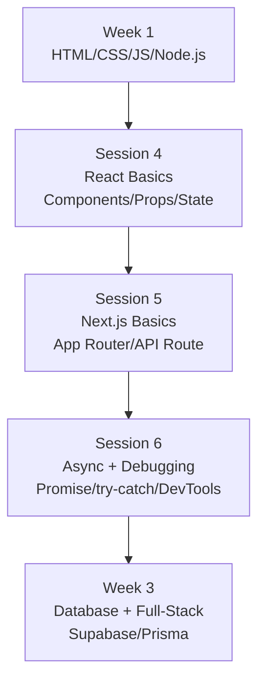

# 2주차: React/Next.js 기초 + 비동기/디버깅

두 번째 주에는 현대 프론트엔드 개발의 핵심 기술을 배웁니다. 정적인 웹 페이지를 넘어, 사용자와 상호작용하는 동적인 UI를 직접 만들어 봅니다. React의 컴포넌트 사고방식을 익히고, Next.js로 실제 웹 애플리케이션 구조를 경험합니다. 마지막으로 비동기 프로그래밍과 디버깅을 통해 실무 개발자처럼 문제를 해결하는 방법을 학습합니다.

## 2주차 전체 학습 목표

이번 주를 마치면 다음을 할 수 있게 됩니다.

- **React 컴포넌트**를 설계하고, props와 state를 활용해 동적인 UI를 구성할 수 있습니다.
- **Next.js App Router**로 페이지와 레이아웃을 구성하고, 서버/클라이언트 컴포넌트를 구분하여 사용할 수 있습니다.
- **API Route**를 직접 만들고, 브라우저에서 데이터를 불러와 화면에 표시할 수 있습니다.
- **async/await** 패턴으로 비동기 코드를 작성하고, try/catch로 에러를 안전하게 처리할 수 있습니다.
- 브라우저 개발자 도구와 console 메서드를 활용하여 버그를 찾고 수정하는 디버깅 루틴을 익힐 수 있습니다.

## 선수 지식

2주차는 1주차 내용을 기반으로 합니다. 다음 개념이 익숙하지 않다면 1주차 내용을 먼저 복습해 주세요.

- HTML, CSS, JavaScript 기초 문법
- Node.js 설치 및 npm 패키지 관리
- HTTP 요청과 응답의 기본 개념 (GET, POST)

## 회차별 개요

### [4회차: React 기초](/week2/session4)

React는 Facebook(현 Meta)에서 만든 UI 라이브러리입니다. 레고 블록처럼 작은 컴포넌트를 조립해 복잡한 UI를 만드는 것이 핵심 아이디어입니다.

**이 회차에서 배우는 것:**

- 함수형 컴포넌트와 JSX 문법으로 UI 구성 요소를 만드는 방법
- Props로 부모에서 자식 컴포넌트로 데이터를 전달하는 방법
- useState Hook으로 컴포넌트 내부 상태를 관리하는 방법
- useEffect Hook으로 데이터 로딩 같은 사이드 이펙트를 처리하는 방법
- 배열 데이터를 map()으로 화면에 렌더링하고 이벤트를 처리하는 방법

**실습:** 상품 목록 대시보드 UI — 카드 목록, 카테고리 필터, 검색 기능

---

### [5회차: Next.js 기초](/week2/session5)

Next.js는 React 위에 구축된 풀스택 프레임워크입니다. 파일 하나를 만들면 자동으로 페이지가 생성되는 파일 기반 라우팅, 서버에서 직접 데이터를 가져오는 Server Component, 그리고 내장 API 서버 기능을 제공합니다.

**이 회차에서 배우는 것:**

- App Router의 파일 시스템 기반 라우팅 구조 (`page.tsx`, `layout.tsx`)
- 동적 라우팅으로 `/blog/[slug]` 같은 URL 패턴을 처리하는 방법
- 서버 컴포넌트(Server Component)와 클라이언트 컴포넌트(`'use client'`)의 차이
- API Route Handler를 만들어 백엔드 없이 API 서버를 구현하는 방법
- `.env.local`로 환경변수를 안전하게 관리하는 방법

**실습:** API Route 생성 → 클라이언트에서 fetch → 화면 렌더링, 동적 상세 페이지 구현

---

### [6회차: 비동기 프로그래밍 + 디버깅](/week2/session6)

서버에서 데이터를 가져오는 모든 작업은 비동기입니다. 비동기 코드를 올바르게 작성하지 않으면 앱이 멈추거나 예상치 못한 오류가 발생합니다. 이 회차에서는 Promise와 async/await를 완벽히 이해하고, 에러가 발생했을 때 체계적으로 해결하는 방법을 배웁니다.

**이 회차에서 배우는 것:**

- 동기 코드와 비동기 코드의 실행 순서 차이 이해
- Promise의 세 가지 상태(pending, fulfilled, rejected)와 체이닝
- async/await 패턴으로 비동기 코드를 동기 코드처럼 읽기 쉽게 작성하는 방법
- try/catch/finally로 에러를 안전하게 처리하는 방법
- Promise.all로 여러 비동기 작업을 병렬로 처리하는 방법
- 브라우저 DevTools의 console, Sources 탭을 활용한 체계적인 디버깅

**실습:** 의도적 에러 발생 → 원인 찾기 → 재현 → 고치기 디버깅 루틴 훈련

---

## 2주차 학습 로드맵



---

## 준비물

- VS Code + ESLint, Prettier 확장 설치
- Node.js 20 LTS 이상
- 터미널 (macOS: 기본 터미널, Windows: PowerShell 또는 Git Bash)

다음 명령어로 Next.js 프로젝트를 미리 생성해 두면 4-6회차 실습에서 바로 활용할 수 있습니다.

```bash
npx create-next-app@latest my-dashboard --typescript --tailwind --app --no-src-dir
cd my-dashboard
npm run dev
```

브라우저에서 `http://localhost:3000`을 열어 개발 서버가 실행되는지 확인해 주세요.
