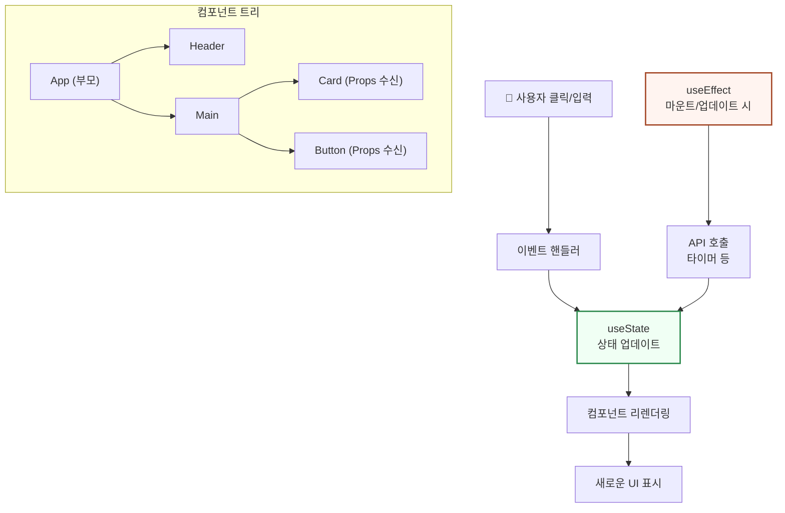
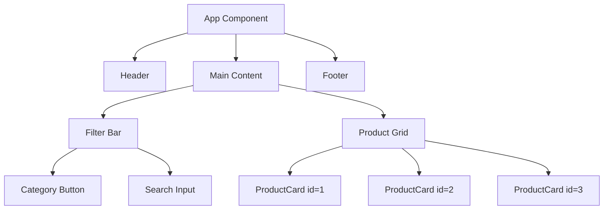
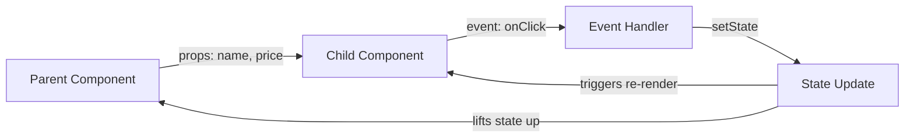
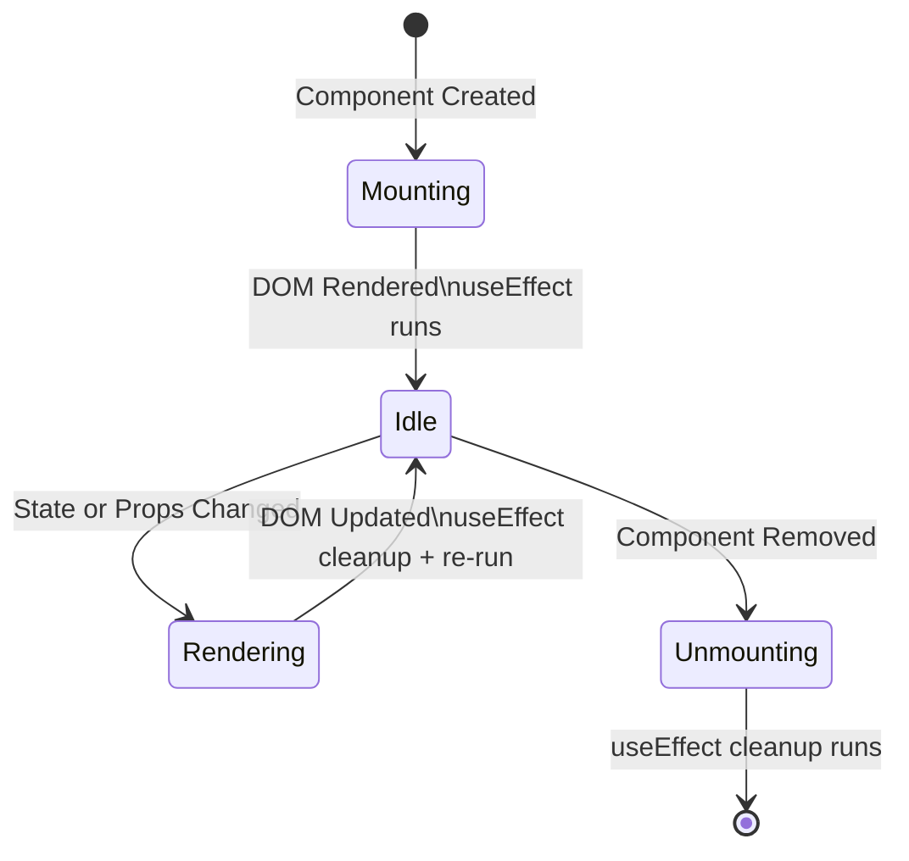

# 4회차: React 기초 (상태/컴포넌트/이벤트)

## 학습 목표

이번 회차를 마치면 다음을 할 수 있게 됩니다.

- 함수형 컴포넌트를 작성하고 JSX 문법으로 UI를 표현할 수 있습니다.
- Props를 사용하여 부모 컴포넌트에서 자식 컴포넌트로 데이터를 전달할 수 있습니다.
- useState Hook으로 컴포넌트의 상태를 관리하고 화면을 동적으로 업데이트할 수 있습니다.
- useEffect Hook으로 컴포넌트가 마운트될 때 데이터를 불러오는 사이드 이펙트를 처리할 수 있습니다.
- 배열 데이터를 map()으로 렌더링하고, onClick/onChange 이벤트를 처리할 수 있습니다.

---

## 이번 세션 전체 그림



React 앱은 컴포넌트 트리로 구성되며, 상태(State)가 바뀔 때마다 해당 컴포넌트와 자식들이 다시 렌더링됩니다. 이 세션에서는 이 흐름을 직접 만들어봅니다. useState가 상태를 관리하고, useEffect가 사이드 이펙트를 처리하는 역할을 이해하는 것이 핵심입니다.

---

## 핵심 개념

### 1. 함수형 컴포넌트와 JSX 문법

> **왜 필요한가?** HTML, CSS, JavaScript를 각각 파일로 분리하는 전통 방식은 '기술 분리'입니다. React는 '기능 분리'를 선택했습니다. 버튼 하나를 만들 때 필요한 마크업, 스타일, 로직을 하나의 컴포넌트에 모아두면 재사용과 유지보수가 훨씬 쉬워집니다. 100개의 상품 카드를 위해 100개의 파일을 만들 필요가 없어집니다.

React에서 UI의 가장 작은 단위는 **컴포넌트(Component)**입니다. 컴포넌트는 레고 블록과 같습니다. 작은 블록(버튼, 카드, 입력창)을 만들고, 이를 조합해 큰 구조물(페이지, 대시보드)을 완성합니다.

함수형 컴포넌트는 단순히 JSX를 반환하는 JavaScript 함수입니다. **JSX(JavaScript XML)**는 JavaScript 안에서 HTML처럼 UI를 작성할 수 있는 문법 확장입니다. 실제로는 빌드 과정에서 `React.createElement()` 호출로 변환됩니다.

> **📎 연결 포인트 → 5회차 (Next.js)**: React 컴포넌트를 그대로 Next.js에서 사용합니다. 5회차에서 배울 Server Component와 Client Component의 차이를 이해하는 데 이번 컴포넌트 개념이 기반이 됩니다.

JSX의 핵심 규칙은 다음과 같습니다.

- 반드시 하나의 최상위 요소를 반환해야 합니다. 여러 요소를 반환하려면 `<>...</>` (Fragment)로 감쌉니다.
- HTML의 `class` 속성은 JSX에서 `className`으로 작성합니다.
- JavaScript 표현식은 `{중괄호}` 안에 작성합니다.
- 컴포넌트 이름은 반드시 대문자로 시작해야 합니다 (`MyComponent`, `Button`).

```tsx
// Basic functional component with JSX
function Greeting({ name }: { name: string }) {
  const isVip = name === "Alice";

  return (
    <div className="card">
      <h1>안녕하세요, {name}님!</h1>
      {isVip && <span className="badge">VIP 회원</span>}
      <p>현재 시각: {new Date().toLocaleTimeString("ko-KR")}</p>
    </div>
  );
}

export default Greeting;
```

### 2. Props: 부모에서 자식으로 데이터 전달

> **왜 필요한가?** 컴포넌트를 재사용하려면 외부에서 데이터를 받을 수 있어야 합니다. Props는 함수의 매개변수(parameter)와 같습니다. 같은 `Card` 컴포넌트에 다른 Props를 전달하면 다른 내용의 카드를 만들 수 있습니다. Props 없이는 모든 컴포넌트가 완전히 독립적인 고정 값을 가져야 합니다.

**Props(Properties)**는 부모 컴포넌트가 자식 컴포넌트에게 전달하는 데이터입니다. 마치 함수의 매개변수처럼 동작합니다. Props는 **읽기 전용**입니다. 자식 컴포넌트는 받은 props를 직접 수정할 수 없습니다.

TypeScript를 사용하면 interface나 type으로 props의 타입을 정의해서 실수를 방지할 수 있습니다.

```tsx
// Defining props type with TypeScript interface
interface ProductCardProps {
  id: number;
  name: string;
  price: number;
  category: string;
  inStock: boolean;
}

// Receiving props as function parameter
function ProductCard({ id, name, price, category, inStock }: ProductCardProps) {
  return (
    <div className="product-card">
      <span className="category-tag">{category}</span>
      <h3>{name}</h3>
      <p className="price">{price.toLocaleString("ko-KR")}원</p>
      {inStock ? (
        <button>장바구니 담기</button>
      ) : (
        <p className="out-of-stock">품절</p>
      )}
    </div>
  );
}

// Parent component passing props to child
function ProductList() {
  return (
    <div>
      <ProductCard
        id={1}
        name="무선 이어폰"
        price={89000}
        category="전자제품"
        inStock={true}
      />
      <ProductCard
        id={2}
        name="노트북 거치대"
        price={45000}
        category="주변기기"
        inStock={false}
      />
    </div>
  );
}
```

### 3. State: useState Hook으로 상태 관리

> **왜 필요한가?** 일반 변수에 값을 바꿔도 화면은 다시 그려지지 않습니다. React는 어떤 값이 바뀌었는지 알 수 없기 때문입니다. `useState`는 React에게 "이 값이 바뀌면 이 컴포넌트를 다시 그려줘"라고 등록하는 방법입니다. 변수와 상태(State)의 차이가 바로 이것입니다.

> **흔한 오해**: "state를 직접 수정해도 되지 않나요? `count = count + 1`처럼요."
> **실제로는**: 직접 수정하면 React가 변경을 감지하지 못합니다. 화면이 업데이트되지 않습니다. 반드시 `setCount(count + 1)` 형태로 setter 함수를 사용해야 합니다.
>
> 이 오해는 자연스럽습니다. 일반 JavaScript에서는 변수를 직접 바꾸는 게 당연하니까요. React는 "불변성(immutability)"이라는 개념으로 상태 변경을 추적합니다.

> **📎 연결 포인트 → 복잡한 상태 관리**: 컴포넌트 간에 공유해야 하는 상태가 많아지면 useState만으로는 부족해집니다. Zustand, Redux 같은 상태 관리 라이브러리가 이 문제를 해결합니다. 규모가 커질 때를 대비한 확장 경로입니다.

**State(상태)**는 컴포넌트가 자체적으로 기억하는 데이터입니다. State가 변경되면 React는 해당 컴포넌트를 자동으로 다시 렌더링합니다. `useState` Hook은 `[현재 값, 값을 변경하는 함수]` 쌍을 반환합니다.

Props와 State의 차이를 기억해 주세요.

| 구분 | Props | State |
|------|-------|-------|
| 출처 | 부모 컴포넌트에서 받음 | 컴포넌트 내부에서 생성 |
| 수정 | 읽기 전용 (수정 불가) | setState 함수로만 수정 |
| 변경 시 | 부모가 변경 | 직접 변경 가능 |

```tsx
import { useState } from "react";

interface CartItem {
  id: number;
  name: string;
  price: number;
  quantity: number;
}

function ShoppingCart() {
  // useState: [current value, setter function]
  const [items, setItems] = useState<CartItem[]>([
    { id: 1, name: "무선 이어폰", price: 89000, quantity: 1 },
    { id: 2, name: "충전 케이블", price: 12000, quantity: 2 },
  ]);
  const [couponApplied, setCouponApplied] = useState(false);

  // Calculate total price
  const totalPrice = items.reduce(
    (sum, item) => sum + item.price * item.quantity,
    0
  );
  const discountedPrice = couponApplied
    ? Math.floor(totalPrice * 0.9)
    : totalPrice;

  // Update quantity for a specific item
  const updateQuantity = (id: number, delta: number) => {
    setItems((prev) =>
      prev.map((item) =>
        item.id === id
          ? { ...item, quantity: Math.max(1, item.quantity + delta) }
          : item
      )
    );
  };

  return (
    <div className="cart">
      <h2>장바구니</h2>
      {items.map((item) => (
        <div key={item.id} className="cart-item">
          <span>{item.name}</span>
          <div className="quantity-control">
            <button onClick={() => updateQuantity(item.id, -1)}>-</button>
            <span>{item.quantity}</span>
            <button onClick={() => updateQuantity(item.id, +1)}>+</button>
          </div>
          <span>{(item.price * item.quantity).toLocaleString("ko-KR")}원</span>
        </div>
      ))}
      <div className="total">
        <label>
          <input
            type="checkbox"
            checked={couponApplied}
            onChange={(e) => setCouponApplied(e.target.checked)}
          />
          10% 할인 쿠폰 적용
        </label>
        <p>합계: {discountedPrice.toLocaleString("ko-KR")}원</p>
      </div>
    </div>
  );
}
```

### 4. useEffect: 사이드 이펙트 처리

> **왜 필요한가?** 컴포넌트가 렌더링되는 도중에 API를 호출하거나 타이머를 설정하면 렌더링 성능에 영향을 줍니다. `useEffect`는 렌더링이 완료된 후 실행될 코드를 등록합니다. "화면을 먼저 보여준 후, 데이터를 불러와서 업데이트한다"는 패턴을 구현할 수 있습니다.

> **진화 맥락 — 클래스형 → 함수형 컴포넌트**: React 16.8(2019년) 이전에는 상태 관리를 위해 클래스형 컴포넌트를 써야 했습니다. `this.setState()`, `this.state`, 라이프사이클 메서드(`componentDidMount` 등)가 복잡했습니다. Hooks(useState, useEffect)의 등장으로 함수형 컴포넌트에서도 상태를 관리할 수 있게 되었고, 현재 모든 새 프로젝트는 함수형 컴포넌트가 표준입니다.

> **📎 연결 포인트 → 6회차 (비동기 프로그래밍)**: useEffect 안에서 API를 호출할 때 async/await를 사용합니다. 6회차에서 배울 비동기 패턴이 여기서 직접 적용됩니다.

**useEffect**는 컴포넌트가 화면에 표시된 후, 또는 특정 값이 변경된 후에 실행할 작업을 등록합니다. API에서 데이터를 불러오기, 타이머 설정, 이벤트 리스너 등록 등이 대표적인 사이드 이펙트입니다.

두 번째 인자인 **의존성 배열(dependency array)**이 핵심입니다.

- `[]` (빈 배열): 컴포넌트가 처음 마운트될 때 한 번만 실행됩니다.
- `[value]`: value가 변경될 때마다 실행됩니다.
- 생략 시: 매 렌더링마다 실행됩니다 (보통 이렇게 사용하지 않습니다).

```tsx
import { useState, useEffect } from "react";

interface User {
  id: number;
  name: string;
  email: string;
}

function UserProfile({ userId }: { userId: number }) {
  const [user, setUser] = useState<User | null>(null);
  const [loading, setLoading] = useState(true);
  const [error, setError] = useState<string | null>(null);

  // Runs when component mounts or userId changes
  useEffect(() => {
    setLoading(true);
    setError(null);

    fetch(`https://jsonplaceholder.typicode.com/users/${userId}`)
      .then((res) => {
        if (!res.ok) throw new Error("사용자를 찾을 수 없습니다.");
        return res.json();
      })
      .then((data: User) => {
        setUser(data);
        setLoading(false);
      })
      .catch((err: Error) => {
        setError(err.message);
        setLoading(false);
      });
  }, [userId]); // Re-runs when userId changes

  if (loading) return <p>로딩 중...</p>;
  if (error) return <p className="error">{error}</p>;
  if (!user) return null;

  return (
    <div className="profile">
      <h2>{user.name}</h2>
      <p>{user.email}</p>
    </div>
  );
}
```

### 5. 리스트 렌더링 (map)과 key 속성

> **왜 필요한가?** React는 성능을 위해 변경된 부분만 실제 DOM에 반영합니다. 리스트에서 어떤 항목이 추가/삭제/변경되었는지 추적하려면 고유한 식별자가 필요합니다. `key`가 없으면 React는 전체 리스트를 다시 그립니다.

> **흔한 오해**: "`key`에 배열 인덱스(0, 1, 2...)를 써도 되지 않나요?"
> **실제로는**: 항목이 추가되거나 삭제되면 인덱스가 바뀝니다. React는 key가 같으면 같은 항목이라고 판단하므로, 인덱스를 key로 쓰면 잘못된 컴포넌트가 재사용될 수 있습니다. 고유한 ID(데이터베이스 id, uuid 등)를 key로 사용하세요.

배열 데이터를 화면에 표시할 때는 `Array.map()`을 사용합니다. map은 각 배열 요소를 JSX로 변환합니다. 이때 반드시 각 항목에 고유한 `key` prop을 지정해야 합니다. key는 React가 어떤 항목이 변경되었는지 효율적으로 파악하는 데 사용됩니다.

**주의:** key로 배열 인덱스(`index`)를 사용하면 항목 순서가 바뀔 때 버그가 발생할 수 있습니다. 데이터베이스 ID처럼 고유하고 안정적인 값을 사용하세요.

```tsx
interface Product {
  id: number;
  name: string;
  price: number;
  category: "전자제품" | "주변기기" | "소프트웨어";
}

const products: Product[] = [
  { id: 1, name: "무선 마우스", price: 35000, category: "주변기기" },
  { id: 2, name: "USB 허브", price: 28000, category: "주변기기" },
  { id: 3, name: "VS Code", price: 0, category: "소프트웨어" },
];

function ProductGrid() {
  const [selectedCategory, setSelectedCategory] = useState<string>("전체");

  const categories = ["전체", "전자제품", "주변기기", "소프트웨어"];

  // Filter products based on selected category
  const filteredProducts =
    selectedCategory === "전체"
      ? products
      : products.filter((p) => p.category === selectedCategory);

  return (
    <div>
      {/* Category filter buttons */}
      <div className="filter-bar">
        {categories.map((cat) => (
          <button
            key={cat}
            className={selectedCategory === cat ? "active" : ""}
            onClick={() => setSelectedCategory(cat)}
          >
            {cat}
          </button>
        ))}
      </div>

      {/* Product list - using id as key (not index) */}
      <div className="product-grid">
        {filteredProducts.length === 0 ? (
          <p>해당 카테고리에 상품이 없습니다.</p>
        ) : (
          filteredProducts.map((product) => (
            <div key={product.id} className="product-card">
              <h3>{product.name}</h3>
              <p>{product.price === 0 ? "무료" : `${product.price.toLocaleString("ko-KR")}원`}</p>
              <span className="category">{product.category}</span>
            </div>
          ))
        )}
      </div>
    </div>
  );
}
```

### 6. 이벤트 핸들링과 조건부 렌더링

React에서 이벤트 핸들러는 camelCase로 작성합니다 (`onClick`, `onChange`, `onSubmit`). 이벤트 객체를 매개변수로 받아 사용할 수 있습니다.

**조건부 렌더링**은 특정 조건에 따라 다른 UI를 보여주는 기법입니다. 두 가지 방법이 주로 사용됩니다.

- **삼항 연산자** `condition ? <A /> : <B />`: 두 가지 UI 중 하나를 선택할 때
- **AND 연산자** `condition && <A />`: 조건이 참일 때만 렌더링할 때

```tsx
import { useState } from "react";

function SearchForm() {
  const [query, setQuery] = useState("");
  const [results, setResults] = useState<string[]>([]);
  const [isSearching, setIsSearching] = useState(false);
  const [hasSearched, setHasSearched] = useState(false);

  const handleSearch = async (e: React.FormEvent) => {
    // Prevent default form submission behavior
    e.preventDefault();
    if (!query.trim()) return;

    setIsSearching(true);
    setHasSearched(true);

    // Simulate API search delay
    await new Promise((resolve) => setTimeout(resolve, 800));
    const mockResults = query.length > 2
      ? ["React 공식 문서", "React 튜토리얼", "React 훅 가이드"]
      : [];
    setResults(mockResults);
    setIsSearching(false);
  };

  const handleClear = () => {
    setQuery("");
    setResults([]);
    setHasSearched(false);
  };

  return (
    <div className="search-container">
      <form onSubmit={handleSearch}>
        <input
          type="text"
          value={query}
          onChange={(e) => setQuery(e.target.value)}
          placeholder="검색어를 입력하세요..."
        />
        <button type="submit" disabled={isSearching}>
          {isSearching ? "검색 중..." : "검색"}
        </button>
        {/* Show clear button only when there is a query */}
        {query && (
          <button type="button" onClick={handleClear}>
            지우기
          </button>
        )}
      </form>

      {/* Conditional rendering with ternary operator */}
      {isSearching ? (
        <p>검색 중입니다...</p>
      ) : hasSearched ? (
        results.length > 0 ? (
          <ul>
            {results.map((result, idx) => (
              <li key={idx}>{result}</li>
            ))}
          </ul>
        ) : (
          <p>"{query}"에 대한 검색 결과가 없습니다.</p>
        )
      ) : null}
    </div>
  );
}
```

---

## 다이어그램

### 컴포넌트 트리 구조

React 앱은 컴포넌트들이 트리 구조로 구성됩니다. 최상위 App 컴포넌트에서 시작해 하위 컴포넌트로 이어지는 구조입니다.



### Props와 State 데이터 흐름

Props는 부모에서 자식으로 한 방향으로만 흐릅니다. State는 컴포넌트 내부에서 관리되며, 변경되면 리렌더링을 일으킵니다.



### React 컴포넌트 생명주기 (State Diagram)

컴포넌트는 마운트, 업데이트, 언마운트 세 단계를 거칩니다. useEffect는 이 과정에서 특정 시점에 실행됩니다.



---

## 코드 예제 (심화)

### 완성된 대시보드 컴포넌트 조합 예제

실제 프로젝트에서 컴포넌트를 어떻게 조합하는지 보여주는 종합 예제입니다.

```tsx
import { useState, useEffect } from "react";

// Type definitions
interface Product {
  id: number;
  title: string;
  price: number;
  category: string;
  rating: { rate: number; count: number };
}

// Atom: Badge component
function Badge({ children, color = "blue" }: { children: string; color?: string }) {
  return (
    <span className={`badge badge-${color}`}>{children}</span>
  );
}

// Molecule: Product card component
function ProductCard({
  product,
  onSelect,
}: {
  product: Product;
  onSelect: (product: Product) => void;
}) {
  return (
    <div className="card" onClick={() => onSelect(product)}>
      <Badge>{product.category}</Badge>
      <h3>{product.title}</h3>
      <p className="price">${product.price.toFixed(2)}</p>
      <div className="rating">
        <span>★ {product.rating.rate}</span>
        <span>({product.rating.count}개 리뷰)</span>
      </div>
    </div>
  );
}

// Organism: Dashboard page assembling all components
function Dashboard() {
  const [products, setProducts] = useState<Product[]>([]);
  const [loading, setLoading] = useState(true);
  const [selectedProduct, setSelectedProduct] = useState<Product | null>(null);
  const [searchQuery, setSearchQuery] = useState("");

  useEffect(() => {
    fetch("https://fakestoreapi.com/products?limit=12")
      .then((res) => res.json())
      .then((data: Product[]) => {
        setProducts(data);
        setLoading(false);
      });
  }, []);

  const filteredProducts = products.filter((p) =>
    p.title.toLowerCase().includes(searchQuery.toLowerCase())
  );

  if (loading) return <div className="loading">상품을 불러오는 중...</div>;

  return (
    <div className="dashboard">
      <header>
        <h1>상품 대시보드</h1>
        <input
          type="search"
          placeholder="상품 검색..."
          value={searchQuery}
          onChange={(e) => setSearchQuery(e.target.value)}
        />
      </header>

      <main>
        <div className="product-grid">
          {filteredProducts.map((product) => (
            <ProductCard
              key={product.id}
              product={product}
              onSelect={setSelectedProduct}
            />
          ))}
        </div>
      </main>

      {/* Modal-like detail view */}
      {selectedProduct && (
        <div className="modal-overlay" onClick={() => setSelectedProduct(null)}>
          <div className="modal" onClick={(e) => e.stopPropagation()}>
            <h2>{selectedProduct.title}</h2>
            <p>가격: ${selectedProduct.price}</p>
            <p>카테고리: {selectedProduct.category}</p>
            <button onClick={() => setSelectedProduct(null)}>닫기</button>
          </div>
        </div>
      )}
    </div>
  );
}

export default Dashboard;
```

---

## 실습

### 실습 목표

상품 목록 대시보드 UI를 단계적으로 만들어 봅니다. 실습을 통해 컴포넌트 분리, 상태 관리, 이벤트 처리를 직접 경험합니다.

### 기본 실습: 상품 목록 컴포넌트 분리

아래 구조를 참고하여 상품 목록 페이지를 만들어 주세요.

**단계 1: 데이터 준비**

`src/data/products.ts` 파일을 만들고, 최소 6개의 상품 데이터를 담은 배열을 정의합니다. 각 상품은 id, name, price, category, inStock 필드를 가져야 합니다.

**단계 2: ProductCard 컴포넌트 작성**

- props로 상품 데이터를 받아 카드 형태로 표시합니다.
- inStock이 false이면 "품절" 표시를 보여줍니다.
- price는 `toLocaleString("ko-KR")`으로 포맷합니다.

**단계 3: ProductList 컴포넌트 작성**

- products 배열을 받아 map()으로 ProductCard를 렌더링합니다.
- 배열이 비어있을 때 "상품이 없습니다" 메시지를 표시합니다.

**단계 4: App 컴포넌트에서 조합**

- useState로 products 상태를 관리합니다.
- useEffect로 컴포넌트가 마운트될 때 products 데이터를 불러옵니다.

### 도전 실습: 카테고리 필터 + 검색 기능 추가

기본 실습을 완료했다면, 다음 기능을 추가해 보세요.

**카테고리 필터 추가:**

- 상품 카테고리 목록을 추출하여 필터 버튼으로 만들기
- 선택된 카테고리에 맞는 상품만 표시하기 (`filter()` 활용)
- "전체" 버튼 클릭 시 모든 상품 표시하기

**검색 기능 추가:**

- 텍스트 입력창을 만들고, onChange로 검색어 상태를 관리합니다.
- 검색어가 포함된 상품만 화면에 표시합니다 (대소문자 무시).
- 필터와 검색이 동시에 적용되어야 합니다.

```tsx
// Hint: Combine filter and search
const displayedProducts = products
  .filter((p) => selectedCategory === "전체" || p.category === selectedCategory)
  .filter((p) => p.name.toLowerCase().includes(searchQuery.toLowerCase()));
```

---

## 요약

이번 회차에서 배운 핵심 개념을 정리합니다.

| 개념 | 설명 | Hook |
|------|------|------|
| Component | UI의 독립적인 조각, JSX를 반환하는 함수 | - |
| Props | 부모가 자식에게 전달하는 읽기 전용 데이터 | - |
| State | 컴포넌트 내부에서 관리하는 변경 가능한 데이터 | `useState` |
| Side Effect | 데이터 로딩, 타이머 등 렌더링 외 작업 | `useEffect` |
| 이벤트 | 사용자 상호작용 처리 (onClick, onChange 등) | - |

**핵심 키워드:** Component, JSX, Props, State, useState, useEffect, 리스트 렌더링, key, 이벤트 핸들링, 조건부 렌더링

**다음 회차 미리보기:** 5회차에서는 React를 기반으로 하는 Next.js 프레임워크를 배웁니다. 파일 하나를 만들면 자동으로 페이지가 생성되는 App Router와, 서버에서 직접 데이터를 가져오는 Server Component, 그리고 백엔드 없이도 API를 만들 수 있는 Route Handler를 다룹니다.
