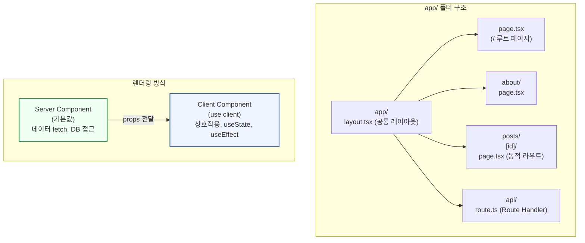
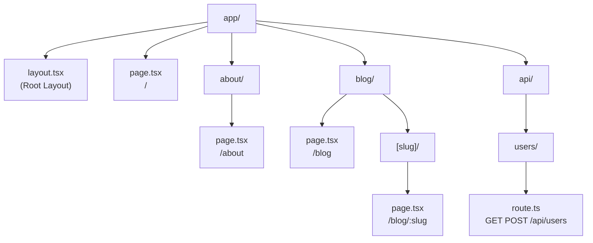
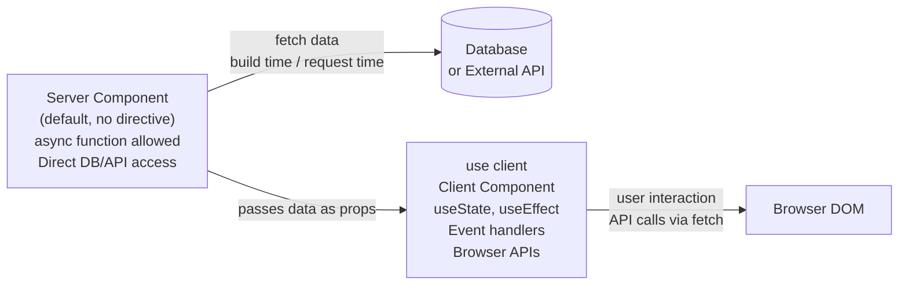
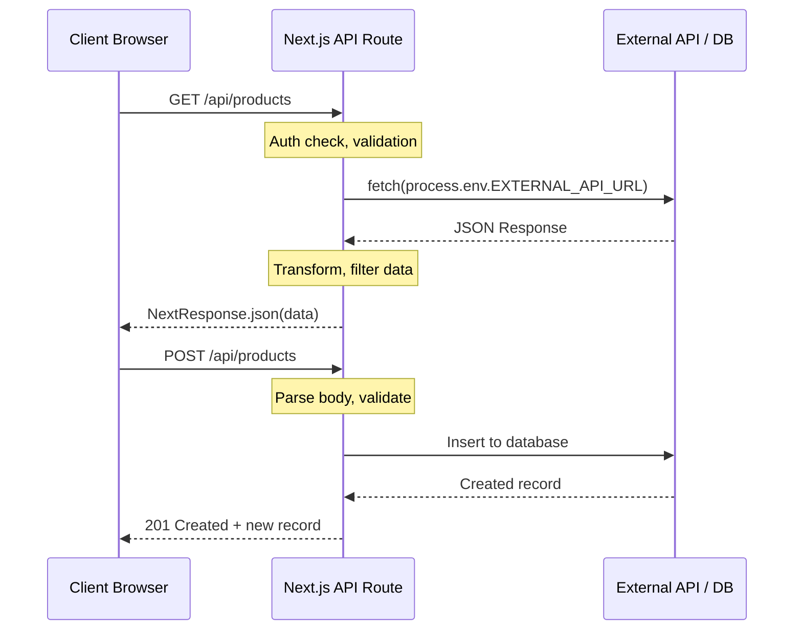

# 5회차: Next.js 기초 (App Router)

## 학습 목표

이번 회차를 마치면 다음을 할 수 있게 됩니다.

- Next.js App Router의 파일 기반 라우팅 구조를 이해하고 페이지를 만들 수 있습니다.
- `page.tsx`, `layout.tsx`, `loading.tsx`, `error.tsx` 의 역할을 구분하고 활용할 수 있습니다.
- 동적 라우팅(`[slug]`)으로 파라미터를 받는 페이지를 만들 수 있습니다.
- 서버 컴포넌트와 클라이언트 컴포넌트(`'use client'`)의 차이를 이해하고 적재적소에 사용할 수 있습니다.
- API Route Handler를 작성하고, 클라이언트에서 해당 API를 호출해 데이터를 화면에 출력할 수 있습니다.

---

## 이번 세션 전체 그림



Next.js App Router에서는 `app/` 폴더의 파일 구조가 URL 구조를 결정합니다. 기본적으로 모든 컴포넌트는 Server Component이며, 상호작용이 필요한 컴포넌트만 `'use client'`를 선언합니다. 이 두 가지 개념이 Next.js 이해의 핵심입니다.

---

## 핵심 개념

### 1. Next.js App Router 개요 및 파일 구조

> **왜 필요한가?** React만으로는 라우팅(URL 관리)을 직접 설정해야 합니다. `react-router-dom` 같은 라이브러리를 추가하고, 코드로 라우트를 등록해야 하죠. Next.js App Router는 `app/` 폴더 안에 파일만 만들면 자동으로 URL이 생성됩니다. "파일 = 페이지" 직관적인 구조입니다.

> **진화 맥락 — Pages Router → App Router**: Next.js 12까지는 `pages/` 폴더를 사용하는 Pages Router가 표준이었습니다. Next.js 13(2022년)에서 `app/` 폴더를 사용하는 App Router가 도입되며 React Server Component를 지원하게 되었습니다. 현재 Next.js 공식 문서는 새 프로젝트에 App Router를 권장합니다. 기존 프로젝트에서 Pages Router를 사용하는 경우도 많으니 두 방식 모두 존재함을 인지해두세요.

Next.js는 React 위에 구축된 **풀스택 프레임워크**입니다. 일반 React 앱은 클라이언트에서만 실행되지만, Next.js는 서버와 클라이언트 양쪽에서 실행할 수 있습니다. App Router(Next.js 13부터 도입)는 `app/` 디렉토리 아래의 파일 구조 자체가 URL 경로가 되는 **파일 기반 라우팅** 방식입니다.

디렉토리 구조를 보면 라우팅이 어떻게 동작하는지 한눈에 알 수 있습니다.

```
app/
├── layout.tsx          → 모든 페이지의 공통 레이아웃 (Root Layout)
├── page.tsx            → "/" 홈 페이지
├── about/
│   └── page.tsx        → "/about" 페이지
├── blog/
│   ├── page.tsx        → "/blog" 목록 페이지
│   └── [slug]/
│       └── page.tsx    → "/blog/react-basics" 상세 페이지
├── api/
│   └── users/
│       └── route.ts    → "/api/users" API 엔드포인트
└── (marketing)/        → URL에 영향 없는 그룹 폴더
    └── contact/
        └── page.tsx    → "/contact" 페이지
```

### 2. page.tsx, layout.tsx, loading.tsx, error.tsx

> **왜 필요한가?** 로딩 상태, 에러 처리, 공통 레이아웃은 모든 페이지에서 반복되는 패턴입니다. Next.js는 이를 파일 이름 컨벤션으로 해결합니다. `loading.tsx`를 만들면 해당 경로의 데이터가 로드되는 동안 자동으로 보여줍니다. 보일러플레이트 코드를 줄여주는 프레임워크의 힘입니다.

Next.js App Router에는 특별한 역할을 하는 예약된 파일명이 있습니다.

**layout.tsx**는 공통 레이아웃을 정의합니다. 같은 디렉토리와 하위 모든 페이지에 적용됩니다. Navigation, Footer처럼 모든 페이지에 공통으로 들어가는 요소를 여기에 넣습니다. 라우트가 변경되어도 레이아웃은 다시 렌더링되지 않습니다.

**loading.tsx**는 페이지 데이터를 로딩하는 동안 자동으로 표시되는 UI입니다. React의 Suspense를 자동으로 활용합니다.

**error.tsx**는 페이지에서 에러가 발생했을 때 표시되는 UI입니다. 반드시 `'use client'` 디렉티브를 추가해야 합니다.

```tsx
// app/layout.tsx - Root Layout (required)
import type { Metadata } from "next";

// Define page metadata for SEO
export const metadata: Metadata = {
  title: {
    template: "%s | My App",
    default: "My App",
  },
  description: "Vibe Coding Bootcamp Project",
};

export default function RootLayout({
  children,
}: {
  children: React.ReactNode;
}) {
  return (
    <html lang="ko">
      <body>
        <nav>
          <a href="/">홈</a>
          <a href="/blog">블로그</a>
        </nav>
        {/* children renders the current page */}
        <main>{children}</main>
        <footer>
          <p>© 2025 My App</p>
        </footer>
      </body>
    </html>
  );
}
```

```tsx
// app/loading.tsx - Automatically shown during page load
export default function Loading() {
  return (
    <div className="loading-spinner">
      <p>페이지를 불러오는 중입니다...</p>
    </div>
  );
}
```

### 3. 동적 라우팅 ([slug], [...slug])

URL 경로의 일부를 변수처럼 사용하는 것이 **동적 라우팅**입니다. 예를 들어 `/blog/react-hooks`, `/blog/nextjs-guide` 처럼 슬러그가 달라지는 URL을 하나의 파일로 처리합니다.

- `[slug]`: 하나의 경로 세그먼트를 동적으로 받습니다 (`/blog/react`)
- `[...slug]`: 나머지 모든 경로 세그먼트를 배열로 받습니다 (`/docs/a/b/c`)
- `[[...slug]]`: 선택적 catch-all (경로가 없어도 매칭)

```tsx
// app/blog/[slug]/page.tsx
interface Post {
  id: number;
  title: string;
  body: string;
  userId: number;
}

// Async Server Component - runs on server, can fetch data directly
export default async function BlogPostPage({
  params,
}: {
  params: Promise<{ slug: string }>;
}) {
  // In Next.js 15, params is a Promise - must await
  const { slug } = await params;
  const postId = parseInt(slug, 10);

  // Direct data fetch on server (no useEffect needed!)
  const res = await fetch(
    `https://jsonplaceholder.typicode.com/posts/${postId}`,
    { next: { revalidate: 3600 } } // Cache for 1 hour
  );

  if (!res.ok) {
    // Triggers the nearest error.tsx
    throw new Error("게시글을 불러오지 못했습니다.");
  }

  const post: Post = await res.json();

  return (
    <article>
      <h1>{post.title}</h1>
      <p>{post.body}</p>
      <a href="/blog">← 목록으로 돌아가기</a>
    </article>
  );
}

// Generate static paths at build time (optional, for SSG)
export async function generateStaticParams() {
  const res = await fetch("https://jsonplaceholder.typicode.com/posts?_limit=10");
  const posts: Post[] = await res.json();
  return posts.map((post) => ({ slug: String(post.id) }));
}
```

### 4. 서버 컴포넌트 vs 클라이언트 컴포넌트

> **왜 필요한가?** 모든 컴포넌트를 클라이언트에서 실행하면 데이터베이스 연결 정보, API 키가 브라우저에 노출될 수 있습니다. Server Component는 서버에서만 실행되므로 민감한 작업을 안전하게 처리하고, 결과만 HTML로 클라이언트에 전달합니다. 성능과 보안 두 가지를 동시에 얻습니다.

> **흔한 오해**: "`'use client'`를 파일 맨 위에 쓰면 그 파일 전체가 클라이언트에서 실행된다."
> **실제로는**: `'use client'`는 "이 컴포넌트부터 클라이언트 경계를 시작한다"는 선언입니다. 해당 컴포넌트와 그 자식 컴포넌트들이 클라이언트에서 렌더링됩니다. 기본값이 서버 컴포넌트이므로, `'use client'`가 없는 모든 컴포넌트는 서버에서 실행됩니다.

> **📎 연결 포인트 → 4회차 (React)**: Next.js는 React 위에 구축되어 있습니다. 4회차에서 배운 컴포넌트, useState, useEffect는 Client Component에서 그대로 사용합니다. Server Component는 React의 개념을 서버 환경으로 확장한 것입니다.

이것이 Next.js App Router에서 가장 중요한 개념입니다.

**서버 컴포넌트(Server Component)**는 App Router의 기본값입니다. 서버에서만 실행되므로 데이터베이스나 외부 API를 바로 접근할 수 있습니다. JavaScript 번들에 포함되지 않아 클라이언트 성능이 향상됩니다.

**클라이언트 컴포넌트(Client Component)**는 `'use client'` 디렉티브를 파일 맨 위에 추가하면 됩니다. 브라우저에서 실행되며 useState, useEffect, onClick 같은 인터랙션이 필요한 경우에 사용합니다.

| 기능 | 서버 컴포넌트 | 클라이언트 컴포넌트 |
|------|-------------|-----------------|
| 데이터 직접 fetch | 가능 | 불가 (useEffect 필요) |
| useState / useEffect | 사용 불가 | 사용 가능 |
| 클릭, 입력 이벤트 | 사용 불가 | 사용 가능 |
| 브라우저 API (window 등) | 사용 불가 | 사용 가능 |
| JS 번들 크기 | 포함 안 됨 | 포함됨 |

```tsx
// app/page.tsx - Server Component (default)
// No 'use client' = runs on server
async function getProducts() {
  const res = await fetch("https://fakestoreapi.com/products?limit=6", {
    next: { revalidate: 60 }, // Revalidate every 60 seconds (ISR)
  });
  return res.json();
}

interface Product {
  id: number;
  title: string;
  price: number;
  image: string;
}

export default async function HomePage() {
  // Data fetching directly in component - server only
  const products: Product[] = await getProducts();

  return (
    <div>
      <h1>추천 상품</h1>
      <div className="grid">
        {products.map((product) => (
          <div key={product.id} className="card">
            
            <h3>{product.title}</h3>
            <p>${product.price}</p>
          </div>
        ))}
      </div>
    </div>
  );
}
```

```tsx
// components/SearchBar.tsx - Client Component
"use client"; // This directive makes it a Client Component

import { useState } from "react";
import { useRouter } from "next/navigation";

export default function SearchBar() {
  const [query, setQuery] = useState("");
  const router = useRouter();

  const handleSearch = (e: React.FormEvent) => {
    e.preventDefault();
    if (query.trim()) {
      // Navigate programmatically
      router.push(`/search?q=${encodeURIComponent(query)}`);
    }
  };

  return (
    <form onSubmit={handleSearch}>
      <input
        value={query}
        onChange={(e) => setQuery(e.target.value)}
        placeholder="검색어 입력..."
      />
      <button type="submit">검색</button>
    </form>
  );
}
```

### 5. API Route Handler

> **왜 필요한가?** 별도 Express 서버를 만들지 않고 Next.js 프로젝트 내에서 API를 구현할 수 있습니다. `app/api/` 폴더에 `route.ts`를 만들면 됩니다. 프론트엔드와 백엔드를 하나의 프로젝트에서 관리할 수 있어 배포와 유지보수가 단순해집니다.

> **📎 연결 포인트 → 7-9회차 (데이터베이스/인증)**: Server Component에서 Supabase를 직접 호출하면 API 키를 노출하지 않고 데이터를 가져올 수 있습니다. Route Handler에서 JWT 검증을 처리하는 패턴을 9회차에서 구현합니다.

> **📎 연결 포인트 → 12회차 (배포)**: Next.js는 Vercel이 만든 프레임워크입니다. Vercel에 배포하면 자동으로 최적화됩니다. EC2에도 배포할 수 있지만, Vercel 배포가 가장 간단합니다.

Next.js의 API Route Handler를 사용하면 Next.js 앱 안에 백엔드 API를 만들 수 있습니다. `app/api/` 디렉토리 아래의 `route.ts` 파일이 API 엔드포인트가 됩니다.

각 HTTP 메서드(GET, POST, PUT, DELETE)에 해당하는 함수를 export하면 됩니다.

```typescript
// app/api/products/route.ts
import { NextRequest, NextResponse } from "next/server";

// In-memory data store (use database in production)
let products = [
  { id: 1, name: "무선 이어폰", price: 89000, category: "전자제품" },
  { id: 2, name: "노트북 거치대", price: 45000, category: "주변기기" },
  { id: 3, name: "기계식 키보드", price: 125000, category: "주변기기" },
];

// GET /api/products or GET /api/products?category=주변기기
export async function GET(request: NextRequest) {
  const { searchParams } = new URL(request.url);
  const category = searchParams.get("category");

  const filtered = category
    ? products.filter((p) => p.category === category)
    : products;

  return NextResponse.json({ data: filtered, total: filtered.length });
}

// POST /api/products
export async function POST(request: NextRequest) {
  try {
    const body = await request.json();

    // Basic validation
    if (!body.name || !body.price || !body.category) {
      return NextResponse.json(
        { error: "name, price, category는 필수입니다." },
        { status: 400 }
      );
    }

    const newProduct = {
      id: products.length + 1,
      name: body.name,
      price: Number(body.price),
      category: body.category,
    };
    products.push(newProduct);

    return NextResponse.json(newProduct, { status: 201 });
  } catch {
    return NextResponse.json(
      { error: "요청 처리 중 오류가 발생했습니다." },
      { status: 500 }
    );
  }
}
```

```typescript
// app/api/products/[id]/route.ts - Dynamic route for individual product
import { NextRequest, NextResponse } from "next/server";

export async function GET(
  request: NextRequest,
  { params }: { params: Promise<{ id: string }> }
) {
  const { id } = await params;
  // Fetch from external API, using server-side env variable
  const res = await fetch(
    `${process.env.EXTERNAL_API_URL}/products/${id}`
  );

  if (!res.ok) {
    return NextResponse.json({ error: "상품을 찾을 수 없습니다." }, { status: 404 });
  }

  const data = await res.json();
  return NextResponse.json(data);
}
```

### 6. 환경변수 관리

환경변수는 API 키, 데이터베이스 URL처럼 코드에 직접 넣으면 안 되는 민감한 정보를 관리하는 방법입니다.

**`NEXT_PUBLIC_` 접두사 규칙이 핵심입니다.**

- `NEXT_PUBLIC_`으로 시작하는 변수: 브라우저에서도 사용 가능 (클라이언트 노출 주의)
- 그 외 변수: 서버에서만 사용 가능 (브라우저에서 접근 불가, 안전)

```bash
# .env.local (never commit to git!)
# Server-only variables (safe for secrets)
DATABASE_URL=postgresql://localhost:5432/mydb
API_SECRET_KEY=your-very-secret-key-here
EXTERNAL_API_URL=https://api.example.com

# Public variables (exposed to browser, no secrets!)
NEXT_PUBLIC_APP_NAME=My Dashboard
NEXT_PUBLIC_API_BASE_URL=https://api.example.com/public
```

```typescript
// Server-side: access any env variable
// app/api/data/route.ts
export async function GET() {
  // SERVER-ONLY: process.env.API_SECRET_KEY is undefined in browser
  const response = await fetch(process.env.EXTERNAL_API_URL + "/data", {
    headers: {
      Authorization: `Bearer ${process.env.API_SECRET_KEY}`,
    },
  });
  const data = await response.json();
  return Response.json(data);
}
```

```tsx
// Client-side: only NEXT_PUBLIC_ variables are available
"use client";

export default function AppHeader() {
  // NEXT_PUBLIC_ prefix = safe to use in browser
  const appName = process.env.NEXT_PUBLIC_APP_NAME ?? "My App";

  // WARNING: process.env.API_SECRET_KEY would be undefined here!
  return <h1>{appName}</h1>;
}
```

---

## 다이어그램

### App Router 디렉토리 구조와 라우팅

파일 시스템이 곧 URL 구조가 됩니다.



### 서버 컴포넌트와 클라이언트 컴포넌트 비교

서버와 클라이언트 컴포넌트의 실행 위치와 역할이 다릅니다.



### API Route 요청-응답 흐름

클라이언트에서 Next.js API Route를 거쳐 외부 서비스로 요청이 전달되는 구조입니다.



---

## 코드 예제 (종합)

### 서버 컴포넌트에서 클라이언트 컴포넌트로 데이터 전달

서버 컴포넌트가 데이터를 가져와 클라이언트 컴포넌트에 props로 넘겨주는 실전 패턴입니다.

```tsx
// app/dashboard/page.tsx - Server Component fetches data
import ProductFilter from "@/components/ProductFilter";

interface Product {
  id: number;
  title: string;
  price: number;
  category: string;
}

async function getProducts(): Promise<Product[]> {
  // Runs on server - can use secret env variables
  const res = await fetch(`${process.env.EXTERNAL_API_URL}/products`, {
    next: { revalidate: 60 }, // ISR: refresh every 60 seconds
  });
  if (!res.ok) throw new Error("Failed to fetch products");
  return res.json();
}

export default async function DashboardPage() {
  const products = await getProducts();
  const categories = [...new Set(products.map((p) => p.category))];

  // Pass data to Client Component as props
  return (
    <div>
      <h1>상품 대시보드</h1>
      <ProductFilter products={products} categories={categories} />
    </div>
  );
}
```

```tsx
// components/ProductFilter.tsx - Client Component for interactivity
"use client";

import { useState } from "react";

interface Product {
  id: number;
  title: string;
  price: number;
  category: string;
}

export default function ProductFilter({
  products,
  categories,
}: {
  products: Product[];
  categories: string[];
}) {
  const [selected, setSelected] = useState("all");
  const [search, setSearch] = useState("");

  const filtered = products
    .filter((p) => selected === "all" || p.category === selected)
    .filter((p) => p.title.toLowerCase().includes(search.toLowerCase()));

  return (
    <div>
      <input
        placeholder="검색..."
        value={search}
        onChange={(e) => setSearch(e.target.value)}
      />
      <div className="categories">
        <button onClick={() => setSelected("all")}>전체</button>
        {categories.map((cat) => (
          <button key={cat} onClick={() => setSelected(cat)}>
            {cat}
          </button>
        ))}
      </div>
      <ul>
        {filtered.map((p) => (
          <li key={p.id}>
            {p.title} - ${p.price}
          </li>
        ))}
      </ul>
    </div>
  );
}
```

---

## 실습

### 실습 목표

Next.js App Router를 사용해 API를 만들고, 그 데이터를 화면에 출력하는 전체 흐름을 경험합니다.

### 기본 실습: API Route 생성 + 클라이언트 데이터 출력

**단계 1: 프로젝트 생성**

```bash
npx create-next-app@latest my-product-app --typescript --tailwind --app
cd my-product-app
```

**단계 2: API Route 작성**

`app/api/products/route.ts` 파일을 만들고, 상품 배열을 JSON으로 반환하는 GET 핸들러를 작성합니다.

**단계 3: 서버 컴포넌트에서 데이터 불러오기**

`app/page.tsx`를 async 함수로 변경하고, 직접 API를 호출해 데이터를 받아 화면에 렌더링합니다.

**단계 4: 클라이언트 컴포넌트에서 불러오기 (비교)**

`components/ProductListClient.tsx`를 `'use client'`로 만들고, `useEffect` + `fetch`로 같은 API를 호출합니다. 서버 컴포넌트 방식과 어떤 차이가 있는지 비교해 보세요.

**확인 포인트:**

- 서버 컴포넌트는 브라우저의 Network 탭에 fetch 요청이 보이지 않습니다.
- 클라이언트 컴포넌트는 Network 탭에서 `/api/products` 요청을 확인할 수 있습니다.

### 도전 실습: 동적 라우팅으로 상세 페이지 구현

**단계 1: 상세 API Route 추가**

`app/api/products/[id]/route.ts`를 만들어 특정 id의 상품을 반환합니다.

**단계 2: 상세 페이지 생성**

`app/products/[id]/page.tsx`를 만들어 동적 라우팅을 구현합니다. URL에서 id를 읽어 해당 상품의 상세 정보를 표시합니다.

**단계 3: 목록 → 상세 연결**

상품 목록 페이지에서 각 카드를 클릭하면 `/products/1`, `/products/2` 처럼 상세 페이지로 이동하도록 Next.js의 `<Link>` 컴포넌트를 사용합니다.

```tsx
// Hint: Using Link component for navigation
import Link from "next/link";

// In product card:
<Link href={`/products/${product.id}`}>
  상세 보기
</Link>
```

---

## 요약

이번 회차에서 배운 핵심 개념을 정리합니다.

| 파일/개념 | 역할 |
|----------|------|
| `app/page.tsx` | 해당 경로의 페이지 컴포넌트 |
| `app/layout.tsx` | 공통 레이아웃, 모든 하위 페이지에 적용 |
| `app/loading.tsx` | 데이터 로딩 중 표시되는 UI |
| `app/error.tsx` | 에러 발생 시 표시되는 UI (`'use client'` 필요) |
| `app/[slug]/page.tsx` | 동적 라우팅, URL 파라미터를 받는 페이지 |
| `app/api/route.ts` | API Route Handler |
| `'use client'` | 클라이언트 컴포넌트 선언 디렉티브 |
| `.env.local` | 환경변수 파일 (git 커밋 금지) |
| `NEXT_PUBLIC_` | 브라우저에서 접근 가능한 환경변수 접두사 |

**핵심 키워드:** App Router, 파일 기반 라우팅, 서버 컴포넌트, 클라이언트 컴포넌트, API Route Handler, 동적 라우팅, 환경변수

**다음 회차 미리보기:** 6회차에서는 비동기 프로그래밍의 핵심인 Promise와 async/await를 깊이 다룹니다. 또한 개발 중 필수적인 디버깅 기법을 익힙니다. 버그를 만났을 때 당황하지 않고 체계적으로 원인을 찾는 방법을 배울 것입니다.
