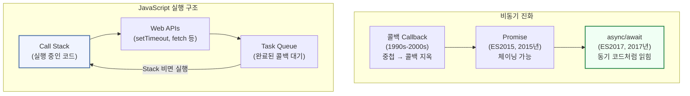
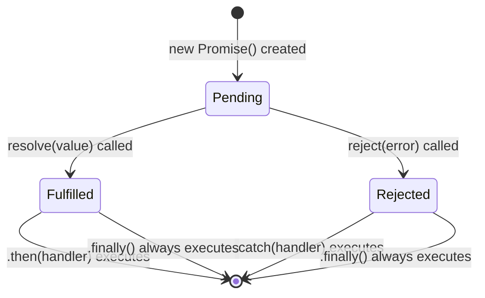
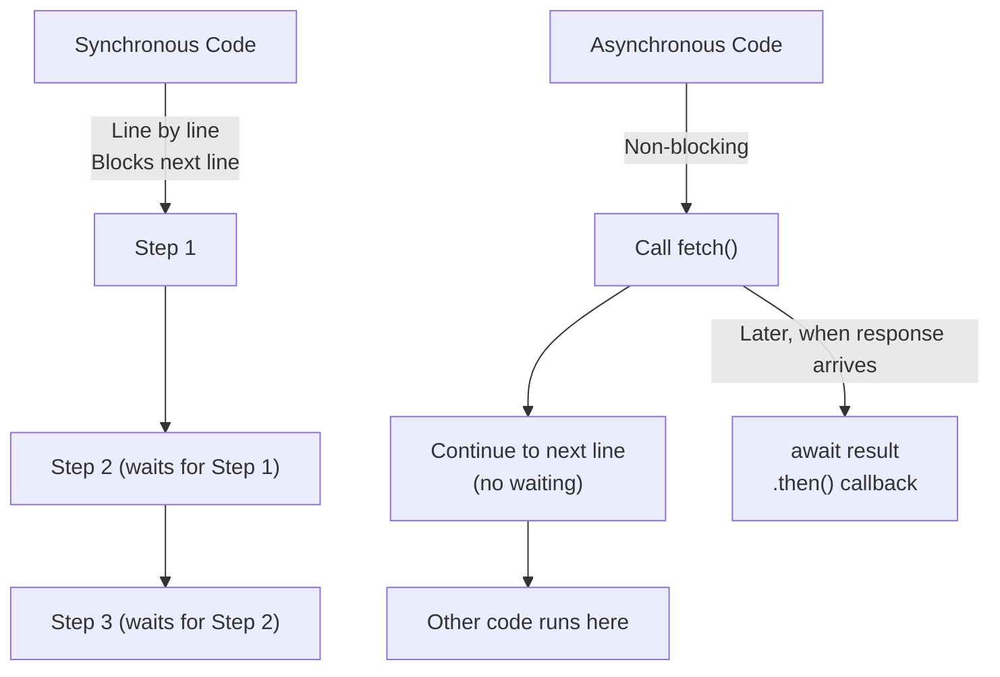
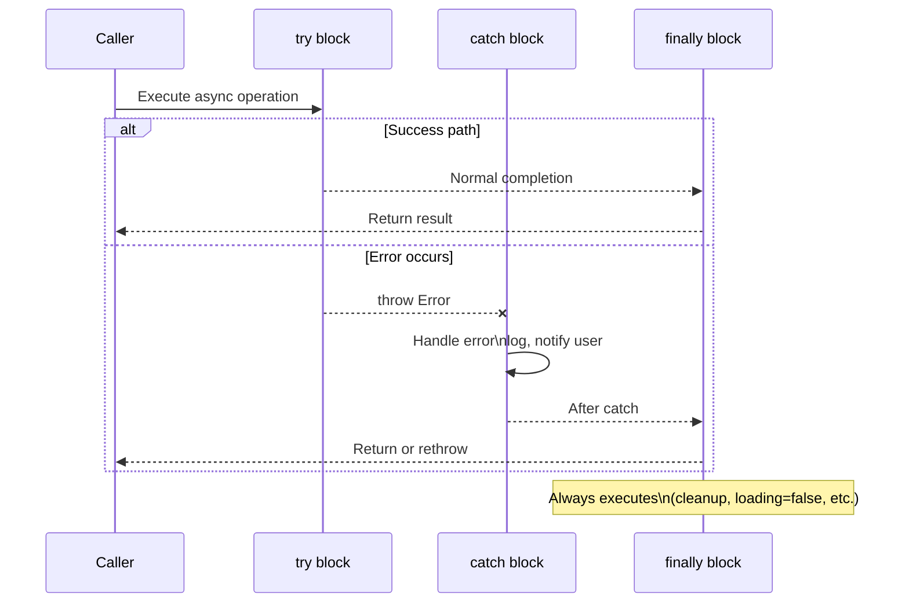

# 6회차: 비동기 프로그래밍 + 디버깅

## 학습 목표

이번 회차를 마치면 다음을 할 수 있게 됩니다.

- 동기 코드와 비동기 코드의 실행 순서 차이를 이해하고 설명할 수 있습니다.
- Promise의 세 가지 상태(pending, fulfilled, rejected)를 이해하고 `.then()`, `.catch()`로 처리할 수 있습니다.
- async/await 문법으로 비동기 코드를 동기 코드처럼 읽기 쉽게 작성할 수 있습니다.
- try/catch/finally 블록으로 에러를 안전하게 처리할 수 있습니다.
- Promise.all로 여러 비동기 작업을 병렬로 실행하고 결과를 합칠 수 있습니다.
- 브라우저 DevTools의 console과 Sources 탭을 활용하여 버그를 체계적으로 찾고 수정할 수 있습니다.

---

## 이번 세션 전체 그림



JavaScript는 싱글 스레드지만 이벤트 루프를 통해 비동기 작업을 효율적으로 처리합니다. 콜백에서 Promise, async/await로 발전한 비동기 패턴의 역사를 이해하면 왜 이런 문법이 필요한지 자연스럽게 이해됩니다.

---

## 핵심 개념

### 1. 동기 vs 비동기 프로그래밍

> **왜 필요한가?** 서버에서 데이터를 받아오는 데 1초가 걸린다고 가정해봅시다. 동기 방식이라면 1초 동안 브라우저가 완전히 멈춥니다. 스크롤도 안 되고, 다른 버튼도 안 눌립니다. 비동기는 "기다리는 동안 다른 일을 한다"는 개념으로, 사용자 경험을 살리는 핵심 기술입니다.

**동기(Synchronous)** 코드는 한 줄씩 순서대로 실행됩니다. 앞 줄이 끝나야 다음 줄이 실행됩니다. 줄을 서서 기다리는 것과 같습니다. 가게에서 한 명씩 주문을 받는 방식입니다.

**비동기(Asynchronous)** 코드는 시간이 오래 걸리는 작업을 기다리지 않고 다음 코드를 먼저 실행합니다. 번호표를 받고 다른 일을 하다가, 번호가 불리면 돌아오는 방식입니다.

네트워크 요청, 파일 읽기, 타이머는 모두 비동기입니다. 서버의 응답을 기다리는 동안 브라우저가 멈추면 사용자 경험이 매우 나빠지기 때문에, JavaScript는 비동기 작업을 기본으로 지원합니다.

```javascript
// Synchronous code - executes line by line (blocks)
console.log("1. 시작");
const result = heavyCalculation(); // Blocks until done
console.log("2. 계산 결과:", result);
console.log("3. 끝");
// Output order: 1 → 2 → 3
```

```javascript
// Asynchronous code - does not block
console.log("1. 시작");
setTimeout(() => {
  // This runs after 2 seconds, but code continues below immediately
  console.log("3. 2초 후 실행");
}, 2000);
console.log("2. setTimeout 이후 (기다리지 않음)");
// Output order: 1 → 2 → 3 (after 2 seconds)
```

비동기 코드를 잘못 이해하면 다음과 같은 실수를 합니다.

```javascript
// WRONG: This is a common mistake
let userData = null;
fetch("/api/user")
  .then((res) => res.json())
  .then((data) => { userData = data; });

console.log(userData); // null! (fetch hasn't finished yet)
```

### 2. Promise: 비동기 작업의 약속

> **왜 필요한가?** 콜백 함수로 비동기를 처리하면 중첩이 깊어질수록 코드가 오른쪽으로 밀려 "콜백 지옥"이 됩니다. 에러 처리도 각 콜백마다 따로 해야 합니다. Promise는 비동기 작업의 성공/실패를 하나의 객체로 표현하고, `.then()`으로 연결해 콜백 지옥을 해결했습니다.

> **진화 맥락 — 콜백 → Promise → async/await**:
>
> **1단계: 콜백 (1995년~)** — 비동기가 완료되면 실행할 함수를 인자로 전달합니다. 단순하지만 중첩이 깊어질수록 "콜백 지옥"이 됩니다.
>
> **2단계: Promise (ES2015, 2015년)** — 미래의 값을 나타내는 객체입니다. `.then()`, `.catch()`로 체이닝하여 가독성을 개선했습니다.
>
> **3단계: async/await (ES2017, 2017년)** — Promise를 더 직관적으로 사용하는 문법입니다. 내부적으로는 Promise와 동일하게 동작합니다.
>
> 세 가지 모두 같은 이벤트 루프를 사용합니다. async/await는 Promise의 문법적 설탕일 뿐, 더 빠른 게 아닙니다.

**Promise**는 "미래에 결과를 알려주겠다"는 약속 객체입니다. 세 가지 상태를 가집니다.

- **Pending(대기):** 아직 결과가 없는 초기 상태
- **Fulfilled(이행):** 작업이 성공적으로 완료된 상태
- **Rejected(거부):** 작업이 실패한 상태

한 번 fulfilled나 rejected가 되면 상태는 변경되지 않습니다.

```javascript
// Creating a Promise manually
const myPromise = new Promise((resolve, reject) => {
  const success = Math.random() > 0.3; // 70% chance of success

  setTimeout(() => {
    if (success) {
      resolve({ userId: 1, name: "Alice" }); // Fulfill the promise
    } else {
      reject(new Error("서버 연결에 실패했습니다.")); // Reject the promise
    }
  }, 1000);
});

// Consuming the Promise with .then() and .catch()
myPromise
  .then((user) => {
    console.log("성공:", user.name);
    return user.userId; // Return value is passed to next .then()
  })
  .then((userId) => {
    console.log("User ID:", userId);
  })
  .catch((error) => {
    // Catches ANY error from above chain
    console.error("실패:", error.message);
  })
  .finally(() => {
    // Always runs regardless of success or failure
    console.log("요청 완료 (성공/실패 무관)");
  });
```

실제 개발에서는 Promise를 직접 만들기보다 `fetch()` 같은 내장 함수가 반환하는 Promise를 사용합니다.

```javascript
// fetch() returns a Promise
fetch("https://jsonplaceholder.typicode.com/users/1")
  .then((response) => {
    // response.ok is true for 200-299 status codes
    if (!response.ok) {
      throw new Error(`HTTP 오류: ${response.status}`);
    }
    return response.json(); // Also returns a Promise
  })
  .then((user) => {
    console.log("사용자:", user.name);
  })
  .catch((error) => {
    console.error("에러:", error.message);
  });
```

### 3. async/await 패턴

> **왜 필요한가?** Promise `.then().catch()` 체인이 길어지면 여전히 읽기 어렵습니다. `async/await`는 Promise를 사용하면서도 코드를 마치 동기 코드처럼 위에서 아래로 읽히게 만드는 문법적 설탕(Syntactic Sugar)입니다. 코드의 가독성이 크게 향상됩니다.

> **흔한 오해**: "async/await를 쓰면 코드가 동기적으로(순서대로) 실행된다."
> **실제로는**: `await`는 해당 Promise가 완료될 때까지 현재 함수의 실행을 일시 정지하지만, JavaScript 엔진은 다른 작업을 계속 처리합니다. 보이는 코드가 동기처럼 생겼을 뿐, 내부적으로는 여전히 비동기입니다. "읽기 편한 비동기 코드"라고 이해하세요.

`async/await`는 Promise를 더 읽기 쉽게 작성하는 문법입니다. `.then()` 체이닝 대신 동기 코드처럼 작성할 수 있습니다.

- `async` 키워드를 함수에 붙이면 해당 함수는 항상 Promise를 반환합니다.
- `await`는 Promise가 완료될 때까지 기다립니다. (다른 코드는 계속 실행됩니다)
- `await`는 반드시 `async` 함수 안에서만 사용할 수 있습니다.

```javascript
// Promise .then() style - harder to read
function getUserWithPosts_ThenStyle(userId) {
  return fetch(`/api/users/${userId}`)
    .then((res) => res.json())
    .then((user) => {
      return fetch(`/api/posts?userId=${user.id}`)
        .then((res) => res.json())
        .then((posts) => ({ user, posts }));
    });
}

// async/await style - reads like synchronous code
async function getUserWithPosts(userId) {
  const userRes = await fetch(`/api/users/${userId}`);
  const user = await userRes.json();

  const postsRes = await fetch(`/api/posts?userId=${user.id}`);
  const posts = await postsRes.json();

  return { user, posts };
}
```

async/await는 훨씬 읽기 쉽지만, 두 방식은 완전히 동일하게 동작합니다.

```typescript
// Practical async/await in React component
"use client";
import { useState, useEffect } from "react";

interface Post {
  id: number;
  title: string;
  body: string;
}

function BlogList() {
  const [posts, setPosts] = useState<Post[]>([]);
  const [loading, setLoading] = useState(true);
  const [error, setError] = useState<string | null>(null);

  useEffect(() => {
    // Define async function inside useEffect
    async function loadPosts() {
      try {
        setLoading(true);
        const res = await fetch("https://jsonplaceholder.typicode.com/posts?_limit=5");

        if (!res.ok) {
          throw new Error(`HTTP 오류 ${res.status}: 데이터를 불러올 수 없습니다.`);
        }

        const data: Post[] = await res.json();
        setPosts(data);
      } catch (err) {
        setError(err instanceof Error ? err.message : "알 수 없는 오류");
      } finally {
        setLoading(false); // Always runs
      }
    }

    loadPosts();
  }, []); // Run once on mount

  if (loading) return <p>로딩 중...</p>;
  if (error) return <p className="error">{error}</p>;

  return (
    <ul>
      {posts.map((post) => (
        <li key={post.id}>{post.title}</li>
      ))}
    </ul>
  );
}
```

### 4. try/catch/finally 에러 처리

> **왜 필요한가?** 비동기 함수 안에서 처리되지 않은 에러는 앱 전체를 중단시킬 수 있습니다. 네트워크 오류, 서버 에러, 타임아웃은 언제든 발생할 수 있습니다. `try/catch`로 에러를 잡아 사용자에게 적절한 피드백(토스트 메시지, 에러 페이지)을 보여주는 것이 좋은 UX의 기본입니다.

비동기 코드에서 에러가 발생하면 반드시 처리해야 합니다. 처리하지 않은 에러는 앱을 크래시시키거나 사용자에게 빈 화면을 보여줄 수 있습니다.

try/catch/finally 블록의 역할을 정확히 이해해야 합니다.

- `try`: 에러가 발생할 수 있는 코드를 감쌉니다.
- `catch(error)`: 에러가 발생했을 때 실행됩니다. error 객체에 정보가 담겨 있습니다.
- `finally`: 에러 여부와 상관없이 항상 실행됩니다. 로딩 상태 해제, 리소스 정리 등에 사용합니다.

```typescript
async function fetchUserData(userId: number) {
  try {
    // 1. Network error: connection refused, DNS failure, etc.
    const response = await fetch(`/api/users/${userId}`);

    // 2. HTTP error: 404, 500, etc. (fetch doesn't throw for these!)
    if (!response.ok) {
      if (response.status === 404) {
        throw new Error(`사용자 ID ${userId}를 찾을 수 없습니다.`);
      }
      if (response.status === 401) {
        throw new Error("로그인이 필요합니다.");
      }
      throw new Error(`서버 오류: ${response.status}`);
    }

    // 3. JSON parse error
    const data = await response.json();
    return data;

  } catch (error) {
    // Type narrowing for better error handling
    if (error instanceof TypeError) {
      // Network error (fetch failed completely)
      console.error("네트워크 오류:", error.message);
      throw new Error("인터넷 연결을 확인해 주세요.");
    }

    if (error instanceof Error) {
      // Re-throw with original message
      throw error;
    }

    // Unknown error type
    throw new Error("알 수 없는 오류가 발생했습니다.");

  } finally {
    // Always runs - use for cleanup
    console.log(`fetchUserData(${userId}) 완료`);
  }
}
```

**중요:** `fetch()`는 네트워크 연결 실패 시에만 에러를 던집니다. 404, 500 같은 HTTP 에러는 `response.ok`나 `response.status`를 직접 확인해야 합니다.

### 5. Promise.all과 Promise.race

> **왜 필요한가?** 10개의 API를 `await`로 순서대로 호출하면 각각의 대기 시간이 모두 합산됩니다. 서로 의존 관계가 없는 요청이라면 동시에 보내면 됩니다. `Promise.all`은 여러 Promise를 동시에 실행하고 모두 완료될 때까지 기다립니다. N배의 속도 개선이 가능합니다.

> **흔한 오해**: "Promise.all은 순서대로 실행된다."
> **실제로는**: `Promise.all`에 전달된 Promise들은 동시에(병렬로) 실행됩니다. 결과 배열의 순서만 입력 순서와 동일하게 보장됩니다. 실행 순서가 아니라 결과 순서가 보장되는 것입니다.
>
> 이 오해가 생기는 이유는 배열 순서 = 실행 순서라고 직관적으로 생각하기 때문입니다.

여러 비동기 작업을 처리하는 두 가지 유용한 메서드입니다.

**Promise.all**: 여러 Promise를 병렬로 실행하고, 모두 완료되면 결과를 배열로 반환합니다. 하나라도 실패하면 전체가 실패합니다.

**Promise.race**: 가장 먼저 완료된 Promise의 결과를 반환합니다. 타임아웃 구현에 유용합니다.

```typescript
// Sequential (slow): fetches one by one, total time = sum of all requests
async function getDataSequential() {
  const user = await fetch("/api/users/1").then((r) => r.json());
  const posts = await fetch("/api/posts?userId=1").then((r) => r.json());
  const comments = await fetch("/api/comments?userId=1").then((r) => r.json());
  return { user, posts, comments };
}

// Parallel (fast): fetches all at the same time, total time = slowest request
async function getDataParallel() {
  const [user, posts, comments] = await Promise.all([
    fetch("/api/users/1").then((r) => r.json()),
    fetch("/api/posts?userId=1").then((r) => r.json()),
    fetch("/api/comments?userId=1").then((r) => r.json()),
  ]);
  return { user, posts, comments };
}

// Handling partial failures with Promise.allSettled
async function getDataSafe() {
  const results = await Promise.allSettled([
    fetch("/api/users/1").then((r) => r.json()),
    fetch("/api/posts?userId=1").then((r) => r.json()),
    fetch("/api/broken-endpoint").then((r) => r.json()), // This will fail
  ]);

  // Each result is { status: 'fulfilled', value: ... } or { status: 'rejected', reason: ... }
  const [userResult, postsResult, brokenResult] = results;

  const user = userResult.status === "fulfilled" ? userResult.value : null;
  const posts = postsResult.status === "fulfilled" ? postsResult.value : [];

  console.log("실패한 요청:", brokenResult.status); // 'rejected'
  return { user, posts };
}

// Timeout with Promise.race
function fetchWithTimeout(url: string, timeoutMs: number) {
  const fetchPromise = fetch(url);
  const timeoutPromise = new Promise<never>((_, reject) =>
    setTimeout(() => reject(new Error(`요청 시간 초과 (${timeoutMs}ms)`)), timeoutMs)
  );

  // Returns whichever resolves/rejects first
  return Promise.race([fetchPromise, timeoutPromise]);
}
```

### 6. 디버깅 기법: console, DevTools

> **📎 연결 포인트 → 2회차 (Node.js 이벤트 루프)**: JavaScript가 싱글 스레드임에도 비동기가 가능한 이유가 이벤트 루프입니다. 2회차에서 이벤트 루프의 동작 원리를 배웠다면, 이번 세션에서 그 위에 Promise와 async/await가 어떻게 동작하는지 이해할 수 있습니다.

> **📎 연결 포인트 → 4회차 (React useEffect)**: React의 `useEffect`에서 API를 호출할 때 async/await를 직접 쓸 수 없는 이유와 올바른 패턴을 4회차에서 배웠습니다. 이번 세션의 비동기 이해가 그 배경입니다.

> **📎 연결 포인트 → 7-9회차 (데이터베이스/인증)**: 데이터베이스 쿼리, API 호출, 파일 읽기는 모두 비동기입니다. 이번 세션의 async/await 패턴을 7-9회차에서 반복적으로 사용합니다.

에러가 발생했을 때 당황하지 않고 체계적으로 원인을 찾는 것이 중요합니다. 좋은 개발자는 에러를 두려워하지 않습니다. 에러는 버그의 위치를 알려주는 안내판입니다.

**console 메서드 전략:**

```javascript
// Different console methods for different purposes
console.log("일반 정보:", data);         // Standard output
console.info("정보:", "서버 연결됨");    // Informational (blue in some browsers)
console.warn("경고:", "deprecated API"); // Warning (yellow)
console.error("에러:", error);           // Error (red, includes stack trace)
console.table(arrayData);               // Displays array/object as table
console.group("API 요청");              // Start collapsible group
console.log("URL:", url);
console.log("Headers:", headers);
console.groupEnd();                     // End group
console.time("fetch-duration");         // Start timer
// ... some async operation ...
console.timeEnd("fetch-duration");      // Logs: "fetch-duration: 234ms"
```

**브라우저 DevTools 활용:**

개발자 도구를 열면(F12 또는 Cmd+Option+I) 다음 탭들을 활용할 수 있습니다.

- **Console 탭**: 에러 메시지와 로그 확인. 에러를 클릭하면 해당 코드 줄로 이동합니다.
- **Sources 탭**: 브레이크포인트(Breakpoint)를 설정해 코드 실행을 멈추고 변수 값을 확인합니다.
- **Network 탭**: API 요청과 응답을 확인합니다. 요청이 실패했는지, 응답 데이터가 올바른지 확인합니다.
- **Application 탭**: localStorage, sessionStorage, Cookie 등 저장된 데이터를 확인합니다.

```typescript
// Defensive coding - add debugging information
async function fetchProducts() {
  const url = "/api/products";
  console.log("[fetchProducts] 요청 시작:", url);

  try {
    const response = await fetch(url);

    console.log("[fetchProducts] 응답 상태:", response.status, response.statusText);

    if (!response.ok) {
      const errorBody = await response.text();
      console.error("[fetchProducts] 에러 응답:", errorBody);
      throw new Error(`HTTP ${response.status}: ${response.statusText}`);
    }

    const data = await response.json();
    console.log("[fetchProducts] 데이터 수신:", data.length, "개 항목");
    console.table(data.slice(0, 3)); // Show first 3 items as table

    return data;
  } catch (error) {
    // Log full error details for debugging
    console.error("[fetchProducts] 에러 발생:");
    console.error("- 메시지:", error instanceof Error ? error.message : error);
    console.error("- 스택:", error instanceof Error ? error.stack : "N/A");
    throw error; // Re-throw so caller can handle
  }
}
```

---

## 다이어그램

### Promise 상태 다이어그램

Promise는 한 번 settled되면 상태가 바뀌지 않습니다.



### 동기 vs 비동기 실행 흐름

비동기 코드는 블로킹 없이 다음 코드를 실행합니다.



### try/catch/finally 에러 전파 흐름



---

## 코드 예제 (심화)

### 실용적인 fetch 에러 처리 패턴

```typescript
// Reusable fetch wrapper with comprehensive error handling
type ApiResponse<T> = {
  data: T | null;
  error: string | null;
  status: number;
};

async function apiCall<T>(url: string, options?: RequestInit): Promise<ApiResponse<T>> {
  try {
    const response = await fetch(url, options);

    // Handle different HTTP error codes differently
    if (!response.ok) {
      const errorMessages: Record<number, string> = {
        400: "잘못된 요청입니다. 입력 데이터를 확인해 주세요.",
        401: "로그인이 필요합니다.",
        403: "접근 권한이 없습니다.",
        404: "요청한 데이터를 찾을 수 없습니다.",
        429: "요청이 너무 많습니다. 잠시 후 다시 시도해 주세요.",
        500: "서버 내부 오류가 발생했습니다.",
        503: "서비스를 일시적으로 이용할 수 없습니다.",
      };

      return {
        data: null,
        error: errorMessages[response.status] ?? `HTTP 오류: ${response.status}`,
        status: response.status,
      };
    }

    const data: T = await response.json();
    return { data, error: null, status: response.status };

  } catch (error) {
    // Network error (no internet, CORS, etc.)
    if (error instanceof TypeError) {
      return {
        data: null,
        error: "네트워크에 연결할 수 없습니다. 인터넷 연결을 확인해 주세요.",
        status: 0,
      };
    }

    return {
      data: null,
      error: error instanceof Error ? error.message : "알 수 없는 오류",
      status: 0,
    };
  }
}

// Usage example
async function loadDashboard() {
  const { data: user, error: userError } = await apiCall<User>("/api/me");
  if (userError) {
    showToast(userError, "error");
    return;
  }

  const { data: stats, error: statsError } = await apiCall<Stats>("/api/stats");
  if (statsError) {
    console.warn("통계 로딩 실패:", statsError);
    // Continue even if stats fail - not critical
  }

  return { user, stats };
}
```

---

## 실습

### 실습 목표

에러를 의도적으로 발생시키고, 체계적으로 원인을 찾아 수정하는 디버깅 루틴을 훈련합니다. 개발자는 에러를 통해 성장합니다.

### 기본 실습: 에러 시나리오 체험

다음 세 가지 에러 시나리오를 직접 재현하고 수정해 보세요.

**시나리오 1: 비동기 타이밍 에러**

아래 코드를 실행하면 `undefined`가 출력됩니다. 이유를 분석하고 async/await로 수정하세요.

```typescript
// BUG: async timing error
function getFirstUser() {
  let user: any;
  fetch("https://jsonplaceholder.typicode.com/users/1")
    .then((r) => r.json())
    .then((data) => { user = data; });
  return user; // Returns undefined! fetch hasn't completed yet
}

const user = getFirstUser();
console.log(user?.name); // undefined - why?
```

**시나리오 2: HTTP 에러를 무시하는 코드**

```typescript
// BUG: Does not check response.ok
async function fetchBrokenApi() {
  const res = await fetch("/api/nonexistent-endpoint");
  const data = await res.json(); // This will fail but error is hidden
  console.log("데이터:", data);
}
```

`/api/nonexistent-endpoint`는 존재하지 않아 404를 반환합니다. 브라우저 Network 탭에서 404 에러를 확인하고, `response.ok` 체크를 추가해 적절한 에러 메시지를 표시하도록 수정하세요.

**시나리오 3: Promise.all에서 하나 실패**

```typescript
// Scenario: One of the requests will fail
async function loadAllData() {
  const [users, posts, broken] = await Promise.all([
    fetch("https://jsonplaceholder.typicode.com/users?_limit=3").then((r) => r.json()),
    fetch("https://jsonplaceholder.typicode.com/posts?_limit=3").then((r) => r.json()),
    fetch("https://jsonplaceholder.typicode.com/invalid-endpoint").then((r) => {
      if (!r.ok) throw new Error("broken endpoint failed");
      return r.json();
    }),
  ]);
  return { users, posts, broken };
}
```

`Promise.all`은 하나라도 실패하면 전체가 실패합니다. `Promise.allSettled`로 변경하여 실패한 요청이 있어도 성공한 데이터는 사용할 수 있도록 수정하세요.

### 도전 실습: 실전 디버깅 루틴 "원인 찾기 → 재현 → 고치기"

아래 컴포넌트에는 3개의 버그가 숨어있습니다. DevTools의 Console 탭과 Network 탭을 열고 버그를 찾아 수정해 보세요.

```typescript
"use client";
import { useState, useEffect } from "react";

// BUG-HUNTING EXERCISE: Find and fix 3 bugs in this component
function BuggyUserList() {
  const [users, setUsers] = useState(null); // Bug 1: wrong initial state type
  const [loading, setLoading] = useState(false);

  useEffect(() => {
    async function load() {
      setLoading(true);
      // Bug 2: missing try/catch - if fetch fails, loading stays true forever
      const res = await fetch("https://jsonplaceholder.typicode.com/users");
      const data = await res.json();
      setUsers(data);
      setLoading(false);
    }
    load();
  }, [users]); // Bug 3: wrong dependency - causes infinite loop!

  if (loading) return <p>로딩 중...</p>;

  return (
    <ul>
      {users?.map((user: any) => (
        <li key={user.id}>{user.name}</li>
      ))}
    </ul>
  );
}
```

**힌트:**

- Bug 1: `useState`의 초기값 타입을 확인하세요. `null`은 배열이 아닙니다.
- Bug 2: 네트워크 오류 발생 시 어떻게 될까요?
- Bug 3: `useEffect`의 의존성 배열을 주의 깊게 살펴보세요. 무한 루프가 왜 발생하는지 생각해 보세요.

---

## 요약

이번 회차에서 배운 핵심 개념을 정리합니다.

| 개념 | 설명 |
|------|------|
| 동기/비동기 | 비동기 코드는 완료를 기다리지 않고 다음 줄을 실행 |
| Promise | 비동기 작업의 결과를 담는 객체 (pending/fulfilled/rejected) |
| async/await | Promise를 동기 코드처럼 읽기 쉽게 작성하는 문법 |
| try/catch/finally | 에러를 안전하게 처리하고 항상 정리 코드를 실행 |
| Promise.all | 여러 비동기 작업을 병렬로 실행, 하나라도 실패하면 전체 실패 |
| Promise.allSettled | 실패해도 모든 결과를 받을 수 있는 안전한 병렬 실행 |
| console 디버깅 | log/warn/error/table/time 메서드로 정보 출력 |
| DevTools | Console, Network, Sources 탭으로 버그 추적 |

**핵심 디버깅 루틴 3단계:**

1. **원인 찾기:** Console의 에러 메시지를 읽고, Network 탭에서 API 요청 상태를 확인합니다.
2. **재현하기:** 에러가 항상 발생하는 최소한의 조건을 찾습니다. 재현이 안 되면 고칠 수 없습니다.
3. **고치기:** 에러의 근본 원인을 수정하고, 수정 후 동일한 조건에서 에러가 사라졌는지 확인합니다.

**핵심 키워드:** 동기, 비동기, Promise, pending/fulfilled/rejected, async/await, try/catch/finally, Promise.all, Promise.allSettled, console.log, 브레이크포인트, DevTools

**다음 주 미리보기:** 3주차에서는 실제 데이터베이스(Supabase/Prisma)와 연결하고, 사용자 인증(로그인/회원가입)을 구현합니다. 2주차에서 배운 API Route, async/await, 에러 처리가 모두 필요한 실전 프로젝트를 진행합니다.

---

## 강사 자료

이 세션 내용을 더 깊이 이해하고 싶다면 아래 자료를 참고하세요.

- [API 호출 실전가이드](/appendix/deep-dive/api-call-guide): 이 세션의 비동기 패턴을 실전 API 호출 코드로 바로 적용합니다
