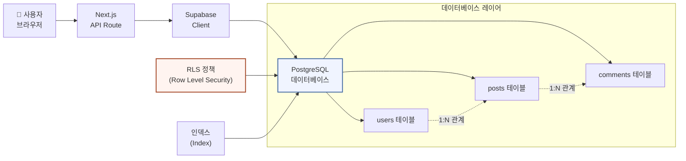
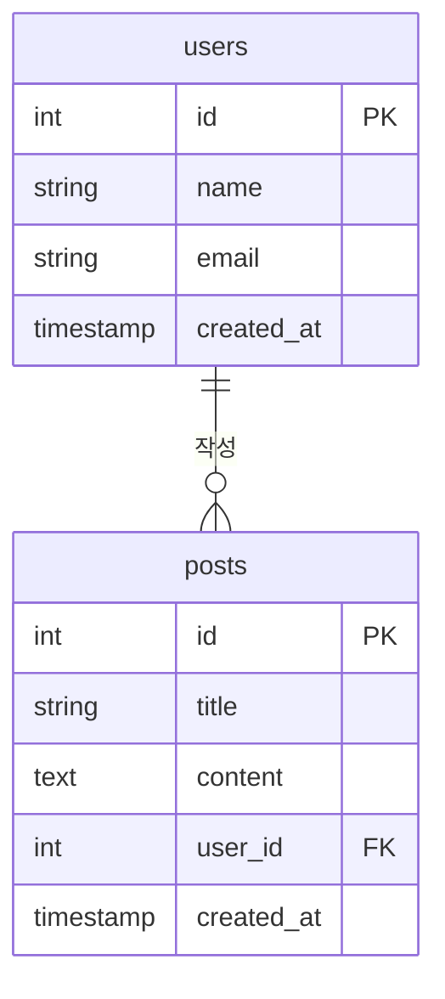
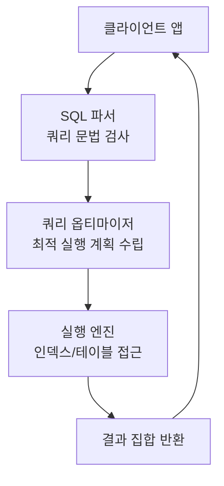
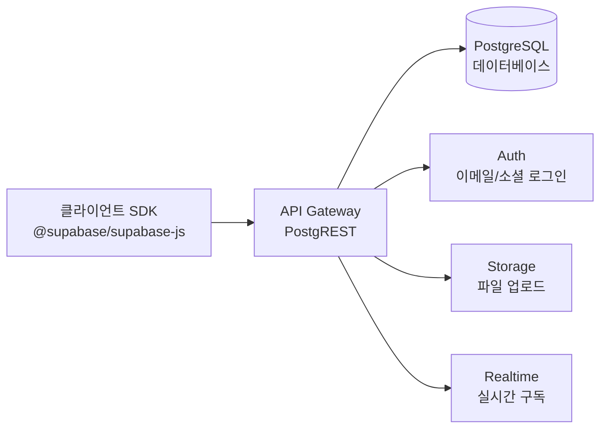

# 7회차: 데이터베이스 개념 + PostgreSQL / Supabase

## 학습 목표

이번 회차를 마치면 다음을 수행할 수 있습니다.

- 데이터베이스의 기본 개념(테이블, 컬럼, 기본키, 외래키, 관계)을 설명할 수 있습니다.
- 1:1, 1:N, N:M 관계의 차이를 이해하고 실제 테이블로 설계할 수 있습니다.
- PostgreSQL 기본 SQL 쿼리(SELECT, INSERT, UPDATE, DELETE)를 직접 작성할 수 있습니다.
- Supabase 클라이언트를 초기화하고 CRUD 함수를 구현할 수 있습니다.
- RLS(Row-Level Security)의 목적과 기본 동작 원리를 설명할 수 있습니다.

---

## 이번 세션 전체 그림



웹 앱에서 사용자가 요청을 보내면 Next.js API를 통해 PostgreSQL 데이터베이스에 접근합니다. Supabase는 PostgreSQL 위에 구축된 서비스로, API와 인증을 자동으로 제공합니다. 이 세션에서는 데이터를 어떻게 설계하고 저장하는지를 배웁니다.

---

## 핵심 개념

### 1. 데이터베이스란 무엇인가

> **왜 필요한가?** 서버의 메모리(RAM)에 데이터를 저장하면 서버가 재시작될 때 모든 데이터가 사라집니다. 회원 정보, 게시글, 주문 내역 같은 영구 보존이 필요한 데이터는 반드시 데이터베이스에 저장해야 합니다. 데이터베이스 없이는 로그인 정보가 새로고침마다 사라집니다.

> **진화 맥락 — 파일 → 관계형 DB → NoSQL**: 초창기 웹은 텍스트 파일에 데이터를 저장했습니다. 데이터가 늘고 복잡한 관계가 필요해지면서 관계형 데이터베이스(RDBMS)가 표준이 되었습니다. 2000년대 후반 소셜 미디어의 폭발적 성장으로 수평 확장이 쉬운 NoSQL이 등장했습니다. 현재는 데이터 특성에 따라 두 방식을 모두 사용합니다.

데이터베이스(Database)는 **구조화된 데이터를 저장하고 효율적으로 조회·수정·삭제할 수 있는 시스템**입니다.

엑셀 스프레드시트를 생각해 보겠습니다. 엑셀에서 행(Row)은 한 명의 사용자 정보를 나타내고, 열(Column)은 이름, 이메일, 나이 등 각 속성을 나타냅니다. 데이터베이스의 **테이블**은 이 스프레드시트 한 장과 동일한 개념입니다. 그런데 엑셀과 다른 점이 있습니다.

| 엑셀 | 데이터베이스 |
|------|-------------|
| 수동 파일 저장 | 자동 영구 저장 |
| 동시 편집 어려움 | 수천 명 동시 접근 지원 |
| 수식으로 계산 | SQL로 복잡한 조회 가능 |
| 수백만 행에서 느려짐 | 인덱스로 수억 행도 빠르게 조회 |
| 관계 연결 어려움 | 테이블 간 JOIN으로 연결 |

웹 서비스에서 데이터베이스가 필요한 이유는 단순합니다. 사용자가 회원가입을 하면 그 정보를 어딘가에 저장해야 하고, 다음에 로그인할 때 다시 불러와야 합니다. 이 역할을 데이터베이스가 담당합니다.

---

### 2. 관계형 DB 설계 기초

> **왜 필요한가?** 테이블을 잘못 설계하면 데이터가 중복되거나, 나중에 변경할 때 수백만 건의 데이터를 수정해야 할 수 있습니다. 예를 들어 모든 게시글에 작성자 이름을 직접 저장하면, 사용자가 이름을 바꿀 때 모든 게시글을 업데이트해야 합니다. 외래키(Foreign Key)로 연결하면 한 곳만 변경하면 됩니다.

> **흔한 오해**: "정규화(Normalization)는 무조건 많이 할수록 좋다."
> **실제로는**: 과도한 정규화는 데이터를 여러 테이블에 쪼개 JOIN이 많아지고 오히려 성능이 저하될 수 있습니다. 읽기가 많은 시스템에서는 의도적으로 비정규화(Denormalization)하여 성능을 높이기도 합니다. "적절한" 정규화가 중요합니다.

> **📎 연결 포인트 → 8회차 (MongoDB)**: 관계형 DB의 한계를 이해하면 8회차의 MongoDB(문서 DB)가 왜 등장했는지 자연스럽게 이해됩니다. SQL vs NoSQL 선택 기준이 8회차의 핵심입니다.

**관계형 데이터베이스(Relational Database)**는 데이터를 여러 테이블로 나누고, 테이블 간의 관계를 통해 데이터를 연결하는 방식입니다. PostgreSQL, MySQL, SQLite가 모두 관계형 데이터베이스입니다.

#### 기본 용어

- **테이블(Table)**: 데이터를 저장하는 구조. 행(Row)과 열(Column)로 구성됩니다.
- **컬럼(Column)**: 데이터의 속성. 이름, 이메일, 생성일 등이 각각 하나의 컬럼입니다.
- **행(Row)**: 실제 데이터 1건. 한 명의 사용자, 하나의 게시글 등입니다.
- **기본키(Primary Key, PK)**: 테이블의 각 행을 유일하게 식별하는 컬럼. 중복 불가, NULL 불가입니다.
- **외래키(Foreign Key, FK)**: 다른 테이블의 기본키를 참조하는 컬럼. 테이블 간 관계를 만듭니다.

#### 관계 유형 3가지

**1:1 관계 (One-to-One)**

한 사용자는 하나의 프로필만 가집니다. 프로필도 정확히 한 명의 사용자에게 속합니다.

```
users 테이블의 1개 행 <----> profiles 테이블의 1개 행
```

**1:N 관계 (One-to-Many)**

가장 흔한 관계입니다. 한 명의 사용자는 여러 게시글을 쓸 수 있지만, 하나의 게시글은 반드시 한 명의 작성자만 가집니다.

```
users 테이블의 1개 행 <----> posts 테이블의 여러 행
```

`posts` 테이블에 `user_id` 컬럼(FK)을 추가하여 구현합니다.

**N:M 관계 (Many-to-Many)**

하나의 게시글은 여러 태그를 가질 수 있고, 하나의 태그는 여러 게시글에 사용될 수 있습니다. N:M 관계는 중간 테이블(연결 테이블)을 만들어 구현합니다.

```
posts <----> post_tags(연결 테이블) <----> tags
```

---

### 3. 인덱스의 역할

> **왜 필요한가?** 100만 개의 행이 있는 테이블에서 특정 이메일을 찾으려면 처음부터 끝까지 모두 확인해야 합니다(Full Table Scan). 이메일 컬럼에 인덱스를 생성하면 이진 탐색(Binary Search)처럼 빠르게 찾을 수 있습니다. 인덱스가 없는 대용량 DB는 쿼리 하나에 수 초가 걸릴 수 있습니다.

인덱스(Index)는 **책의 목차**에 비유할 수 있습니다. 500페이지 책에서 특정 단어를 찾을 때, 처음부터 끝까지 읽으면 시간이 많이 걸립니다. 하지만 책 뒤에 있는 색인(Index)을 보면 몇 페이지에 있는지 바로 알 수 있습니다.

데이터베이스도 마찬가지입니다. `email`로 사용자를 조회할 때, 인덱스가 없으면 수백만 건의 데이터를 전부 확인합니다(Full Table Scan). 인덱스가 있으면 B-Tree 구조 덕분에 매우 빠르게 찾을 수 있습니다.

- 자주 검색하는 컬럼(`email`, `username`)에 인덱스를 추가합니다.
- 인덱스는 조회 속도를 높이지만, 데이터 삽입/수정/삭제 시 인덱스도 갱신해야 하므로 과도하게 추가하면 쓰기 성능이 저하됩니다.
- 기본키(PK)는 자동으로 인덱스가 생성됩니다.

---

### 4. PostgreSQL 기본 SQL 쿼리

> **왜 필요한가?** 데이터베이스는 데이터를 저장하는 방법과 조회하는 방법에 대한 약속(언어)이 필요합니다. SQL은 1970년대에 만들어졌지만 지금도 전 세계 대부분의 데이터베이스에서 사용됩니다. 한 번 배우면 PostgreSQL, MySQL, SQLite 어디서든 쓸 수 있습니다.

SQL(Structured Query Language)은 데이터베이스와 대화하는 언어입니다. 영어 문장과 비슷한 구조로 읽기 쉽습니다.

**핵심 4가지 명령어 (CRUD)**

| 명령어 | 의미 | 사용 상황 |
|--------|------|-----------|
| `SELECT` | 조회 | 데이터를 읽을 때 |
| `INSERT` | 삽입 | 새 데이터를 추가할 때 |
| `UPDATE` | 수정 | 기존 데이터를 바꿀 때 |
| `DELETE` | 삭제 | 데이터를 지울 때 |

---

### 5. Supabase 소개 및 클라이언트 연동

> **흔한 오해**: "Supabase는 Firebase와 비슷한 NoSQL 서비스 아닌가요?"
> **실제로는**: Supabase는 PostgreSQL(관계형 DB) 기반입니다. Firebase는 Firestore라는 NoSQL을 사용합니다. 철학이 다릅니다. Supabase는 PostgreSQL의 모든 기능(SQL, 트랜잭션, JOIN)을 그대로 사용할 수 있습니다.

Supabase는 **Firebase의 오픈소스 대안**으로, PostgreSQL 데이터베이스를 기반으로 한 백엔드 플랫폼입니다. 직접 서버를 구축하지 않고도 다음 기능을 즉시 사용할 수 있습니다.

- **PostgreSQL 데이터베이스**: 완전한 SQL 지원
- **REST API**: 자동 생성, 별도 백엔드 코드 불필요
- **인증(Auth)**: 이메일, 소셜 로그인 지원
- **실시간(Realtime)**: 데이터 변경을 실시간으로 구독
- **스토리지(Storage)**: 파일 업로드/다운로드

프론트엔드(Next.js)에서 Supabase SDK를 사용하면 직접 데이터베이스에 접근하는 것처럼 코드를 작성할 수 있습니다.

---

### 6. RLS(Row-Level Security) 개념 맛보기

> **왜 필요한가?** 클라이언트가 데이터베이스에 직접 접근하면 모든 데이터가 노출될 위험이 있습니다. RLS(Row Level Security)는 "이 사용자는 자신의 데이터만 볼 수 있다"는 규칙을 데이터베이스 레벨에서 강제합니다. 애플리케이션 코드의 실수로 인한 데이터 노출을 DB 자체에서 막습니다.

> **📎 연결 포인트 → 9회차 (인증/RLS)**: Supabase의 RLS는 9회차에서 배울 OAuth 인증과 결합됩니다. "로그인한 사용자는 자신의 데이터만 접근"을 RLS로 구현하는 패턴을 9회차에서 완성합니다.

RLS는 PostgreSQL의 강력한 보안 기능입니다. "어떤 사용자가 어떤 데이터를 볼 수 있는지"를 데이터베이스 레벨에서 제어합니다.

예를 들어, `posts` 테이블에 모든 사용자의 게시글이 저장되어 있을 때, RLS를 적용하면 "자신이 작성한 게시글만 수정/삭제할 수 있다"는 규칙을 데이터베이스에 직접 설정할 수 있습니다.

RLS가 없으면 프론트엔드나 백엔드 코드에서 권한 체크를 해야 합니다. 코드 실수로 권한 체크가 빠지면 데이터 유출이 발생할 수 있습니다. RLS를 사용하면 데이터베이스 자체에서 차단하므로 더 안전합니다.

---

## 다이어그램

### 다이어그램 1: 유저-게시글 ER 다이어그램



위 다이어그램에서 `users` 한 명은 `posts` 여러 개를 작성할 수 있는 1:N 관계를 나타냅니다. `posts.user_id`가 `users.id`를 참조하는 외래키입니다.

---

### 다이어그램 2: SQL 쿼리 실행 흐름



SQL 쿼리를 보내면 데이터베이스 내부에서 파싱, 최적화, 실행의 단계를 거쳐 결과를 반환합니다. 옵티마이저가 인덱스 사용 여부를 결정하므로, 인덱스를 잘 설계하면 실행 엔진이 더 빠르게 동작합니다.

---

### 다이어그램 3: Supabase 아키텍처



Supabase의 클라이언트 SDK는 내부적으로 API Gateway(PostgREST)를 통해 PostgreSQL과 통신합니다. 개발자는 SDK 메서드를 호출하기만 하면 됩니다.

---

## 코드 예제

### 예제 1: 테이블 생성 SQL

```sql
-- users 테이블 생성
CREATE TABLE users (
  id         SERIAL PRIMARY KEY,         -- 자동 증가 기본키
  name       VARCHAR(100) NOT NULL,      -- 이름 (필수)
  email      VARCHAR(255) UNIQUE NOT NULL, -- 이메일 (중복 불가, 필수)
  created_at TIMESTAMP DEFAULT NOW()    -- 생성 시각 (기본값: 현재 시각)
);

-- posts 테이블 생성
CREATE TABLE posts (
  id         SERIAL PRIMARY KEY,
  title      VARCHAR(255) NOT NULL,
  content    TEXT,
  user_id    INTEGER NOT NULL REFERENCES users(id) ON DELETE CASCADE,
  -- user_id가 users.id를 참조; 사용자 삭제 시 게시글도 함께 삭제
  created_at TIMESTAMP DEFAULT NOW()
);

-- email 컬럼에 인덱스 추가 (자주 검색하는 컬럼)
CREATE INDEX idx_users_email ON users(email);

-- user_id 컬럼에 인덱스 추가 (JOIN 성능 향상)
CREATE INDEX idx_posts_user_id ON posts(user_id);
```

---

### 예제 2: 기본 CRUD SQL 쿼리

```sql
-- SELECT: 모든 사용자 조회
SELECT id, name, email FROM users;

-- SELECT: 특정 이메일로 조회
SELECT * FROM users WHERE email = 'alice@example.com';

-- SELECT: 사용자와 게시글 JOIN 조회
SELECT
  users.name   AS author_name,
  posts.title  AS post_title,
  posts.created_at
FROM posts
JOIN users ON posts.user_id = users.id
ORDER BY posts.created_at DESC;

-- INSERT: 새 사용자 추가
INSERT INTO users (name, email)
VALUES ('Alice', 'alice@example.com')
RETURNING id, name, email; -- 삽입된 행 반환

-- INSERT: 새 게시글 추가
INSERT INTO posts (title, content, user_id)
VALUES ('첫 번째 게시글', '내용입니다.', 1);

-- UPDATE: 게시글 제목 수정
UPDATE posts
SET title = '수정된 제목'
WHERE id = 1;

-- DELETE: 특정 게시글 삭제
DELETE FROM posts WHERE id = 1;
```

---

### 예제 3: Supabase 클라이언트 초기화

```typescript
// lib/supabase.ts
import { createClient } from '@supabase/supabase-js'

// Supabase 프로젝트 URL과 anon key는 .env.local 파일에 저장
const supabaseUrl = process.env.NEXT_PUBLIC_SUPABASE_URL!
const supabaseAnonKey = process.env.NEXT_PUBLIC_SUPABASE_ANON_KEY!

// 싱글톤 패턴으로 클라이언트 인스턴스 생성
export const supabase = createClient(supabaseUrl, supabaseAnonKey)
```

```
# .env.local 파일 설정
NEXT_PUBLIC_SUPABASE_URL=https://your-project.supabase.co
NEXT_PUBLIC_SUPABASE_ANON_KEY=your-anon-key
```

> **중요**: `NEXT_PUBLIC_` 접두사가 붙은 환경변수는 브라우저에 노출됩니다. `anon key`는 RLS 정책이 적용된 공개 키이므로 브라우저 노출이 허용됩니다. 그러나 `service_role key`는 절대로 `NEXT_PUBLIC_`으로 사용하지 마십시오.

---

### 예제 4: Supabase CRUD 함수

```typescript
// lib/api/users.ts
import { supabase } from '@/lib/supabase'

// User 타입 정의
interface User {
  id: number
  name: string
  email: string
  created_at: string
}

// 모든 사용자 조회
export async function getUsers(): Promise<User[]> {
  const { data, error } = await supabase
    .from('users')
    .select('*')
    .order('created_at', { ascending: false })

  if (error) throw new Error(error.message)
  return data ?? []
}

// 특정 사용자 조회 (이메일로)
export async function getUserByEmail(email: string): Promise<User | null> {
  const { data, error } = await supabase
    .from('users')
    .select('*')
    .eq('email', email)  // WHERE email = ?
    .single()            // 단일 행 반환

  if (error) return null
  return data
}

// 새 사용자 생성
export async function createUser(name: string, email: string): Promise<User> {
  const { data, error } = await supabase
    .from('users')
    .insert({ name, email })  // INSERT INTO users
    .select()
    .single()

  if (error) throw new Error(error.message)
  return data
}

// 사용자의 게시글 목록 조회 (JOIN)
export async function getPostsByUserId(userId: number) {
  const { data, error } = await supabase
    .from('posts')
    .select(`
      id,
      title,
      content,
      created_at,
      users ( name, email )
    `)   // 연관 테이블 데이터 포함
    .eq('user_id', userId)
    .order('created_at', { ascending: false })

  if (error) throw new Error(error.message)
  return data ?? []
}

// 게시글 생성
export async function createPost(title: string, content: string, userId: number) {
  const { data, error } = await supabase
    .from('posts')
    .insert({ title, content, user_id: userId })
    .select()
    .single()

  if (error) throw new Error(error.message)
  return data
}

// 게시글 삭제
export async function deletePost(postId: number) {
  const { error } = await supabase
    .from('posts')
    .delete()
    .eq('id', postId)

  if (error) throw new Error(error.message)
}
```

---

### 예제 5: RLS 정책 SQL 예시

```sql
-- 1. posts 테이블에 RLS 활성화
ALTER TABLE posts ENABLE ROW LEVEL SECURITY;

-- 2. 모든 사용자가 게시글을 읽을 수 있는 정책 (공개 읽기)
CREATE POLICY "게시글 공개 읽기"
ON posts
FOR SELECT
USING (true);  -- 모든 행에 대해 SELECT 허용

-- 3. 인증된 사용자만 본인 게시글을 생성할 수 있는 정책
CREATE POLICY "본인 게시글 생성"
ON posts
FOR INSERT
WITH CHECK (auth.uid() = user_id::uuid);
-- auth.uid()는 현재 로그인한 사용자의 ID를 반환
-- user_id가 현재 사용자와 일치하는 경우만 INSERT 허용

-- 4. 본인 게시글만 수정할 수 있는 정책
CREATE POLICY "본인 게시글 수정"
ON posts
FOR UPDATE
USING (auth.uid() = user_id::uuid);

-- 5. 본인 게시글만 삭제할 수 있는 정책
CREATE POLICY "본인 게시글 삭제"
ON posts
FOR DELETE
USING (auth.uid() = user_id::uuid);
```

RLS 정책이 없으면 anon key를 가진 누구나 모든 데이터를 읽고 쓸 수 있습니다. 정책을 추가하면 각 요청 시 해당 조건을 자동으로 검사합니다.

---

## 실습

### 기본 실습: Supabase에서 users 테이블 생성 및 CRUD 실습

**준비 사항**
- Supabase 계정 생성 (supabase.com)
- 새 프로젝트 생성
- Project URL과 anon key 복사

**단계 1: SQL Editor에서 테이블 생성**

Supabase 대시보드 좌측 메뉴에서 `SQL Editor`를 클릭한 뒤, 아래 SQL을 실행합니다.

```sql
CREATE TABLE users (
  id         SERIAL PRIMARY KEY,
  name       VARCHAR(100) NOT NULL,
  email      VARCHAR(255) UNIQUE NOT NULL,
  created_at TIMESTAMP DEFAULT NOW()
);
```

예상 결과: "Success. No rows returned" 메시지가 표시됩니다.

**단계 2: 샘플 데이터 삽입**

```sql
INSERT INTO users (name, email) VALUES
  ('Alice', 'alice@example.com'),
  ('Bob', 'bob@example.com'),
  ('Charlie', 'charlie@example.com');
```

예상 결과: 3개 행이 삽입됩니다.

**단계 3: 데이터 조회**

```sql
SELECT * FROM users ORDER BY created_at DESC;
```

예상 결과: 방금 삽입한 3명의 사용자가 표시됩니다.

**단계 4: Next.js 프로젝트에서 SDK 연동**

`.env.local` 파일을 생성하고, Supabase에서 복사한 값을 입력합니다.

```
NEXT_PUBLIC_SUPABASE_URL=https://your-project.supabase.co
NEXT_PUBLIC_SUPABASE_ANON_KEY=your-anon-key
```

패키지를 설치합니다.

```bash
npm install @supabase/supabase-js
```

`lib/supabase.ts` 파일을 생성하고 예제 3의 초기화 코드를 작성합니다.

**단계 5: 페이지에서 사용자 목록 불러오기**

```typescript
// app/page.tsx
import { getUsers } from '@/lib/api/users'

export default async function HomePage() {
  const users = await getUsers()

  return (
    <main>
      <h1>사용자 목록</h1>
      <ul>
        {users.map((user) => (
          <li key={user.id}>
            {user.name} ({user.email})
          </li>
        ))}
      </ul>
    </main>
  )
}
```

예상 결과: 브라우저에서 3명의 사용자 이름과 이메일이 목록으로 표시됩니다.

---

### 도전 실습: posts 테이블 생성 + JOIN 쿼리

**단계 1: posts 테이블 생성**

```sql
CREATE TABLE posts (
  id         SERIAL PRIMARY KEY,
  title      VARCHAR(255) NOT NULL,
  content    TEXT,
  user_id    INTEGER NOT NULL REFERENCES users(id) ON DELETE CASCADE,
  created_at TIMESTAMP DEFAULT NOW()
);

INSERT INTO posts (title, content, user_id) VALUES
  ('Alice의 첫 글', '안녕하세요!', 1),
  ('Alice의 두 번째 글', '두 번째 게시글입니다.', 1),
  ('Bob의 글', '저는 Bob입니다.', 2);
```

**단계 2: JOIN 쿼리로 작성자 정보와 함께 조회**

```sql
SELECT
  posts.id,
  posts.title,
  users.name  AS author,
  posts.created_at
FROM posts
JOIN users ON posts.user_id = users.id
ORDER BY posts.created_at DESC;
```

예상 결과: 각 게시글의 제목과 작성자 이름이 함께 표시됩니다.

**단계 3: Supabase SDK로 JOIN 쿼리 실행**

`lib/api/users.ts`에 `getPostsByUserId` 함수(예제 4 참고)를 추가하고, 페이지에서 호출하여 결과를 확인합니다.

---

## 요약

이번 7회차에서 배운 핵심 내용을 정리합니다.

- **데이터베이스**는 구조화된 데이터를 저장·조회·수정·삭제하는 시스템이며, 테이블/컬럼/행으로 구성됩니다.
- **관계 설계**에서 1:N 관계가 가장 흔하며, 외래키(FK)를 통해 테이블 간 연결을 표현합니다.
- **인덱스**는 자주 조회하는 컬럼에 추가하여 검색 속도를 크게 향상시킵니다.
- **SQL 4대 명령어** SELECT, INSERT, UPDATE, DELETE로 모든 CRUD 작업을 수행합니다.
- **Supabase**는 PostgreSQL 기반의 BaaS로, SDK를 통해 직접 데이터베이스 작업이 가능하며, RLS로 행 단위 보안을 적용할 수 있습니다.

> **다음 8회차 미리보기**: 관계형 데이터베이스만으로 해결하기 어려운 문제가 있습니다. 유연한 스키마가 필요할 때 MongoDB를, 빠른 전문 검색이 필요할 때 ElasticSearch를 사용합니다. 8회차에서는 이 두 가지 데이터베이스의 개념과 MongoDB 기본 CRUD를 학습합니다.
