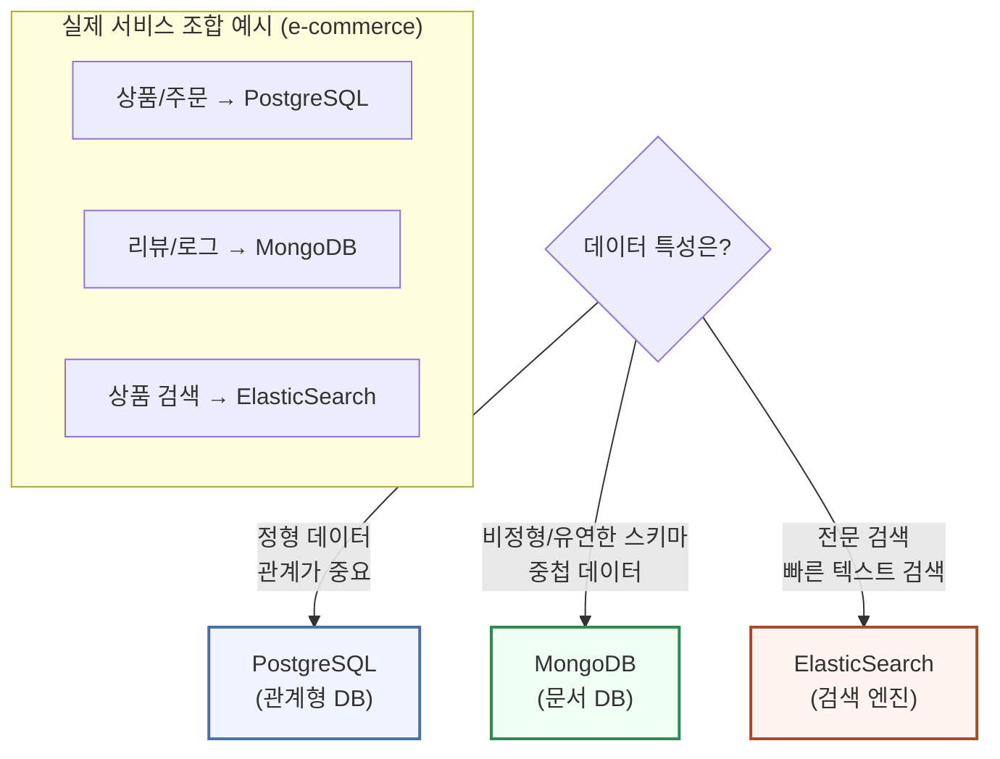
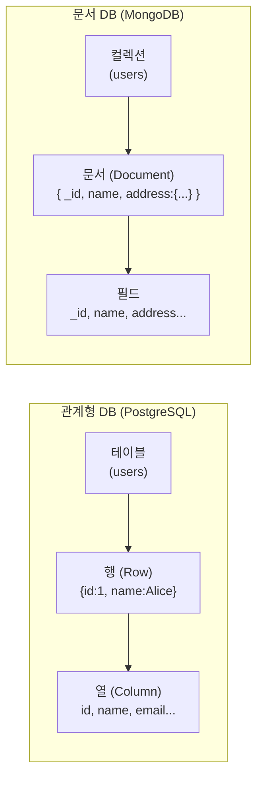
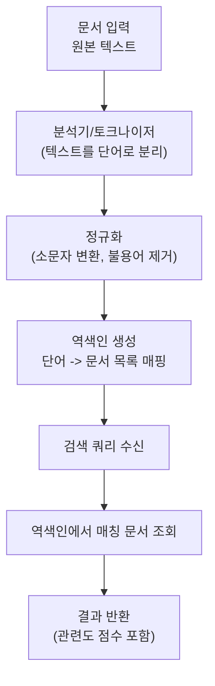
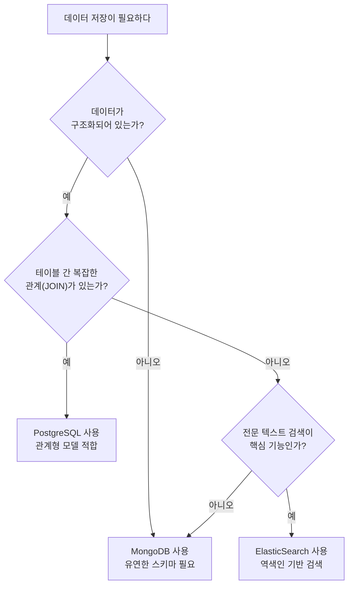

# 8회차: MongoDB + ElasticSearch 개요

## 학습 목표

이번 회차를 마치면 다음을 수행할 수 있습니다.

- 문서형 DB(Document DB)와 관계형 DB(RDB)의 핵심 차이를 설명할 수 있습니다.
- MongoDB의 Document, Collection, ObjectId 개념을 이해하고 기본 CRUD를 작성할 수 있습니다.
- ElasticSearch가 일반 데이터베이스와 다른 포지션에 있음을 설명할 수 있습니다.
- 전문 검색(Full-text Search)에서 역색인(Inverted Index)이 어떻게 동작하는지 이해합니다.
- 주어진 요구사항에 따라 RDB, MongoDB, ElasticSearch 중 어떤 것을 선택할지 판단할 수 있습니다.

---

## 이번 세션 전체 그림



데이터베이스는 목적에 따라 선택합니다. 하나의 서비스에서 여러 종류의 DB를 함께 사용하는 것은 흔한 패턴(폴리글랏 퍼시스턴스)입니다. 이 세션에서는 MongoDB와 ElasticSearch가 어떤 문제를 해결하는지 이해하고, 선택 기준을 배웁니다.

---

## 핵심 개념

### 1. 문서 DB vs 관계형 DB 비교

> **왜 필요한가?** 소셜 미디어 게시글은 사진이 0개일 수도 10개일 수도 있습니다. 동영상, 위치 정보, 태그가 있을 수도 없을 수도 있습니다. 관계형 DB에서 이를 표현하려면 여러 테이블과 복잡한 JOIN이 필요합니다. MongoDB는 이런 유연한 구조의 데이터를 하나의 문서(document)에 그대로 저장합니다.

> **진화 맥락 — RDB 독점 → NoSQL 등장**: 2000년대 초반까지 대부분의 데이터는 관계형 DB에 저장했습니다. 페이스북, 트위터 같은 소셜 미디어의 급성장(초당 수천 건의 쓰기)으로 수평 확장이 어려운 관계형 DB의 한계가 드러났습니다. 2009년 전후 MongoDB, Cassandra, Redis 등 NoSQL이 주목받기 시작했습니다. 지금은 "폴리글랏 퍼시스턴스(Polyglot Persistence)"라 불리는, 목적에 맞게 여러 DB를 함께 쓰는 패턴이 표준입니다.

7회차에서 배운 PostgreSQL은 **관계형 데이터베이스(RDB)**입니다. 데이터를 엄격한 스키마(테이블 구조)에 맞게 저장하며, 테이블 간 관계(JOIN)로 데이터를 연결합니다.

MongoDB는 **문서형 데이터베이스(Document DB)**입니다. 데이터를 JSON과 유사한 형태(BSON)로 저장하며, 스키마가 유연합니다.

| 비교 항목 | 관계형 DB (PostgreSQL) | 문서 DB (MongoDB) |
|-----------|------------------------|-------------------|
| 저장 단위 | 행(Row) | 문서(Document) |
| 모음 단위 | 테이블(Table) | 컬렉션(Collection) |
| 스키마 | 엄격(사전 정의 필수) | 유연(문서마다 다를 수 있음) |
| 데이터 형식 | 정형 데이터 | JSON/BSON |
| JOIN | 지원 (강력) | 기본적으로 없음 (Aggregation으로 대체) |
| 수평 확장 | 어려움 | 샤딩으로 쉬운 수평 확장 |
| 트랜잭션 | 완전 지원 (ACID) | 다중 문서 트랜잭션 지원(v4.0+) |

두 데이터베이스는 서로 경쟁 관계가 아닙니다. 사용 목적에 따라 함께 사용하기도 합니다.

---

### 2. MongoDB 핵심 개념

#### Document (문서)

MongoDB에서 데이터의 기본 단위입니다. JSON과 매우 비슷하게 생겼지만 내부적으로는 BSON(Binary JSON)으로 저장됩니다.

```json
{
  "_id": "ObjectId('64b7f3a2e4b0a5c8d9e0f123')",
  "name": "Alice",
  "email": "alice@example.com",
  "age": 28,
  "address": {
    "city": "서울",
    "district": "마포구"
  },
  "tags": ["개발자", "프론트엔드"],
  "createdAt": "2024-01-15T09:00:00Z"
}
```

관계형 DB에서는 주소를 별도 테이블로 분리해야 했습니다. MongoDB에서는 중첩 객체(Embedded Document)로 한 문서 안에 모두 저장할 수 있습니다.

#### Collection (컬렉션)

비슷한 성격의 문서를 모아놓은 것입니다. 관계형 DB의 테이블에 해당합니다. 단, 스키마가 강제되지 않으므로 같은 컬렉션 내에서도 문서마다 필드가 달라도 됩니다.

#### ObjectId

> **왜 필요한가?** MongoDB의 ObjectId는 분산 환경에서 여러 서버가 동시에 데이터를 생성해도 충돌 없이 고유한 ID를 만들 수 있습니다. 타임스탬프 정보도 포함되어 있어 생성 시간을 알 수 있습니다. 중앙 서버 없이도 ID가 고유함을 보장하는 설계입니다.

MongoDB가 자동으로 생성하는 고유 식별자입니다. 24자리 16진수 문자열입니다. 관계형 DB의 `SERIAL PRIMARY KEY` 역할을 합니다.

```
ObjectId("64b7f3a2e4b0a5c8d9e0f123")
      └─ 타임스탬프(4바이트) + 머신ID(3바이트) + 프로세스ID(2바이트) + 랜덤(3바이트)
```

---

### 3. MongoDB 쿼리 패턴

MongoDB는 SQL 대신 JavaScript 객체 형태의 쿼리를 사용합니다.

- `db.collection.find({조건})` - 조회 (SELECT)
- `db.collection.insertOne({문서})` - 삽입 (INSERT)
- `db.collection.updateOne({조건}, {수정내용})` - 수정 (UPDATE)
- `db.collection.deleteOne({조건})` - 삭제 (DELETE)

조건 연산자:

| 연산자 | 의미 | SQL 대응 |
|--------|------|----------|
| `$eq` | 같다 | `=` |
| `$gt` | 크다 | `>` |
| `$lt` | 작다 | `<` |
| `$in` | 목록에 포함 | `IN (...)` |
| `$and` | 모두 만족 | `AND` |
| `$or` | 하나 이상 만족 | `OR` |

---

### 4. ElasticSearch: 검색 엔진 포지셔닝

> **왜 필요한가?** SQL의 `LIKE '%검색어%'`는 인덱스를 사용하지 못하고 전체 테이블을 스캔합니다. 데이터가 1억 건이라면 수십 초가 걸릴 수 있습니다. ElasticSearch는 역색인(Inverted Index)을 미리 구성해두어 수억 건의 데이터에서도 밀리초 단위의 전문 검색(Full-text Search)이 가능합니다.

> **흔한 오해**: "ElasticSearch를 메인 데이터베이스로 써도 된다."
> **실제로는**: ElasticSearch는 검색에 특화되어 있어 트랜잭션, 복잡한 관계, 일관성 보장이 약합니다. 보통 PostgreSQL이나 MongoDB에 원본 데이터를 저장하고, ElasticSearch에 검색용 복사본을 동기화하는 방식으로 사용합니다.

> **📎 연결 포인트 → 7회차 (PostgreSQL)**: PostgreSQL의 강점(트랜잭션, 관계, 집계)과 MongoDB의 강점(유연한 스키마, 수평 확장)을 비교하면 각각 언제 쓸지 명확해집니다.

ElasticSearch(이하 ES)는 데이터베이스이기도 하지만, 그보다는 **검색·분석 엔진**으로 포지셔닝됩니다.

일반 데이터베이스에서 `LIKE '%검색어%'` 쿼리는 모든 행을 순차 스캔하여 느립니다. ES는 **역색인(Inverted Index)** 구조 덕분에 수억 건의 텍스트에서도 밀리초 단위로 검색합니다.

ES가 잘 어울리는 사용 사례:

- 블로그 게시글 전문 검색
- 상품명/설명 검색
- 로그 분석 (ELK Stack)
- 자동완성(Autocomplete)

ES가 어울리지 않는 사용 사례:

- 트랜잭션이 필요한 금융 데이터
- 복잡한 관계(JOIN)가 많은 구조화된 데이터
- 실시간 업데이트가 빈번한 데이터 (색인 비용이 큼)

실제 서비스에서는 PostgreSQL이나 MongoDB에 데이터를 저장하고, 검색 기능만 ES로 별도 구축하는 패턴을 많이 사용합니다.

---

### 5. 검색 엔진 역색인(Inverted Index) 개념

> **왜 필요한가?** 일반 인덱스는 "이 행에 어떤 단어가 있나?"를 찾습니다. 역색인은 반대로 "이 단어는 어떤 행에 있나?"를 미리 저장해둡니다. 책 뒤쪽 색인처럼, 단어를 먼저 찾고 그 단어가 있는 페이지(문서)를 바로 알 수 있습니다.

역색인이 동작하는 원리를 간단히 이해해 봅니다.

세 개의 문서가 있다고 가정합니다.

```
문서 1: "Node.js로 백엔드 개발하기"
문서 2: "React로 프론트엔드 개발하기"
문서 3: "Node.js와 React 풀스택 개발"
```

ES는 이 문서들을 색인할 때 다음과 같은 **역색인 테이블**을 만듭니다.

```
단어          -> 문서 목록
"Node.js"     -> [문서1, 문서3]
"백엔드"      -> [문서1]
"React"       -> [문서2, 문서3]
"개발"        -> [문서1, 문서2, 문서3]
"풀스택"      -> [문서3]
```

"Node.js"를 검색하면 역색인에서 바로 [문서1, 문서3]을 찾아 반환합니다. 전체 문서를 스캔하지 않으므로 매우 빠릅니다. 이것이 역색인의 핵심입니다.

---

### 6. DB 유형별 적합한 사용 사례

> **흔한 오해**: "MongoDB는 스키마가 없으니 아무 구조나 저장해도 된다."
> **실제로는**: 스키마를 강제하지 않는 것과 스키마 없이 개발하는 것은 다릅니다. 애플리케이션 레벨에서 Mongoose(ODM)나 Zod로 데이터 구조를 검증해야 합니다. 스키마 없이 마구 저장하면 나중에 데이터 정합성 문제가 발생합니다.

> **📎 연결 포인트 → AI 검색**: ElasticSearch는 최근 벡터 검색(Vector Search)을 지원하여 AI 임베딩 기반 유사도 검색에도 사용됩니다. AI API와 결합하면 시맨틱 검색(Semantic Search) 기능을 구현할 수 있습니다.

| 상황 | 추천 DB | 이유 |
|------|---------|------|
| 쇼핑몰 주문/결제 데이터 | PostgreSQL | 트랜잭션, 복잡한 관계 |
| 블로그 게시글 전문 검색 | ElasticSearch | 역색인 기반 빠른 검색 |
| 소셜 미디어 사용자 프로필 | MongoDB | 유연한 스키마 (사람마다 다른 정보) |
| 로그 수집 및 분석 | ElasticSearch | 대용량 텍스트 분석 |
| CMS 콘텐츠 관리 | MongoDB | 다양한 콘텐츠 타입 |
| 인증/권한 데이터 | PostgreSQL | 데이터 일관성 중요 |

---

## 다이어그램

### 다이어그램 1: RDB vs MongoDB 데이터 모델 비교



관계형 DB는 테이블 → 행 → 열의 구조이고, MongoDB는 컬렉션 → 문서 → 필드의 구조입니다. MongoDB 문서는 중첩 객체와 배열을 포함할 수 있어 더 유연합니다.

---

### 다이어그램 2: ElasticSearch 색인 프로세스



문서가 저장될 때 분석기가 텍스트를 토큰으로 분리하고 역색인을 생성합니다. 검색 시에는 역색인을 참조하여 매칭 문서를 빠르게 반환합니다.

---

### 다이어그램 3: DB 선택 의사결정 트리



이 트리는 하나의 가이드라인입니다. 실제 서비스에서는 여러 DB를 함께 사용하는 경우가 많습니다.

---

## 코드 예제

### 예제 1: MongoDB 기본 CRUD

```javascript
// MongoDB Node.js Driver 사용 예제
const { MongoClient, ObjectId } = require('mongodb')

const client = new MongoClient('mongodb://localhost:27017')
const db = client.db('myapp')
const users = db.collection('users')

async function main() {
  // INSERT: 단일 문서 삽입
  const insertResult = await users.insertOne({
    name: 'Alice',
    email: 'alice@example.com',
    age: 28,
    address: { city: '서울', district: '마포구' },  // 중첩 객체
    tags: ['개발자', '프론트엔드'],                   // 배열 필드
    createdAt: new Date()
  })
  console.log('삽입된 ID:', insertResult.insertedId)

  // SELECT: 조건 없이 전체 조회
  const allUsers = await users.find({}).toArray()
  console.log('전체 사용자:', allUsers)

  // SELECT: 조건 조회 (age가 25 이상)
  const adults = await users.find({ age: { $gte: 25 } }).toArray()

  // SELECT: 특정 이메일로 단일 문서 조회
  const alice = await users.findOne({ email: 'alice@example.com' })

  // UPDATE: 단일 문서 수정
  await users.updateOne(
    { email: 'alice@example.com' },    // 조건
    { $set: { age: 29 } }             // 수정 내용 ($set: 특정 필드만 업데이트)
  )

  // DELETE: 단일 문서 삭제
  await users.deleteOne({ email: 'alice@example.com' })

  await client.close()
}

main()
```

---

### 예제 2: SQL vs MongoDB 쿼리 비교

동일한 작업을 SQL과 MongoDB로 작성하면 다음과 같습니다.

```javascript
// ---- 전체 조회 ----

// SQL
// SELECT * FROM users;

// MongoDB
await users.find({}).toArray()


// ---- 조건 조회: 나이 25 이상 ----

// SQL
// SELECT name, email FROM users WHERE age >= 25;

// MongoDB
await users.find(
  { age: { $gte: 25 } },
  { projection: { name: 1, email: 1 } }  // SELECT 컬럼 지정
).toArray()


// ---- 정렬 및 제한 ----

// SQL
// SELECT * FROM users ORDER BY createdAt DESC LIMIT 10;

// MongoDB
await users.find({})
  .sort({ createdAt: -1 })  // -1 = 내림차순
  .limit(10)
  .toArray()


// ---- 특정 값 포함 여부 ----

// SQL
// SELECT * FROM users WHERE tags IN ('개발자', '디자이너');

// MongoDB
await users.find({ tags: { $in: ['개발자', '디자이너'] } }).toArray()


// ---- 문서 업데이트 ----

// SQL
// UPDATE users SET age = 30 WHERE email = 'alice@example.com';

// MongoDB
await users.updateOne(
  { email: 'alice@example.com' },
  { $set: { age: 30 } }
)
```

---

### 예제 3: ElasticSearch 인덱스/검색 개념 (의사코드)

ElasticSearch는 HTTP REST API로 통신합니다. 아래는 API 요청/응답 구조를 보여주는 의사코드입니다.

```json
// 1. 인덱스(Index) 생성 - PUT /articles
// ES의 "인덱스"는 RDB의 "테이블"에 해당
{
  "mappings": {
    "properties": {
      "title":   { "type": "text" },
      "content": { "type": "text", "analyzer": "korean" },
      "author":  { "type": "keyword" },
      "tags":    { "type": "keyword" },
      "createdAt": { "type": "date" }
    }
  }
}

// 2. 문서 저장 - POST /articles/_doc
{
  "title": "Next.js로 풀스택 개발하기",
  "content": "Next.js는 React 기반의 풀스택 프레임워크입니다...",
  "author": "Alice",
  "tags": ["Next.js", "React", "풀스택"],
  "createdAt": "2024-01-15"
}

// 3. 전문 검색 쿼리 - GET /articles/_search
{
  "query": {
    "multi_match": {
      "query": "풀스택 개발",         // 검색어
      "fields": ["title", "content"], // 검색 대상 필드
      "type": "best_fields"
    }
  },
  "highlight": {
    "fields": {
      "content": {}  // 검색어 하이라이팅
    }
  },
  "size": 10
}

// 4. 검색 결과 응답 구조
{
  "hits": {
    "total": { "value": 3 },
    "hits": [
      {
        "_id": "abc123",
        "_score": 1.85,     // 관련도 점수 (높을수록 관련성 높음)
        "_source": {
          "title": "Next.js로 풀스택 개발하기",
          "author": "Alice"
        },
        "highlight": {
          "content": ["<em>풀스택</em> 개발자를 위한..."]
        }
      }
    ]
  }
}
```

---

### 예제 4: RDB vs MongoDB vs ES 설계 비교

블로그 게시글 시스템을 세 가지 방식으로 설계하면 다음과 같습니다.

**시나리오**: 게시글(제목, 내용, 작성자, 태그)을 저장하고 검색해야 합니다.

```sql
-- PostgreSQL 설계
CREATE TABLE posts (
  id         SERIAL PRIMARY KEY,
  title      VARCHAR(255),
  content    TEXT,
  user_id    INTEGER REFERENCES users(id),
  created_at TIMESTAMP DEFAULT NOW()
);

CREATE TABLE tags (
  id   SERIAL PRIMARY KEY,
  name VARCHAR(50)
);

CREATE TABLE post_tags (        -- N:M 연결 테이블
  post_id INTEGER REFERENCES posts(id),
  tag_id  INTEGER REFERENCES tags(id)
);
-- 태그 검색: LIKE 또는 전문 검색 확장 필요
```

```javascript
// MongoDB 설계
// posts 컬렉션에 태그를 배열로 포함 (중첩 구조 활용)
{
  _id: ObjectId,
  title: "게시글 제목",
  content: "게시글 내용...",
  author: { userId: ObjectId, name: "Alice" },  // 중첩 객체
  tags: ["Next.js", "React", "풀스택"],         // 배열
  createdAt: Date
}
// 장점: JOIN 불필요, 관련 데이터를 한 문서에서 조회
// 단점: 전문 검색은 MongoDB Text Index로 제한적 지원
```

```json
// ElasticSearch 설계 (검색 전용)
// posts 인덱스
{
  "mappings": {
    "properties": {
      "title":   { "type": "text", "analyzer": "korean" },
      "content": { "type": "text", "analyzer": "korean" },
      "tags":    { "type": "keyword" },
      "authorName": { "type": "keyword" }
    }
  }
}
// 장점: 초고속 전문 검색, 관련도 점수 계산
// 단점: 단독 사용보다 RDB/MongoDB와 조합하여 사용
```

---

## 실습

### 기본 실습: MongoDB Atlas로 문서 CRUD 실습

MongoDB Atlas는 MongoDB의 클라우드 서비스로 무료 Tier를 제공합니다.

**단계 1: Atlas 접속 및 클러스터 생성**

1. mongodb.com/atlas에서 계정을 생성합니다.
2. Free Tier 클러스터(M0)를 생성합니다.
3. `Database Access`에서 데이터베이스 사용자를 추가합니다.
4. `Network Access`에서 현재 IP를 허용합니다.

**단계 2: Atlas UI에서 문서 삽입**

클러스터 접속 후 `Browse Collections`를 클릭합니다. `+ Create Database`로 `myapp` 데이터베이스와 `users` 컬렉션을 생성합니다. `Insert Document`를 클릭하고 아래 데이터를 입력합니다.

```json
{
  "name": "Alice",
  "email": "alice@example.com",
  "tags": ["개발자", "Next.js"],
  "createdAt": { "$date": "2024-01-15T00:00:00Z" }
}
```

예상 결과: 문서가 삽입되고 `_id` 필드가 자동으로 생성됩니다.

**단계 3: 필터 쿼리 실습**

Atlas UI의 검색창에 다음 조건을 입력하여 조회합니다.

```json
{ "tags": "Next.js" }
```

예상 결과: tags 배열에 "Next.js"를 포함하는 문서가 조회됩니다.

---

### 도전 실습: 동일한 데이터를 3가지 방식으로 설계하기

다음 요구사항으로 각 DB의 설계 방안을 작성해 봅니다.

**요구사항**: 도서관 시스템에서 책, 저자, 독자의 대출 정보를 관리합니다.
- 책(제목, ISBN, 장르)
- 저자(이름, 국적)
- 독자(이름, 이메일)
- 대출 기록(책, 독자, 대출일, 반납일)
- 책 제목과 내용으로 전문 검색 필요

**PostgreSQL 설계 작성**: 테이블과 관계를 SQL로 작성합니다.

**MongoDB 설계 작성**: 어떤 데이터를 한 문서에 내포(embed)할지, 어떤 데이터를 별도 컬렉션으로 분리할지 결정하고 문서 구조를 JSON으로 작성합니다.

**ElasticSearch 설계 작성**: 검색이 필요한 필드를 mappings로 정의합니다.

**토론**: 이 시스템에서 어떤 DB를 주(primary) DB로 사용하고, 어떤 DB를 보조(secondary)로 사용할지 이유와 함께 정리합니다.

모범 답안 예시:
- **주 DB**: PostgreSQL (트랜잭션, 복잡한 관계 - 대출 기록의 무결성)
- **보조 DB**: ElasticSearch (책 제목/내용 전문 검색)
- MongoDB는 이 경우 필수는 아니지만, 책의 상세 정보(다양한 형식의 메타데이터)를 저장하는 데 활용 가능

---

## 요약

이번 8회차에서 배운 핵심 내용을 정리합니다.

- **MongoDB**는 JSON 형태의 Document를 Collection에 저장하는 문서형 DB입니다. 스키마가 유연하여 다양한 형태의 데이터를 저장하기 좋습니다.
- **SQL vs MongoDB 쿼리**: SQL은 선언적 쿼리 언어를 사용하고, MongoDB는 JavaScript 객체 형태의 쿼리를 사용합니다. 핵심 CRUD 개념은 동일합니다.
- **ElasticSearch**는 전문 텍스트 검색에 특화된 검색·분석 엔진입니다. 역색인(Inverted Index) 구조로 대용량 텍스트도 밀리초 내 검색이 가능합니다.
- **DB 선택 기준**: 구조화된 관계 데이터 → PostgreSQL, 유연한 스키마/수평 확장 → MongoDB, 전문 텍스트 검색 → ElasticSearch입니다.
- 실제 서비스에서는 **폴리글롯 영속성(Polyglot Persistence)**, 즉 여러 DB를 목적에 맞게 혼합 사용하는 것이 일반적입니다.

> **다음 9회차 미리보기**: 웹 서비스에서 빠질 수 없는 두 가지 주제를 다룹니다. Part A에서는 "누가 접근하는지"를 확인하는 OAuth/JWT 인증을 학습하고, Part B에서는 AI API를 서버에서 안전하게 호출하는 프록시 패턴을 학습합니다. 이 두 기술을 마스터하면 완성도 있는 풀스택 애플리케이션을 만들 수 있습니다.

---

## 강사 자료

이 세션 내용을 더 깊이 이해하고 싶다면 아래 자료를 참고하세요.

- [ORM 실전가이드](/appendix/deep-dive/orm-guide): MongoDB 이후 SQL/NoSQL을 ORM으로 추상화하는 방법을 다룹니다
