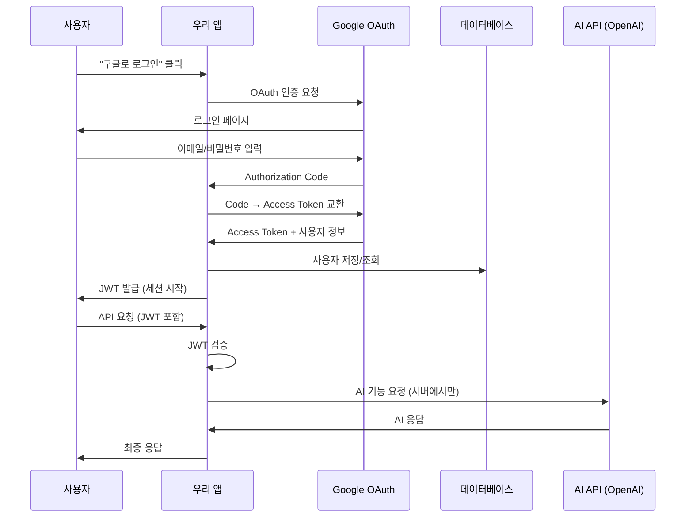
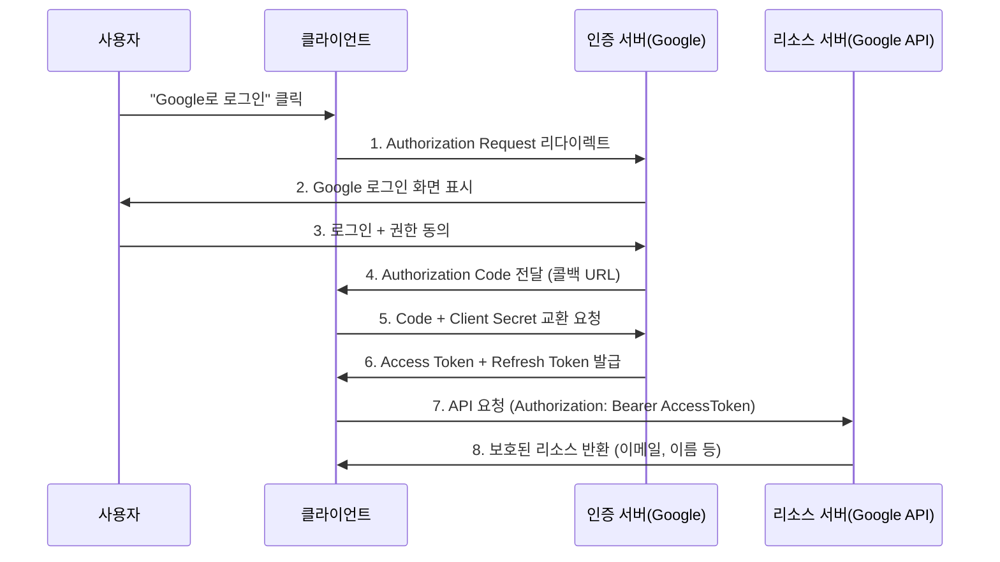
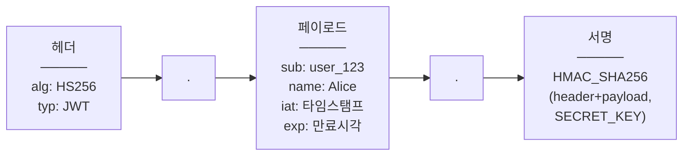
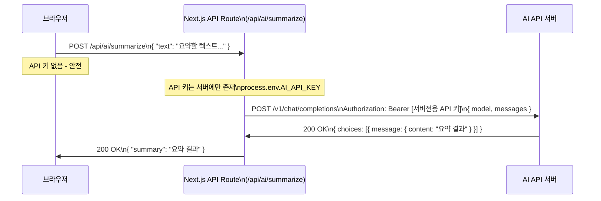

# 9회차: OAuth/JWT 인증 + AI API 연동

## 학습 목표

이번 회차는 두 가지 대주제로 구성됩니다.

**Part A - 인증 (OAuth / JWT)**
- 인증(Authentication)과 인가(Authorization)의 차이를 명확히 설명할 수 있습니다.
- OAuth 2.0 Authorization Code 흐름을 단계별로 설명할 수 있습니다.
- 세션 기반 인증과 JWT 기반 인증의 차이점과 장단점을 비교할 수 있습니다.
- JWT 토큰의 세 부분(Header, Payload, Signature) 구조를 이해합니다.
- NextAuth.js를 사용하여 Google 로그인을 구현할 수 있습니다.

**Part B - AI API 연동**
- API 키를 안전하게 관리하는 원칙을 설명할 수 있습니다.
- 서버 프록시 패턴을 이용하여 클라이언트에 API 키를 노출하지 않고 AI API를 호출할 수 있습니다.
- Next.js API Route를 활용한 프록시 함수를 구현할 수 있습니다.
- AI API로 텍스트 요약, 분류, 추천 기능을 구현할 수 있습니다.

---

## 이번 세션 전체 그림



OAuth는 "구글/깃허브로 로그인" 기능입니다. 사용자를 Google이 인증하면, 우리 서버는 JWT를 발급해 이후 요청을 처리합니다. AI API는 서버(Route Handler)를 통해서만 호출하여 API 키를 보호합니다.

---

## Part A: 인증 (OAuth / JWT)

### 핵심 개념 A

#### 1. 인증(Authentication) vs 인가(Authorization)

> **왜 필요한가?** 이 두 개념을 혼동하면 보안 취약점이 생깁니다. 로그인(인증)에 성공했다고 해서 모든 리소스에 접근할 수 있는 것은 아닙니다. "나는 누구인가(인증)"와 "나는 무엇을 할 수 있는가(인가)"는 별개의 개념입니다. 관리자 페이지 접근 제한이 인가의 예입니다.

두 개념은 종종 혼용되지만 엄연히 다릅니다.

**인증(Authentication)**: "너는 누구인가?" - 신원을 확인하는 과정입니다.

공항에서 여권을 제시하는 것이 인증입니다. 시스템에서는 로그인이 인증에 해당합니다.

**인가(Authorization)**: "너는 무엇을 할 수 있는가?" - 권한을 확인하는 과정입니다.

탑승권에 'Business Class'라고 적혀 있으면 비즈니스 클래스에 탑승할 권한이 있는 것입니다. 시스템에서는 "관리자만 삭제 가능", "본인 데이터만 수정 가능" 같은 규칙이 인가입니다.

```
인증 먼저, 인가 나중
로그인(인증) → 권한 확인(인가) → 리소스 접근
```

---

#### 2. OAuth 2.0 Authorization Code 흐름

> **왜 필요한가?** 직접 비밀번호를 받아 저장하면 DB가 해킹당했을 때 사용자 비밀번호가 유출됩니다. OAuth는 비밀번호를 받지 않고, Google/GitHub 같은 신뢰할 수 있는 제공자가 인증을 대신합니다. 사용자는 이미 신뢰하는 서비스로 로그인하고, 우리 앱은 사용자 정보만 받습니다.

> **진화 맥락 — 비밀번호 → 해싱 → OAuth**: 초기 웹은 비밀번호를 평문으로 저장했습니다. 해킹 사례가 늘면서 bcrypt 같은 단방향 해싱이 표준이 되었습니다. 그러나 "비밀번호를 직접 받는다"는 위험은 여전했습니다. OAuth는 비밀번호 자체를 받지 않고 신뢰할 수 있는 제3자에게 인증을 위임합니다. 보안 책임을 분산시키는 현대적 접근입니다.

OAuth 2.0은 **제3자 서비스(Google, GitHub 등)에 비밀번호를 공유하지 않고 인증을 위임**하는 표준 프로토콜입니다.

"Google로 로그인"을 클릭할 때 내부에서 일어나는 일을 단계별로 살펴봅니다.

1. 사용자가 "Google로 로그인" 버튼을 클릭합니다.
2. 클라이언트(우리 앱)가 Google 인증 서버로 사용자를 리다이렉트합니다.
3. Google이 사용자에게 로그인 화면을 보여줍니다.
4. 사용자가 Google에 로그인하고 우리 앱의 접근에 동의합니다.
5. Google이 단기 유효 Authorization Code를 클라이언트에 보냅니다.
6. 클라이언트가 서버에서 Code와 Client Secret으로 Access Token을 요청합니다.
7. Google이 Access Token(+ Refresh Token)을 발급합니다.
8. Access Token으로 Google API(사용자 이메일, 이름 등)를 호출합니다.

핵심은 **사용자의 Google 비밀번호가 우리 서버에 절대 전달되지 않는다**는 점입니다.

---

#### 3. 세션 기반 인증 vs JWT 기반 인증

> **왜 필요한가?** 세션 방식은 로그인 상태를 서버 메모리에 저장합니다. 서버가 여러 대로 늘어나면(수평 확장, Scale Out) 어느 서버에 세션이 있는지 공유해야 합니다. JWT는 토큰 자체에 사용자 정보가 담겨 있어 서버가 상태를 저장하지 않아도 됩니다. 어느 서버에서든 토큰만 검증하면 됩니다.

> **흔한 오해**: "세션이 JWT보다 더 안전하다."
> **실제로는**: 세션과 JWT는 서로 다른 위협에 취약합니다. 세션은 Session Hijacking(쿠키 탈취), JWT는 토큰 탈취가 위협입니다. 어떤 방식이 더 안전한지는 사용 환경에 따라 다릅니다. 중요한 것은 HTTPS 사용, 적절한 만료 시간 설정, XSS 방어입니다.

| 비교 항목 | 세션 기반 인증 | JWT 기반 인증 |
|-----------|---------------|---------------|
| 저장 위치 | 서버(DB or Redis) | 클라이언트(쿠키/LocalStorage) |
| 서버 부담 | 세션 저장소 필요 | 서버 무상태(Stateless) |
| 확장성 | 수평 확장 시 세션 공유 필요 | 어떤 서버에서도 검증 가능 |
| 로그아웃 | 서버에서 즉시 무효화 가능 | 토큰 만료 전 무효화 어려움 |
| 보안 | CSRF 공격 주의 | XSS 공격 주의 |
| 적합한 상황 | 단일 서버, 즉각 로그아웃 필요 | 마이크로서비스, API 서버 |

**세션 기반**: 서버가 "사용자 A가 로그인 중"이라는 정보를 기억합니다.

**JWT 기반**: 사용자가 "나는 A입니다"라는 증명서(토큰)를 직접 들고 다닙니다. 서버는 증명서의 서명만 검증합니다.

NextAuth.js는 두 방식을 모두 지원하며, 기본적으로 암호화된 JWT를 HttpOnly 쿠키에 저장합니다.

---

#### 4. JWT 토큰 구조

> **왜 필요한가?** JWT를 이해하지 못하면 "안전한 토큰"으로 오해하고 민감한 정보를 담을 수 있습니다. JWT는 암호화가 아니라 서명(Signature)입니다. Base64로 인코딩된 내용은 누구나 디코딩해 볼 수 있습니다. 서명은 "이 토큰이 우리 서버가 발급한 것"임을 검증할 뿐입니다.

> **흔한 오해**: "JWT는 암호화되어 있어서 내용을 볼 수 없다."
> **실제로는**: JWT는 Base64로 인코딩되어 있어 쉽게 디코딩됩니다. jwt.io 같은 사이트에서 바로 확인할 수 있습니다. 비밀번호나 카드번호 같은 민감한 정보를 JWT에 넣으면 안 됩니다. JWT의 보안은 "누군가 변조했는가"를 검증하는 서명에 있지, 내용을 숨기는 암호화에 있지 않습니다.

JWT(JSON Web Token)는 세 부분을 `.`으로 연결한 문자열입니다.

```
<헤더 Base64URL>.<페이로드 Base64URL>.<서명 Base64URL>
```

각 부분은 Base64URL로 인코딩된 JSON입니다.

**헤더(Header)**: 알고리즘과 토큰 타입을 명시합니다.
```json
{ "alg": "HS256", "typ": "JWT" }
```

**페이로드(Payload)**: 사용자 정보(Claim)를 담습니다. 암호화되지 않으므로 민감 정보는 포함하지 않습니다.
```json
{ "sub": "user_123", "name": "Alice", "email": "alice@example.com", "iat": 1705362000, "exp": 1705448400 }
```

**서명(Signature)**: 헤더 + 페이로드를 Secret Key로 서명합니다. 변조 여부를 검증할 때 사용합니다.
```
HMAC_SHA256(base64url(header) + "." + base64url(payload), SECRET_KEY)
```

> JWT는 Base64URL로 **인코딩**된 것이지, **암호화**가 아닙니다. 누구나 헤더와 페이로드를 디코딩하여 읽을 수 있습니다. 중요한 것은 서명 검증이며, Secret Key 없이는 서명을 위조할 수 없습니다.

---

#### 5. NextAuth.js 활용 전략

> **📎 연결 포인트 → 3회차 (HTTP)**: JWT는 `Authorization: Bearer [토큰]` 형태로 HTTP 헤더에 담아 전달합니다. 3회차에서 배운 HTTP 헤더 개념이 여기서 직접 사용됩니다.

> **📎 연결 포인트 → 7회차 (Supabase RLS)**: Supabase Auth와 RLS를 결합하면 "로그인한 사용자는 자신의 데이터만 접근"을 데이터베이스 레벨에서 강제할 수 있습니다.

> **📎 연결 포인트 → 1회차 (.env)**: AI API 키는 반드시 `.env`에 저장하고 서버에서만 사용해야 합니다. 1회차에서 익힌 환경변수 관리가 여기서 보안의 핵심이 됩니다.

NextAuth.js(현재 Auth.js라는 이름으로 통합 중)는 Next.js에서 인증을 빠르게 구현할 수 있는 라이브러리입니다.

- 30개 이상의 OAuth Provider 지원 (Google, GitHub, Kakao 등)
- 이메일/비밀번호 로그인 지원
- JWT와 세션 방식 모두 지원
- Middleware로 보호 라우트 구현 가능

---

### 다이어그램 A

#### 다이어그램 A-1: OAuth 2.0 Authorization Code 흐름



---

#### 다이어그램 A-2: JWT 토큰 구조



---

### 코드 예제 A

#### 예제 A-1: NextAuth.js 설정 파일

```typescript
// app/api/auth/[...nextauth]/route.ts
import NextAuth from 'next-auth'
import GoogleProvider from 'next-auth/providers/google'
import { NextAuthOptions } from 'next-auth'

export const authOptions: NextAuthOptions = {
  providers: [
    GoogleProvider({
      clientId: process.env.GOOGLE_CLIENT_ID!,
      clientSecret: process.env.GOOGLE_CLIENT_SECRET!,
    }),
  ],
  callbacks: {
    // JWT 콜백: 토큰에 추가 정보를 담을 때 사용
    async jwt({ token, account }) {
      if (account) {
        token.accessToken = account.access_token
      }
      return token
    },
    // Session 콜백: 클라이언트에서 session.user로 접근할 수 있는 정보 설정
    async session({ session, token }) {
      session.user.id = token.sub as string
      return session
    },
  },
  pages: {
    signIn: '/auth/signin', // 커스텀 로그인 페이지 경로
  },
}

const handler = NextAuth(authOptions)
export { handler as GET, handler as POST }
```

```
# .env.local 설정 항목 (실제 값은 Google Cloud Console에서 발급)
NEXTAUTH_URL=http://localhost:3000
NEXTAUTH_SECRET=openssl-rand-base64-32-로-생성한-랜덤-문자열
GOOGLE_CLIENT_ID=Google-Cloud-Console에서-발급한-클라이언트-ID
GOOGLE_CLIENT_SECRET=Google-Cloud-Console에서-발급한-클라이언트-보안-비밀
```

---

#### 예제 A-2: Google OAuth Provider 구성 및 로그인 버튼

```typescript
// app/components/LoginButton.tsx
'use client'
import { signIn, signOut, useSession } from 'next-auth/react'

export function LoginButton() {
  const { data: session, status } = useSession()

  if (status === 'loading') {
    return <span>로딩 중...</span>
  }

  if (session) {
    return (
      <div>
        <p>{session.user?.name}님 안녕하세요</p>
        <button onClick={() => signOut()}>로그아웃</button>
      </div>
    )
  }

  return (
    <button onClick={() => signIn('google')}>
      Google로 로그인
    </button>
  )
}
```

```typescript
// app/layout.tsx - SessionProvider 설정
import { SessionProvider } from 'next-auth/react'

export default function RootLayout({ children }: { children: React.ReactNode }) {
  return (
    <html lang="ko">
      <body>
        <SessionProvider>
          {children}
        </SessionProvider>
      </body>
    </html>
  )
}
```

Google Cloud Console에서 OAuth 앱을 생성할 때 승인된 리다이렉트 URI에 아래 주소를 추가합니다.

- 개발 환경: `http://localhost:3000/api/auth/callback/google`
- 프로덕션: `https://your-domain.com/api/auth/callback/google`

---

#### 예제 A-3: JWT 생성/검증 개념 코드

NextAuth.js는 JWT를 자동으로 처리하지만, 직접 JWT를 다루는 원리를 이해하기 위한 예제입니다.

```typescript
// JWT 직접 생성/검증 개념 예제 (jsonwebtoken 라이브러리)
// npm install jsonwebtoken @types/jsonwebtoken
import jwt from 'jsonwebtoken'

// SECRET_KEY는 반드시 환경변수로 관리합니다
const SECRET_KEY = process.env.JWT_SECRET!

interface UserPayload {
  userId: string
  email: string
  role: 'admin' | 'user'
}

// JWT 생성 (로그인 성공 시 서버에서 호출)
export function generateAccessToken(user: UserPayload): string {
  return jwt.sign(
    {
      sub: user.userId,    // subject: 토큰의 주인
      email: user.email,
      role: user.role,
    },
    SECRET_KEY,
    {
      expiresIn: '1h',     // 1시간 후 만료
      algorithm: 'HS256',
    }
  )
}

// JWT 검증 (보호된 API 요청 시 서버에서 호출)
export function verifyAccessToken(token: string): UserPayload | null {
  try {
    const decoded = jwt.verify(token, SECRET_KEY) as {
      sub: string
      email: string
      role: 'admin' | 'user'
    }
    return { userId: decoded.sub, email: decoded.email, role: decoded.role }
  } catch {
    // 토큰이 만료되었거나 서명이 유효하지 않은 경우 null 반환
    return null
  }
}
```

---

#### 예제 A-4: 보호 라우트(Protected Route) 구현

```typescript
// middleware.ts - 프로젝트 루트 디렉토리에 위치
// 인증되지 않은 사용자가 보호된 페이지에 접근하면 로그인 페이지로 리다이렉트
import { withAuth } from 'next-auth/middleware'
import { NextResponse } from 'next/server'

export default withAuth(
  function middleware(req) {
    const token = req.nextauth.token

    // 관리자 전용 경로에 일반 사용자가 접근하면 접근 거부
    if (req.nextUrl.pathname.startsWith('/admin') && token?.role !== 'admin') {
      return NextResponse.rewrite(new URL('/unauthorized', req.url))
    }
  },
  {
    callbacks: {
      // 토큰이 있으면 인증된 것으로 처리
      authorized: ({ token }) => !!token,
    },
  }
)

// 미들웨어를 적용할 경로 패턴 설정
export const config = {
  matcher: [
    '/dashboard/:path*',
    '/profile/:path*',
    '/admin/:path*',
  ],
}
```

```typescript
// app/dashboard/page.tsx - 서버 컴포넌트에서 세션 확인
import { getServerSession } from 'next-auth'
import { authOptions } from '@/app/api/auth/[...nextauth]/route'
import { redirect } from 'next/navigation'

export default async function DashboardPage() {
  const session = await getServerSession(authOptions)

  if (!session) {
    redirect('/auth/signin')
  }

  return (
    <main>
      <h1>대시보드</h1>
      <p>환영합니다, {session.user?.name}님!</p>
      <p>이메일: {session.user?.email}</p>
    </main>
  )
}
```

---

### 실습 A

#### 기본 실습: Google 로그인 연동 + 보호 페이지 구현

**단계 1: 패키지 설치**

```bash
npm install next-auth
```

**단계 2: Google Cloud Console 설정**

1. console.cloud.google.com에 접속합니다.
2. 새 프로젝트를 생성합니다.
3. `API 및 서비스` > `OAuth 동의 화면`을 설정합니다.
4. `사용자 인증 정보` > `OAuth 2.0 클라이언트 ID`를 생성합니다.
5. 애플리케이션 유형으로 `웹 애플리케이션`을 선택합니다.
6. 승인된 리다이렉트 URI에 `http://localhost:3000/api/auth/callback/google`을 추가합니다.
7. 클라이언트 ID와 클라이언트 보안 비밀을 복사합니다.

**단계 3: 환경변수 설정**

`.env.local` 파일을 생성하고 아래 항목을 채웁니다. 실제 값은 Google Cloud Console에서 복사합니다.

```
NEXTAUTH_URL=http://localhost:3000
NEXTAUTH_SECRET=랜덤-비밀-문자열
GOOGLE_CLIENT_ID=Google-Cloud-Console-클라이언트-ID
GOOGLE_CLIENT_SECRET=Google-Cloud-Console-클라이언트-보안-비밀
```

**단계 4: NextAuth.js 설정 파일 생성**

예제 A-1의 코드를 `app/api/auth/[...nextauth]/route.ts`에 작성합니다.

**단계 5: SessionProvider 설정**

예제 A-2의 `RootLayout` 코드를 `app/layout.tsx`에 적용합니다.

**단계 6: 로그인 버튼 추가 및 테스트**

`LoginButton` 컴포넌트를 메인 페이지에 추가하고, "Google로 로그인"을 클릭하여 실제 흐름을 확인합니다.

예상 결과: Google 로그인 완료 후 사용자 이름이 화면에 표시됩니다.

**단계 7: 보호 라우트 설정**

예제 A-4의 `middleware.ts`를 프로젝트 루트에 추가합니다. `app/dashboard/page.tsx`를 생성한 뒤, 비로그인 상태에서 `/dashboard`에 접근하면 로그인 페이지로 이동하는지 확인합니다.

---

#### 도전 실습: 로그인 상태에 따른 조건부 렌더링

```typescript
// app/components/ConditionalContent.tsx
'use client'
import { useSession } from 'next-auth/react'

export function ConditionalContent() {
  const { data: session } = useSession()

  return (
    <div>
      {session ? (
        <div>
          <h2>나의 대시보드</h2>
          <p>안녕하세요, {session.user?.name}!</p>
        </div>
      ) : (
        <div>
          <h2>서비스를 이용하려면 로그인하세요</h2>
          <p>더 많은 기능을 사용하려면 로그인이 필요합니다.</p>
        </div>
      )}
    </div>
  )
}
```

이 컴포넌트를 다양한 페이지에 적용하여 로그인 상태에 따라 다른 UI가 표시되는지 확인합니다.

---

## Part B: AI API 연동

### 핵심 개념 B

#### 1. AI API 호출의 기본 원리

AI API는 HTTP 요청으로 텍스트나 이미지를 입력하면 AI가 처리한 결과를 반환하는 서비스입니다. 대표적으로 OpenAI, Anthropic, Google Gemini, Cohere 등이 있습니다.

모든 AI API의 호출 구조는 비슷합니다.

```
클라이언트 → HTTP POST 요청 (입력 데이터 + API 키) → AI API 서버 → 응답 반환
```

HTTP 요청 헤더에 `Authorization: Bearer {API_KEY}` 형식으로 API 키를 포함합니다.

---

#### 2. API 키 관리 원칙

> **왜 필요한가?** 클라이언트(브라우저)에서 직접 AI API를 호출하면 API 키가 브라우저 개발자 도구에서 그대로 보입니다. GitHub에 실수로 올라가거나, 브라우저에서 노출된 API 키는 몇 분 안에 자동화된 봇이 발견해 남용합니다. 수십만 원의 비용이 청구될 수 있습니다.

**API 키를 클라이언트(브라우저)에 절대 노출하면 안 됩니다.**

브라우저에서 직접 AI API를 호출하면, 개발자 도구(Network 탭)를 열면 API 키가 그대로 보입니다. 키가 노출되면 타인이 내 계정으로 무제한 API를 호출하여 막대한 비용이 청구될 수 있습니다.

**안전한 방법: 서버에서만 API 키를 사용합니다.**

- API 키는 `.env.local` (또는 서버 환경변수)에만 저장합니다.
- `NEXT_PUBLIC_` 접두사 없이 저장합니다. (`NEXT_PUBLIC_`은 브라우저에 노출됩니다.)
- 클라이언트는 내 서버(Next.js API Route)를 호출하고, 서버가 AI API를 호출합니다.

---

#### 3. 서버 프록시 호출 패턴

```
브라우저 → 내 Next.js API Route → AI API 서버
         (API 키 없음)           (API 키 포함)
```

이 패턴을 **서버 프록시(Server Proxy)**라고 합니다.

장점:
- API 키가 클라이언트에 노출되지 않습니다.
- 요청 횟수 제한(Rate Limiting)을 서버에서 직접 구현할 수 있습니다.
- 사용량 모니터링이 가능합니다.
- AI 벤더를 변경해도 클라이언트 코드는 수정할 필요가 없습니다.

---

#### 4. 요약/분류/추천 기능의 AI 활용 사례

| 기능 | 입력 | 출력 |
|------|------|------|
| 요약(Summarization) | 긴 기사, 문서 | 3줄 요약 |
| 분류(Classification) | 고객 문의 텍스트 | 카테고리 (배송/결제/환불) |
| 추천(Recommendation) | 사용자 취향, 히스토리 | 관련 상품/콘텐츠 목록 |
| 번역(Translation) | 원문 텍스트 | 번역 결과 |
| 감성 분석(Sentiment) | 리뷰 텍스트 | 긍정/부정/중립 |
| 코드 생성(Code Gen) | 자연어 요구사항 | 코드 |

---

### 다이어그램 B

#### 다이어그램 B-1: AI API 프록시 호출 흐름



---

### 코드 예제 B

#### 예제 B-1: API 키 환경변수 관리

```bash
# .env.local 설정 항목
# AI API 키는 NEXT_PUBLIC_ 없이 서버에서만 접근 가능하게 설정합니다
# 실제 값은 각 AI 서비스의 대시보드에서 발급받습니다

AI_API_KEY=발급받은-AI-서비스-키
AI_API_BASE_URL=https://api.openai.com/v1
```

```typescript
// lib/env.ts - 환경변수 유효성 검사 헬퍼
export function getAIConfig() {
  const apiKey = process.env.AI_API_KEY
  const baseUrl = process.env.AI_API_BASE_URL

  if (!apiKey) {
    throw new Error('AI_API_KEY 환경변수가 설정되지 않았습니다.')
  }

  return {
    apiKey,
    baseUrl: baseUrl ?? 'https://api.openai.com/v1',
  }
}
```

---

#### 예제 B-2: Next.js API Route 프록시 함수

```typescript
// app/api/ai/summarize/route.ts
import { NextRequest, NextResponse } from 'next/server'
import { getAIConfig } from '@/lib/env'

interface SummarizeRequest {
  text: string
}

export async function POST(request: NextRequest) {
  try {
    // 1. 요청 바디 파싱
    const body: SummarizeRequest = await request.json()

    if (!body.text || body.text.trim().length === 0) {
      return NextResponse.json(
        { error: '요약할 텍스트를 입력해주세요.' },
        { status: 400 }
      )
    }

    // 2. 텍스트 길이 제한 (비용 및 오용 방지)
    if (body.text.length > 5000) {
      return NextResponse.json(
        { error: '텍스트는 5,000자 이하로 입력해주세요.' },
        { status: 400 }
      )
    }

    // 3. AI API 설정 가져오기 (서버에서만 접근 가능)
    const { apiKey, baseUrl } = getAIConfig()

    // 4. AI API 호출 (서버 → AI API)
    const aiResponse = await fetch(`${baseUrl}/chat/completions`, {
      method: 'POST',
      headers: {
        'Content-Type': 'application/json',
        'Authorization': `Bearer ${apiKey}`,
      },
      body: JSON.stringify({
        model: 'gpt-4o-mini',
        messages: [
          {
            role: 'system',
            content:
              '당신은 텍스트 요약 전문가입니다. 입력된 텍스트를 핵심 내용 위주로 3-5문장으로 요약해주세요.',
          },
          {
            role: 'user',
            content: body.text,
          },
        ],
        max_tokens: 500,
        temperature: 0.3,
      }),
    })

    if (!aiResponse.ok) {
      const errorData = await aiResponse.json()
      throw new Error(`AI API 오류: ${errorData.error?.message ?? '알 수 없는 오류'}`)
    }

    // 5. AI 응답 파싱
    const aiData = await aiResponse.json()
    const summary = aiData.choices?.[0]?.message?.content

    if (!summary) {
      throw new Error('AI 응답에서 요약 결과를 찾을 수 없습니다.')
    }

    // 6. 클라이언트에 결과 반환 (API 키 노출 없음)
    return NextResponse.json({ summary })
  } catch (error) {
    console.error('AI API 호출 오류:', error)
    return NextResponse.json(
      { error: '요약 처리 중 오류가 발생했습니다.' },
      { status: 500 }
    )
  }
}
```

---

#### 예제 B-3: 분류 기능 API Route

```typescript
// app/api/ai/classify/route.ts
import { NextRequest, NextResponse } from 'next/server'
import { getAIConfig } from '@/lib/env'

const CATEGORIES = ['기술/개발', '비즈니스', '과학', '문화/예술', '스포츠', '기타']

export async function POST(request: NextRequest) {
  try {
    const { text }: { text: string } = await request.json()

    if (!text) {
      return NextResponse.json({ error: '텍스트를 입력해주세요.' }, { status: 400 })
    }

    const { apiKey, baseUrl } = getAIConfig()

    const aiResponse = await fetch(`${baseUrl}/chat/completions`, {
      method: 'POST',
      headers: {
        'Content-Type': 'application/json',
        'Authorization': `Bearer ${apiKey}`,
      },
      body: JSON.stringify({
        model: 'gpt-4o-mini',
        messages: [
          {
            role: 'system',
            content: `다음 카테고리 중 하나로만 분류해주세요: ${CATEGORIES.join(', ')}.
카테고리 이름만 반환하고, 다른 설명은 포함하지 마세요.`,
          },
          { role: 'user', content: text },
        ],
        max_tokens: 20,
        temperature: 0,
      }),
    })

    const aiData = await aiResponse.json()
    const category = aiData.choices?.[0]?.message?.content?.trim()

    return NextResponse.json({ category })
  } catch {
    return NextResponse.json(
      { error: '분류 처리 중 오류가 발생했습니다.' },
      { status: 500 }
    )
  }
}
```

---

#### 예제 B-4: 프론트엔드에서 프록시 API 호출

```typescript
// app/components/AITools.tsx
'use client'
import { useState } from 'react'

export function AITools() {
  const [text, setText] = useState('')
  const [summary, setSummary] = useState('')
  const [category, setCategory] = useState('')
  const [isLoading, setIsLoading] = useState(false)
  const [error, setError] = useState('')

  // 요약 기능: 내 서버의 API Route를 호출 (AI API 직접 호출 아님)
  async function handleSummarize() {
    if (!text.trim()) return
    setIsLoading(true)
    setError('')
    setSummary('')

    try {
      const response = await fetch('/api/ai/summarize', {
        method: 'POST',
        headers: { 'Content-Type': 'application/json' },
        body: JSON.stringify({ text }),
      })

      const data = await response.json()

      if (!response.ok) {
        throw new Error(data.error ?? '요약에 실패했습니다.')
      }

      setSummary(data.summary)
    } catch (err) {
      setError(err instanceof Error ? err.message : '오류가 발생했습니다.')
    } finally {
      setIsLoading(false)
    }
  }

  // 분류 기능
  async function handleClassify() {
    if (!text.trim()) return
    setIsLoading(true)
    setError('')
    setCategory('')

    try {
      const response = await fetch('/api/ai/classify', {
        method: 'POST',
        headers: { 'Content-Type': 'application/json' },
        body: JSON.stringify({ text }),
      })

      const data = await response.json()
      if (!response.ok) throw new Error(data.error)
      setCategory(data.category)
    } catch (err) {
      setError(err instanceof Error ? err.message : '오류가 발생했습니다.')
    } finally {
      setIsLoading(false)
    }
  }

  return (
    <div>
      <h2>AI 텍스트 분석 도구</h2>

      <textarea
        value={text}
        onChange={(e) => setText(e.target.value)}
        placeholder="분석할 텍스트를 입력하세요..."
        rows={10}
        style={{ width: '100%' }}
      />

      <div>
        <button onClick={handleSummarize} disabled={isLoading || !text.trim()}>
          {isLoading ? '처리 중...' : '요약하기'}
        </button>
        <button onClick={handleClassify} disabled={isLoading || !text.trim()}>
          {isLoading ? '처리 중...' : '카테고리 분류'}
        </button>
      </div>

      {error && <p style={{ color: 'red' }}>오류: {error}</p>}

      {summary && (
        <div>
          <h3>요약 결과</h3>
          <p>{summary}</p>
        </div>
      )}

      {category && (
        <div>
          <h3>분류 결과</h3>
          <p>카테고리: <strong>{category}</strong></p>
        </div>
      )}
    </div>
  )
}
```

---

### 실습 B

#### 기본 실습: 텍스트 요약 기능 구현

**단계 1: AI API 키 발급**

OpenAI, Anthropic, Google Gemini 등 원하는 AI 서비스에서 계정을 생성하고 API 키를 발급받습니다. 수업에서는 OpenAI 방식을 기준으로 진행하지만, 다른 벤더의 API도 구조가 유사합니다.

**단계 2: 환경변수 설정**

`.env.local` 파일에 발급받은 API 키를 서버 전용으로 저장합니다.

```bash
AI_API_KEY=AI-서비스에서-발급받은-키
AI_API_BASE_URL=https://api.openai.com/v1
```

**단계 3: API Route 생성**

예제 B-2의 코드를 `app/api/ai/summarize/route.ts`에 작성합니다.

**단계 4: 프론트엔드 컴포넌트 구현**

예제 B-4의 `AITools` 컴포넌트를 작성하고 페이지에 포함시킵니다.

**단계 5: 테스트**

뉴스 기사 또는 긴 텍스트를 입력하고 "요약하기" 버튼을 클릭합니다.

예상 결과: 입력한 텍스트의 핵심 내용이 3-5문장으로 요약되어 표시됩니다.

**단계 6: 보안 확인**

브라우저 개발자 도구 Network 탭에서 `/api/ai/summarize` 요청을 클릭합니다. Request Headers에 API 키가 포함되어 있지 않음을 확인합니다. API 키는 서버 측 코드에만 존재합니다.

---

#### 도전 실습: 카테고리 분류 기능 추가

예제 B-3의 분류 API Route를 `app/api/ai/classify/route.ts`에 구현합니다. `AITools` 컴포넌트의 "카테고리 분류" 버튼이 정상적으로 동작하는지 확인합니다.

**확장 도전**: 시스템 프롬프트를 수정하여 자신만의 분류 시스템을 만들어 봅니다. 예를 들어, 고객 문의를 "배송 문의", "결제 문의", "환불 문의", "상품 문의"로 분류하는 고객센터 자동화를 구현해 봅니다.

```typescript
// 고객센터 특화 시스템 프롬프트 예시
const CS_CATEGORIES = ['배송 문의', '결제 문의', '환불 문의', '상품 문의', '기타']

// 시스템 프롬프트
`다음 고객센터 카테고리 중 하나로만 분류해주세요: ${CS_CATEGORIES.join(', ')}.
카테고리 이름만 반환하고, 다른 설명은 포함하지 마세요.`
```

---

## 요약

이번 9회차에서 배운 핵심 내용을 정리합니다.

**Part A - OAuth/JWT 인증**
- **인증**은 신원 확인("너는 누구인가"), **인가**는 권한 확인("너는 무엇을 할 수 있는가")입니다.
- **OAuth 2.0**은 비밀번호를 공유하지 않고 제3자 서비스에 인증을 위임하는 표준 프로토콜입니다. Authorization Code 방식이 가장 안전합니다.
- **JWT**는 Header.Payload.Signature 구조이며, 서명으로 변조를 방지합니다. 암호화가 아니므로 민감 정보를 Payload에 담지 않습니다.
- **NextAuth.js**로 Google OAuth를 빠르게 연동하고, Middleware로 보호 라우트를 구현할 수 있습니다.

**Part B - AI API 연동**
- **API 키는 서버에서만** 사용해야 합니다. `NEXT_PUBLIC_` 없이 `.env.local`에 저장합니다.
- **서버 프록시 패턴**: 브라우저 → 내 API Route → AI API 순서로 호출하여 API 키를 안전하게 보호합니다.
- **Next.js API Route**로 요약, 분류, 추천 등 다양한 AI 기능을 서버에서 안전하게 제공할 수 있습니다.

> **다음 4주차 미리보기**: 완성된 애플리케이션을 실제 사용자에게 전달하는 DevOps와 배포를 학습합니다. Docker로 애플리케이션을 컨테이너화하고, Vercel/Railway로 배포하며, GitHub Actions으로 CI/CD 파이프라인을 구축합니다. "로컬에서 잘 되는데 서버에서 안 된다"는 문제를 영원히 해결합니다.

---

## 강사 자료

이 세션 내용을 더 깊이 이해하고 싶다면 아래 자료를 참고하세요.

- [AI 코딩 운영 규칙](/appendix/ai-tools/ai-coding-rules): AI API 키와 OAuth 토큰의 운영 보안 규칙을 정리합니다
