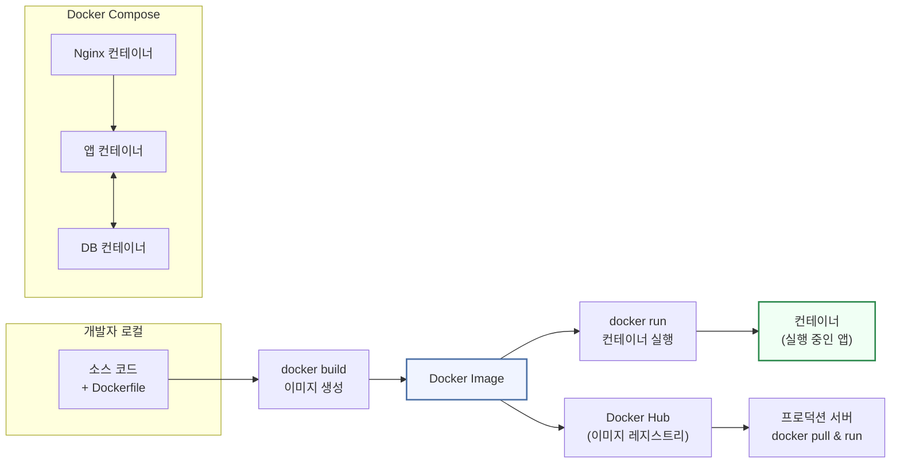
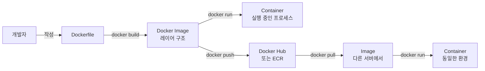
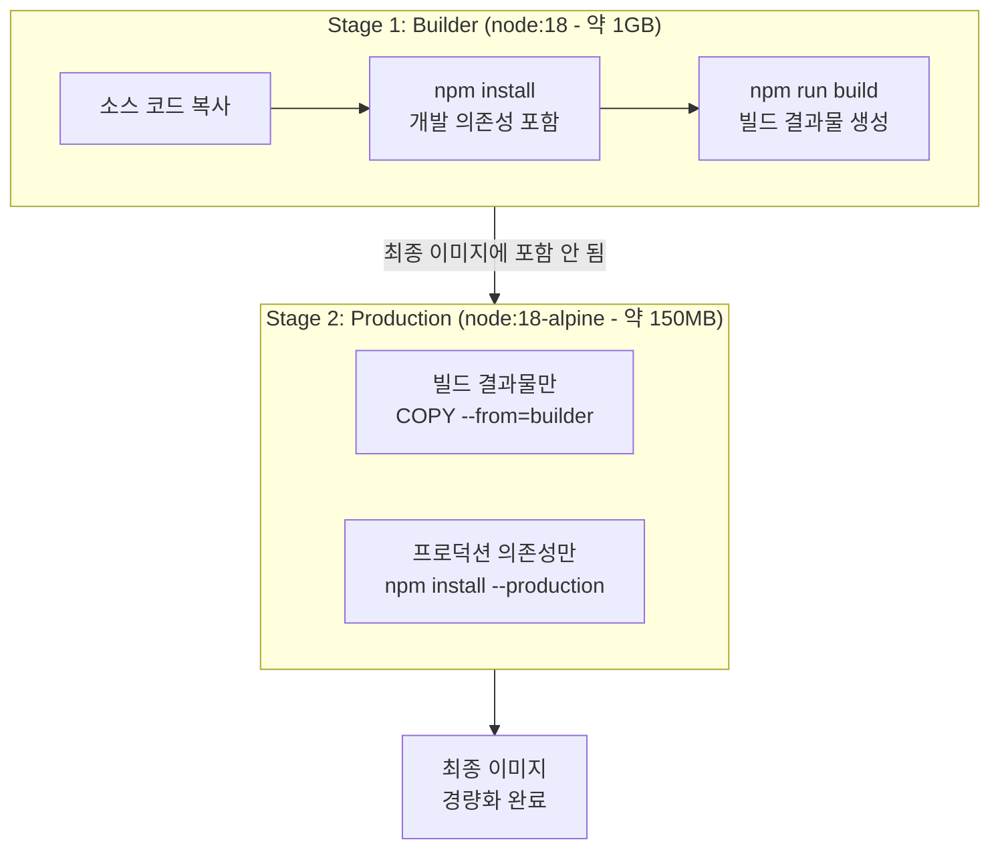
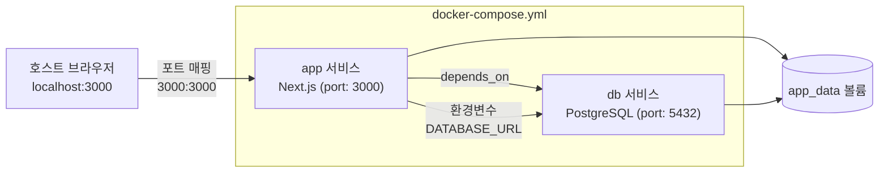

# 10회차: Docker로 실행환경 만들기

## 학습 목표

이번 회차를 마치면 다음을 수행할 수 있습니다.

- Docker(도커)의 개념과 필요성을 이해하고, 컨테이너와 가상머신의 차이를 설명할 수 있습니다.
- Dockerfile을 작성하고 이미지를 빌드할 수 있습니다.
- 멀티스테이지 빌드(Multi-stage Build)를 활용하여 경량화된 프로덕션 이미지를 만들 수 있습니다.
- Docker Compose(도커 컴포즈)로 여러 서비스를 정의하고 관리할 수 있습니다.

---

## 이번 세션 전체 그림



Docker는 앱을 "이미지"로 포장해 어디서든 동일하게 실행하는 기술입니다. 이미지를 빌드하고, 컨테이너로 실행하고, Docker Hub에 올려 서버에 배포하는 전체 흐름을 이 세션에서 배웁니다. Docker Compose로 여러 컨테이너를 한 번에 관리하는 것이 실무의 핵심입니다.

---

## 핵심 개념

### 1. 컨테이너(Container) vs 가상머신(VM)

> **왜 필요한가?** 팀에 5명이 있으면 5개의 서로 다른 개발 환경이 존재합니다. A는 Node.js 18, B는 Node.js 20, 운영 서버는 Node.js 16을 사용한다면 "나는 되는데 왜 안 되지?"가 반복됩니다. Docker 컨테이너는 앱과 실행 환경을 함께 패키징하여 "어디서 실행해도 동일한 환경"을 보장합니다.

> **진화 맥락 — 물리 서버 → VM → 컨테이너**: 초기에는 서버 한 대에 앱 하나를 올렸습니다. 자원 낭비를 줄이기 위해 하이퍼바이저로 OS를 가상화하는 VM(Virtual Machine)이 등장했습니다. VM은 무겁고(수 GB) 시작이 느렸습니다. 컨테이너는 OS 커널을 공유하므로 훨씬 가볍고(수 MB) 빠릅니다. VM이 "건물 전체를 임대"라면 컨테이너는 "방 하나를 공유"입니다.

> **흔한 오해**: "Docker를 사용하면 앱이 느려지지 않나요?"
> **실제로는**: 컨테이너는 OS 커널을 공유하므로 네이티브 실행에 가까운 성능을 냅니다. VM과 달리 별도 OS를 에뮬레이션하지 않습니다. 성능 손실은 거의 없습니다. VM과 혼동해서 생기는 오해입니다.

배포 환경 문제는 개발자가 가장 자주 마주치는 문제 중 하나입니다. "내 컴퓨터에서는 잘 되는데요?"라는 말을 들어보셨나요? 개발 환경, 테스트 환경, 운영 서버 환경이 조금씩 달라서 발생하는 문제입니다.

Docker는 이 문제를 해결합니다. 애플리케이션과 그 실행에 필요한 모든 것(라이브러리, 설정, 런타임)을 하나의 패키지로 묶어서 어디서든 동일하게 실행할 수 있게 합니다. 이 패키지를 **컨테이너(Container)**라고 부릅니다.

**비유: 이민 가방 vs 이삿짐 트럭**

가상머신(VM)은 이삿짐 트럭과 비슷합니다. 집 자체(운영체제 전체)를 통째로 이사하는 방식입니다. 용량이 크고(수 GB), 시작하는 데 시간이 걸립니다.

컨테이너는 정확히 필요한 짐만 챙긴 이민 가방과 같습니다. 운영체제를 통째로 포함하지 않고, 호스트(Host) 운영체제의 커널을 공유하며 애플리케이션 실행에 필요한 부분만 격리합니다. 덕분에 용량이 작고(수십 MB~수백 MB), 시작이 매우 빠릅니다(1초 내외).

| 비교 항목 | 가상머신 (VM) | 컨테이너 (Container) |
|-----------|---------------|----------------------|
| 격리 수준 | 하드웨어 수준 | 프로세스 수준 |
| 시작 시간 | 수십 초 ~ 수 분 | 1초 내외 |
| 이미지 크기 | 수 GB | 수십 ~ 수백 MB |
| OS 포함 여부 | 게스트 OS 포함 | 호스트 OS 커널 공유 |
| 리소스 오버헤드 | 높음 | 낮음 |

### 2. Docker 핵심 개념

> **왜 필요한가?** 이미지-컨테이너의 관계를 이해하면 Docker의 대부분을 이해한 것입니다. 이미지는 레시피(Recipe), 컨테이너는 레시피로 요리한 음식입니다. 하나의 이미지로 수십 개의 컨테이너를 만들 수 있고, 컨테이너를 삭제해도 이미지는 남아있어 다시 만들 수 있습니다.

> **📎 연결 포인트 → 7회차 (Database)**: `docker-compose.yml`에 PostgreSQL 컨테이너를 추가하면 로컬 개발 환경에서 실제 DB를 실행할 수 있습니다. `supabase/postgres` 이미지를 사용하면 Supabase 환경도 로컬에서 구성 가능합니다.

Docker를 이해하려면 네 가지 핵심 개념을 알아야 합니다.

**이미지(Image)**

이미지는 컨테이너를 만들기 위한 읽기 전용 템플릿입니다. 레이어(Layer) 구조로 이루어져 있어 변경된 부분만 저장합니다. 한번 빌드된 이미지는 변하지 않으므로, 어떤 환경에서 실행하든 동일한 결과를 보장합니다.

**컨테이너(Container)**

이미지를 실행한 상태입니다. 이미지가 클래스(Class)라면, 컨테이너는 인스턴스(Instance)입니다. 하나의 이미지로 여러 개의 컨테이너를 동시에 실행할 수 있습니다.

**레지스트리(Registry)**

이미지를 저장하고 공유하는 저장소입니다. Docker Hub는 공개 레지스트리로, Node.js, PostgreSQL, Nginx 등 수많은 공식 이미지를 제공합니다. 회사에서는 비공개 레지스트리(Amazon ECR, GitHub Container Registry 등)를 사용하기도 합니다.

**레이어(Layer)**

Docker 이미지는 여러 레이어로 구성됩니다. `Dockerfile`의 각 명령어(RUN, COPY 등)가 하나의 레이어를 생성합니다. 레이어는 캐시(Cache)되므로, 변경되지 않은 레이어는 빌드 시 재사용하여 빌드 속도를 크게 높일 수 있습니다.

### 3. Dockerfile 작성법

> **왜 필요한가?** "서버 세팅 방법을 Word 문서로 남겨봤자 사람마다 다르게 해석합니다." Dockerfile은 서버 환경 설정을 코드로 표현합니다. 신입 개발자가 왔을 때 `docker build` 한 줄로 동일한 환경을 구성할 수 있습니다. 인프라를 코드로 관리하는 "IaC(Infrastructure as Code)"의 시작입니다.

`Dockerfile`은 이미지를 빌드하기 위한 명령어 스크립트 파일입니다. 주요 명령어를 살펴봅니다.

| 명령어 | 역할 |
|--------|------|
| `FROM` | 베이스 이미지 지정 (시작점) |
| `WORKDIR` | 컨테이너 내 작업 디렉토리 설정 |
| `COPY` | 호스트 파일을 컨테이너로 복사 |
| `RUN` | 빌드 중 실행할 명령어 (레이어 생성) |
| `EXPOSE` | 컨테이너가 사용할 포트 명시 (문서화 목적) |
| `ENV` | 환경변수 설정 |
| `CMD` | 컨테이너 시작 시 실행할 기본 명령어 |
| `ENTRYPOINT` | CMD와 유사하지만, 덮어쓰기 불가 |

### 4. 멀티스테이지 빌드(Multi-stage Build)

일반적으로 빌드(Build) 환경과 실행(Production) 환경의 요구사항은 다릅니다. 빌드 환경에는 컴파일러, 개발 도구 등이 필요하지만, 실제 실행에는 필요 없습니다.

멀티스테이지 빌드는 하나의 Dockerfile 안에서 여러 단계(Stage)를 정의하여, 최종 이미지에는 실행에 필요한 파일만 포함시키는 기법입니다. 이를 통해 이미지 크기를 수백 MB에서 수십 MB로 줄일 수 있습니다.

### 5. .dockerignore 파일

`.gitignore`처럼 `.dockerignore` 파일은 Docker 빌드 컨텍스트에서 제외할 파일과 디렉토리를 지정합니다. `node_modules` 폴더, `.env` 파일, `.git` 폴더 등을 제외하면 빌드 속도가 빨라지고, 불필요하거나 민감한 파일이 이미지에 포함되는 것을 방지합니다.

### 6. Docker Compose

> **왜 필요한가?** 실제 서비스는 앱 하나로 끝나지 않습니다. Node.js 앱, PostgreSQL DB, Redis 캐시, Nginx 웹 서버가 함께 실행되어야 합니다. 이걸 각각 `docker run`으로 실행하면 포트 연결, 네트워크 설정, 환경변수 공유가 복잡해집니다. Docker Compose는 이 모든 설정을 하나의 YAML 파일로 정의합니다.

> **흔한 오해**: "Docker가 있으면 Kubernetes(k8s)는 필요 없다."
> **실제로는**: Docker는 단일 서버에서 컨테이너를 실행합니다. 수십 개의 서버에 수백 개의 컨테이너를 배포하고 관리하는 것은 Kubernetes의 영역입니다. 소규모 서비스는 Docker만으로 충분하지만, 규모가 커지면 k8s가 필요해집니다.

> **📎 연결 포인트 → 11회차 (AWS EC2)**: 이번에 만든 Docker 이미지를 11회차에서 EC2 서버에 배포합니다. `docker pull & docker run`으로 서버에서 앱을 실행하는 전체 흐름을 완성합니다.

> **📎 연결 포인트 → 12회차 (CI/CD)**: GitHub Actions에서 자동으로 Docker 이미지를 빌드하고 Docker Hub에 push한 뒤, 서버에 자동 배포하는 파이프라인을 12회차에서 구현합니다.

Docker Compose는 여러 컨테이너로 구성된 애플리케이션을 `docker-compose.yml` 파일 하나로 정의하고 관리하는 도구입니다. 웹 서버, 데이터베이스, 캐시 서버 등 여러 서비스를 한 번의 명령으로 실행하고 종료할 수 있습니다.

---

## 다이어그램

### D10-1: Docker 핵심 아키텍처



### D10-2: 멀티스테이지 빌드 프로세스



### D10-3: Docker Compose 서비스 구성



---

## 코드 예제

### C10-1: 기본 Node.js Dockerfile

```dockerfile
# Use official Node.js 18 LTS as the base image
FROM node:18-alpine

# Set the working directory inside the container
WORKDIR /app

# Copy package files first for better layer caching
COPY package*.json ./

# Install dependencies
RUN npm ci

# Copy the rest of the application source code
COPY . .

# Expose port 3000 to the outside world
EXPOSE 3000

# Command to run the application
CMD ["node", "server.js"]
```

### C10-2: Next.js 최적화 멀티스테이지 Dockerfile

```dockerfile
# ===== Stage 1: Builder =====
# Use full Node.js image for building (includes build tools)
FROM node:18-alpine AS builder

WORKDIR /app

# Install dependencies
COPY package*.json ./
RUN npm ci

# Copy source code and build
COPY . .

# Set production environment for Next.js build optimization
ENV NODE_ENV=production
RUN npm run build

# ===== Stage 2: Production Runner =====
# Use lightweight Alpine image for the final image
FROM node:18-alpine AS runner

WORKDIR /app

# Create a non-root user for security
RUN addgroup --system --gid 1001 nodejs
RUN adduser --system --uid 1001 nextjs

# Copy only the necessary build artifacts from the builder stage
COPY --from=builder /app/public ./public
COPY --from=builder --chown=nextjs:nodejs /app/.next/standalone ./
COPY --from=builder --chown=nextjs:nodejs /app/.next/static ./.next/static

# Switch to the non-root user
USER nextjs

# Expose port and define start command
EXPOSE 3000
ENV PORT 3000

# Start the Next.js standalone server
CMD ["node", "server.js"]
```

### C10-3: .dockerignore 파일

```text
# Node.js dependencies (will be installed inside the container)
node_modules
npm-debug.log*

# Next.js build output
.next
out

# Environment files (never include secrets in images)
.env
.env.local
.env.production

# Version control
.git
.gitignore

# Development tools
.eslintrc*
.prettierrc*
*.md

# OS files
.DS_Store
Thumbs.db

# IDE configuration
.vscode
.idea
```

### C10-4: docker-compose.yml (앱 + 데이터베이스)

```yaml
# Docker Compose configuration for local development
version: "3.9"

services:
  # Next.js application service
  app:
    build:
      context: .
      dockerfile: Dockerfile
    ports:
      - "3000:3000"
    environment:
      # Database connection URL pointing to the 'db' service
      DATABASE_URL: postgresql://postgres:password@db:5432/myapp
      NODE_ENV: development
    volumes:
      # Mount source code for live reloading in development
      - .:/app
      - /app/node_modules
    depends_on:
      db:
        condition: service_healthy
    restart: unless-stopped

  # PostgreSQL database service
  db:
    image: postgres:16-alpine
    ports:
      - "5432:5432"
    environment:
      POSTGRES_USER: postgres
      POSTGRES_PASSWORD: password
      POSTGRES_DB: myapp
    volumes:
      # Persist database data across container restarts
      - postgres_data:/var/lib/postgresql/data
    healthcheck:
      test: ["CMD-SHELL", "pg_isready -U postgres"]
      interval: 10s
      timeout: 5s
      retries: 5

  # Redis cache service (optional)
  redis:
    image: redis:7-alpine
    ports:
      - "6379:6379"
    volumes:
      - redis_data:/data

# Named volumes for data persistence
volumes:
  postgres_data:
  redis_data:
```

### C10-5: 기본 Docker 명령어

```bash
# --- 이미지 빌드 ---
# Build an image with the tag "myapp:latest" from the current directory
docker build -t myapp:latest .

# Build with a specific Dockerfile
docker build -t myapp:v1.0 -f Dockerfile.prod .

# --- 컨테이너 실행 ---
# Run in detached mode (-d), with port mapping (-p) and environment variable (-e)
docker run -d -p 3000:3000 -e NODE_ENV=production --name myapp-container myapp:latest

# Run interactively with a shell (useful for debugging)
docker run -it --rm myapp:latest sh

# --- 실행 중인 컨테이너 확인 ---
docker ps

# --- 로그 확인 ---
# Follow logs in real time
docker logs -f myapp-container

# --- 컨테이너 중지 및 삭제 ---
docker stop myapp-container
docker rm myapp-container

# --- 이미지 목록 및 삭제 ---
docker images
docker rmi myapp:latest

# --- 사용하지 않는 리소스 정리 ---
docker system prune -a
```

### C10-6: Docker Compose 명령어 및 포트/볼륨 설정

```bash
# --- Docker Compose 시작 ---
# Start all services in detached mode
docker compose up -d

# Start and rebuild images
docker compose up -d --build

# --- 특정 서비스만 실행 ---
docker compose up -d db

# --- 로그 확인 ---
docker compose logs -f app

# --- 서비스 중지 (데이터 보존) ---
docker compose stop

# --- 서비스 삭제 (볼륨도 삭제하려면 -v 추가) ---
docker compose down
docker compose down -v

# --- 실행 중인 컨테이너에서 명령 실행 ---
# Access the database with psql
docker compose exec db psql -U postgres -d myapp

# Access the app container shell
docker compose exec app sh

# --- 포트 매핑 예제 (docker run) ---
# Map host port 8080 to container port 3000
docker run -p 8080:3000 myapp:latest

# --- 볼륨 마운트 예제 (docker run) ---
# Mount current directory to /app (for live code reload)
docker run -v $(pwd):/app -p 3000:3000 myapp:latest

# Mount a named volume
docker run -v myapp_data:/app/data myapp:latest
```

---

## 실습

### 기본 실습: Next.js 앱을 Docker로 실행하기

다음 단계를 따라 기존 Next.js 프로젝트를 Docker 컨테이너로 실행해 봅니다.

**1단계: next.config.mjs에 standalone 출력 설정 추가**

```javascript
/** @type {import('next').NextConfig} */
const nextConfig = {
  // Enable standalone output for optimized Docker deployment
  output: "standalone",
};

export default nextConfig;
```

**2단계: Dockerfile 생성**

프로젝트 루트에 위의 C10-2 멀티스테이지 Dockerfile을 생성합니다.

**3단계: .dockerignore 생성**

프로젝트 루트에 위의 C10-3 내용으로 `.dockerignore` 파일을 생성합니다.

**4단계: 이미지 빌드 및 실행**

```bash
# Build the Docker image
docker build -t my-nextjs-app .

# Run the container
docker run -d -p 3000:3000 --name nextjs-container my-nextjs-app

# Check if it's running
docker ps

# View logs
docker logs nextjs-container
```

**5단계: 브라우저에서 `http://localhost:3000` 접속하여 확인합니다.**

**확인 질문:** `docker images` 명령어로 빌드된 이미지 크기를 확인해 보세요. 멀티스테이지 빌드를 적용했을 때와 적용하지 않았을 때 크기 차이가 있나요?

---

### 도전 실습: Docker Compose로 앱 + 데이터베이스 연결

**1단계: docker-compose.yml 생성**

위의 C10-4 파일을 프로젝트 루트에 생성합니다.

**2단계: 환경변수 파일 생성**

```bash
# Create .env file for docker compose
echo "DATABASE_URL=postgresql://postgres:password@db:5432/myapp" > .env.docker
```

**3단계: 실행 및 확인**

```bash
# Start all services
docker compose up -d

# Check all services are running
docker compose ps

# Check app logs
docker compose logs app

# Check database logs
docker compose logs db
```

**4단계: 데이터베이스 연결 확인**

```bash
# Connect to the database from within the app container
docker compose exec db psql -U postgres -d myapp -c "\l"
```

---

## 요약

이번 회차에서는 Docker를 사용하여 일관된 실행환경을 만드는 방법을 학습했습니다.

**핵심 키워드 정리:**

- **Docker**: 컨테이너 기반 가상화 플랫폼
- **Image (이미지)**: 컨테이너 실행을 위한 읽기 전용 템플릿 (레이어 구조)
- **Container (컨테이너)**: 이미지를 실행한 격리된 프로세스
- **Registry (레지스트리)**: 이미지 저장소 (예: Docker Hub, Amazon ECR)
- **Dockerfile**: 이미지 빌드 명령어 스크립트
- **Multi-stage Build (멀티스테이지 빌드)**: 빌드 환경과 실행 환경을 분리하여 이미지 경량화
- **.dockerignore**: 빌드 컨텍스트에서 제외할 파일 목록
- **Docker Compose**: 다중 컨테이너 서비스 정의 및 관리 도구
- **Volume (볼륨)**: 컨테이너 데이터 영속화를 위한 스토리지

**11회차 미리보기:**

다음 회차에서는 실제 클라우드 서버에 애플리케이션을 배포합니다. AWS EC2 인스턴스를 생성하고, SSH로 서버에 접속하여 Nginx 리버스 프록시를 설정하고, Let's Encrypt로 HTTPS를 적용하는 전체 배포 과정을 실습합니다.

---

## 강사 자료

이 세션 내용을 더 깊이 이해하고 싶다면 아래 자료를 참고하세요.

- [Node.js 핵심](/appendix/deep-dive/nodejs-core): Docker 컨테이너 안에서 Node.js를 최적화하는 핵심 개념입니다
