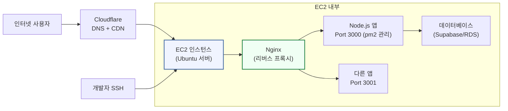
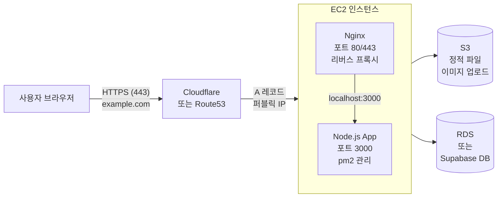
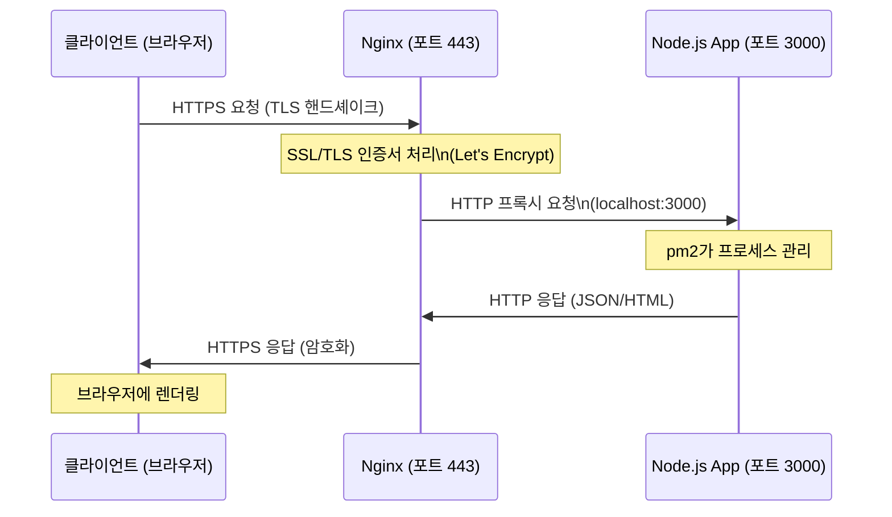
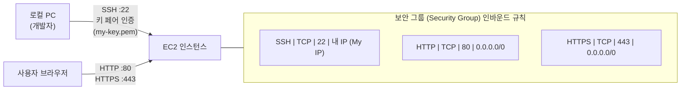

# 11회차: AWS EC2 배포 올코스 + SSH/Nginx

## 학습 목표

이번 회차를 마치면 다음을 수행할 수 있습니다.

- AWS EC2(Amazon Elastic Compute Cloud) 인스턴스를 생성하고 보안 그룹을 설정할 수 있습니다.
- SSH(Secure Shell)로 서버에 접속하고, 기본 리눅스 명령어를 사용할 수 있습니다.
- Nginx(엔진엑스)를 설치하고 리버스 프록시(Reverse Proxy)를 설정할 수 있습니다.
- Let's Encrypt와 Certbot으로 무료 HTTPS를 적용할 수 있습니다.
- pm2로 Node.js 프로세스를 관리하고 무중단 실행을 구성할 수 있습니다.

---

## 이번 세션 전체 그림



AWS EC2는 클라우드 가상 서버입니다. 사용자의 요청은 Cloudflare DNS를 거쳐 EC2에 도달하고, Nginx가 요청을 받아 Node.js 앱으로 전달합니다. pm2는 Node.js 프로세스가 항상 실행되도록 관리합니다. 개발자는 SSH로 서버에 접속해 관리합니다.

---

## 핵심 개념

### 1. AWS EC2 소개

> **왜 필요한가?** 로컬 컴퓨터를 서버로 사용하면 컴퓨터를 끄면 서비스도 중단됩니다. 24시간 켜두려면 전기세, 인터넷 비용, 물리적 보안이 필요합니다. EC2는 AWS 데이터센터의 서버를 시간 단위로 빌려 사용하는 서비스입니다. 필요할 때 켜고 끌 수 있으며, 트래픽에 따라 크기를 조절할 수 있습니다.

> **진화 맥락 — 물리 서버 → IaaS → PaaS**: 초기에는 물리 서버를 직접 구매하거나 IDC(인터넷 데이터 센터)에 임대했습니다. AWS EC2 같은 IaaS(Infrastructure as a Service)는 서버를 가상화하여 필요할 때 즉시 생성하고 사용량만 지불합니다. Vercel, Railway 같은 PaaS(Platform as a Service)는 서버 설정도 추상화하여 코드 배포만 신경 쓰면 됩니다. 자유도는 IaaS가 높고, 편의성은 PaaS가 높습니다.

AWS EC2(Amazon Elastic Compute Cloud)는 클라우드에서 가상 서버(인스턴스)를 빌려 사용하는 서비스입니다. 물리 서버를 직접 구매하는 대신, 몇 분 만에 서버를 생성하고 사용한 만큼만 비용을 지불할 수 있습니다.

**주요 용어:**

| 용어 | 설명 |
|------|------|
| 인스턴스(Instance) | 클라우드에서 실행되는 가상 서버 하나 |
| AMI (Amazon Machine Image) | 인스턴스 생성의 기반이 되는 OS 템플릿 |
| 인스턴스 타입(Instance Type) | CPU, 메모리, 네트워크 성능의 조합 (예: t2.micro) |
| 프리 티어(Free Tier) | 신규 계정에서 12개월간 t2.micro를 월 750시간 무료 사용 가능 |
| 리전(Region) | 데이터센터의 지리적 위치 (예: ap-northeast-2는 서울) |
| 가용 영역(AZ) | 리전 내의 독립된 데이터센터 (고가용성을 위해 여러 AZ 사용) |
| 탄력적 IP(Elastic IP) | 인스턴스에 고정 공인 IP를 할당하는 기능 |

**실습에서 사용할 권장 사양:**

- AMI: Ubuntu 22.04 LTS (Jammy Jellyfish)
- 인스턴스 타입: t2.micro (프리 티어 적용 가능)
- 스토리지: 20GB gp3

### 2. 키 페어(Key Pair)와 보안 그룹(Security Group)

**키 페어(Key Pair)**

> **왜 필요한가?** 서버를 인터넷에 연결하는 순간 전 세계의 자동화된 봇이 접속을 시도합니다. 포트 22(SSH)를 모든 IP에 열어두면 초당 수백 번의 무차별 대입 공격(Brute Force)을 받습니다. 키 페어는 비밀번호보다 훨씬 복잡한 암호키를 사용해 이런 공격을 사실상 불가능하게 만듭니다.

SSH로 서버에 접속하려면 키 페어가 필요합니다. 공개 키(Public Key)는 EC2 서버에 저장되고, 개인 키(Private Key)는 `.pem` 파일로 로컬에 보관합니다. 개인 키 파일은 절대 외부에 공유하거나 Git에 커밋하면 안 됩니다.

**보안 그룹(Security Group)**

보안 그룹은 EC2 인스턴스에 대한 방화벽 역할을 합니다. 인바운드(Inbound, 들어오는 트래픽)와 아웃바운드(Outbound, 나가는 트래픽) 규칙을 설정합니다.

초기 설정에 필요한 인바운드 규칙:

| 유형 | 포트 | 소스 | 목적 |
|------|------|------|------|
| SSH | 22 | 내 IP (My IP) | 서버 관리 접속 |
| HTTP | 80 | 0.0.0.0/0 | 웹 서비스 |
| HTTPS | 443 | 0.0.0.0/0 | 보안 웹 서비스 |

SSH(포트 22)는 반드시 "내 IP"로만 제한하는 것이 보안상 중요합니다. 전체 공개(`0.0.0.0/0`)로 설정하면 브루트포스 공격에 취약해집니다.

### 3. SSH 접속과 기본 리눅스 명령어

> **왜 필요한가?** 클라우드 서버는 모니터와 키보드가 없습니다. 원격에서 서버를 제어하는 표준 방법이 SSH(Secure Shell)입니다. SSH 없이는 서버에서 아무것도 할 수 없습니다. 파일 복사, 앱 실행, 로그 확인 모두 SSH 터미널에서 이루어집니다.

SSH(Secure Shell)는 암호화된 연결을 통해 원격 서버에 접속하는 프로토콜입니다. 키 페어 인증 방식을 사용하므로, 비밀번호 없이 개인 키 파일만으로 안전하게 접속합니다.

접속 후 자주 사용하는 기본 리눅스 명령어:

| 명령어 | 설명 |
|--------|------|
| `pwd` | 현재 위치(디렉토리) 확인 |
| `ls -la` | 파일 목록 상세 확인 (숨김 파일 포함) |
| `cd /path` | 디렉토리 이동 |
| `mkdir dirname` | 디렉토리 생성 |
| `sudo apt update` | 패키지 목록 업데이트 |
| `sudo apt install pkg` | 패키지 설치 |
| `systemctl status nginx` | 서비스 상태 확인 |
| `tail -f /var/log/nginx/error.log` | 로그 실시간 확인 |
| `chmod 600 file` | 파일 권한 변경 |
| `df -h` | 디스크 사용량 확인 |
| `free -h` | 메모리 사용량 확인 |
| `top` | 실시간 프로세스 모니터링 |

### 4. 애플리케이션 배포 과정

EC2에 Node.js 앱을 배포하는 기본 과정은 다음과 같습니다.

1. EC2에 Node.js 런타임 설치 (nvm 사용 권장)
2. Git으로 소스 코드를 서버에 클론(clone)
3. `npm install`로 의존성 설치
4. 환경변수(`.env`) 파일 설정
5. `npm run build`로 프로덕션 빌드
6. pm2로 앱 실행 및 프로세스 관리

### 5. pm2: 프로세스 관리자

> **왜 필요한가?** 서버가 재시작되면(전력 차단, 업데이트 등) Node.js 프로세스도 종료됩니다. pm2는 프로세스 관리자로, 앱이 예기치 않게 종료되면 자동으로 재시작하고, 서버 재부팅 후에도 자동으로 앱을 실행합니다. 프로덕션 환경에서 필수입니다.

pm2는 Node.js 애플리케이션을 위한 프로세스 관리자입니다. 다음 기능을 제공합니다.

- **무중단 실행**: 앱이 충돌하면 자동으로 재시작합니다.
- **부팅 시 자동 시작**: 서버 재부팅 후에도 앱이 자동으로 실행됩니다.
- **클러스터 모드**: CPU 코어 수만큼 프로세스를 생성하여 성능을 향상시킵니다.
- **로그 관리**: 앱의 stdout/stderr 로그를 파일로 저장합니다.

pm2는 `npm install -g pm2`로 전역 설치합니다.

### 6. Nginx: 웹 서버와 리버스 프록시

> **왜 필요한가?** Node.js 앱은 80번 포트(HTTP 기본 포트)를 직접 사용하기 어렵습니다(root 권한 필요). 또한 하나의 서버에서 여러 도메인/앱을 실행하려면 요청을 분기하는 역할이 필요합니다. Nginx가 80/443 포트에서 요청을 받아 내부 Node.js 앱(예: 포트 3000)으로 전달하는 리버스 프록시 역할을 합니다.

> **흔한 오해**: "Nginx가 웹 서버라면 Node.js 앱 대신 Nginx가 응답하는 건가요?"
> **실제로는**: Nginx는 클라이언트의 요청을 받아 내부 Node.js 앱으로 전달하고, 앱의 응답을 클라이언트에게 돌려줍니다. "교통 정리"를 담당합니다. 정적 파일(이미지, CSS)은 Nginx가 직접 처리하여 Node.js 부담을 줄이기도 합니다.

Nginx(엔진엑스)는 고성능 웹 서버이자 리버스 프록시입니다. EC2 배포에서 Nginx의 역할은 다음과 같습니다.

- **리버스 프록시(Reverse Proxy)**: 외부 요청(80, 443 포트)을 내부 앱 서버(예: 3000 포트)로 전달합니다.
- **SSL 종료(SSL Termination)**: HTTPS 요청을 처리하고 내부에는 HTTP로 전달하여, 앱 서버가 SSL을 직접 처리하지 않아도 됩니다.
- **정적 파일 서빙**: HTML, CSS, 이미지 같은 정적 파일을 직접 빠르게 서빙합니다.
- **부하 분산(Load Balancing)**: 여러 백엔드 서버로 요청을 분산할 수 있습니다.

### 7. Let's Encrypt와 HTTPS 적용

> **흔한 오해**: "EC2 인스턴스를 재시작하면 IP가 바뀐다는 게 무슨 의미인가요?"
> **실제로는**: EC2 인스턴스를 중지(stop)했다가 시작(start)하면 공인 IP 주소가 변경됩니다. 도메인을 이 IP에 연결해두었다면 도메인도 깨집니다. Elastic IP를 할당하면 인스턴스를 재시작해도 IP가 유지됩니다. Elastic IP는 할당만 하고 사용하지 않으면 요금이 부과되니 주의하세요.

> **📎 연결 포인트 → 10회차 (Docker)**: Docker를 EC2에 설치하면 컨테이너로 앱을 배포할 수 있습니다. Dockerfile로 환경을 정의하면 "이 EC2에만 되는 설정" 문제가 사라집니다.

> **📎 연결 포인트 → 12회차 (CI/CD)**: GitHub Actions에서 SSH로 EC2에 접속해 새 코드를 자동 배포하는 파이프라인을 12회차에서 구성합니다. 지금 설정하는 EC2가 CI/CD의 배포 대상이 됩니다.

> **📎 연결 포인트 → 1회차 (.env)**: EC2 서버의 환경변수는 .env 파일이나 `export` 명령으로 설정합니다. 1회차에서 익힌 환경변수 개념을 서버에서 그대로 적용합니다.

Let's Encrypt는 무료 SSL/TLS 인증서를 발급하는 인증 기관(CA)입니다. Certbot 도구를 사용하면 인증서 발급부터 Nginx 설정 자동화, 자동 갱신까지 처리해 줍니다. 인증서 유효 기간은 90일이며, Certbot이 만료 전에 자동 갱신합니다.

**주의:** Let's Encrypt 인증서 발급에는 실제 도메인 이름이 필요합니다. 도메인이 없는 경우에는 EC2의 퍼블릭 IP 주소로 HTTP 접속하여 동작을 확인합니다.

### 8. S3 정적 파일 호스팅

AWS S3(Simple Storage Service)는 이미지, CSS, JavaScript 등 정적 파일을 저장하고 서빙하기 위한 객체 스토리지 서비스입니다. Next.js 앱의 `public` 폴더나 사용자 업로드 파일을 S3에 저장하면 EC2 서버의 부담을 줄이고, CloudFront CDN과 연동하여 전 세계에 빠르게 배포할 수 있습니다.

### 9. IAM 권한 최소화 원칙

IAM(Identity and Access Management)은 AWS 서비스에 대한 접근 권한을 관리합니다. 최소 권한 원칙(Principle of Least Privilege)에 따라, 각 사용자 또는 서비스에는 작업 수행에 필요한 최소한의 권한만 부여해야 합니다. 예를 들어, 앱 서버가 S3에 파일을 업로드해야 한다면, S3의 특정 버킷에 대한 쓰기 권한만 가진 IAM 역할(Role)을 EC2에 부여합니다.

### 10. 기본 보안 체크리스트

서버를 외부에 공개하기 전, 다음 보안 사항을 점검합니다.

- SSH 포트 22는 허용 IP를 제한합니다.
- 루트(root) 사용자 직접 로그인을 비활성화합니다.
- 불필요한 서비스와 포트를 비활성화합니다.
- `sudo apt upgrade`로 OS 패키지를 최신 상태로 유지합니다.
- 방화벽(UFW)을 활성화하고 필요한 포트만 허용합니다.
- 환경변수(`.env`)를 소스 코드 저장소에 절대 커밋하지 않습니다.

---

## 다이어그램

### D11-1: AWS EC2 배포 아키텍처



### D11-2: Nginx 리버스 프록시 요청 흐름



### D11-3: SSH 접속 및 보안 그룹 구조



---

## 코드 예제

### C11-1: SSH 접속 및 기본 서버 설정

```bash
# --- Step 1: 개인 키 파일 권한 설정 (반드시 필요) ---
# SSH requires the private key file to have strict permissions
chmod 400 my-ec2-key.pem

# --- Step 2: EC2에 SSH 접속 ---
# Replace <EC2_PUBLIC_IP> with your instance's public IP address
ssh -i my-ec2-key.pem ubuntu@<EC2_PUBLIC_IP>

# --- Step 3: 서버 초기 설정 (접속 후 실행) ---

# Update the package list and upgrade existing packages
sudo apt update && sudo apt upgrade -y

# Install essential tools
sudo apt install -y git curl wget build-essential

# Install nvm (Node Version Manager) for managing Node.js versions
curl -o- https://raw.githubusercontent.com/nvm-sh/nvm/v0.39.7/install.sh | bash

# Reload shell configuration to activate nvm
source ~/.bashrc

# Install Node.js LTS
nvm install --lts
nvm use --lts

# Verify installation
node --version
npm --version

# Install pm2 globally for process management
npm install -g pm2

# --- Step 4: 앱 배포 ---

# Clone the repository
git clone https://github.com/your-username/your-app.git /home/ubuntu/app

cd /home/ubuntu/app

# Install dependencies
npm ci

# Create environment variable file
nano .env
# (Add DATABASE_URL, SECRET_KEY, etc.)

# Build the application
npm run build

# Start the app with pm2
pm2 start ecosystem.config.js

# Save pm2 process list (survives reboot)
pm2 save

# Configure pm2 to start on system boot
pm2 startup
# (Follow the instructions from the output of the above command)
```

### C11-2: Nginx 설정 파일 (리버스 프록시)

```nginx
# /etc/nginx/sites-available/myapp
# This configuration proxies all requests to the Node.js app on port 3000

server {
    # Listen on port 80 (HTTP)
    listen 80;
    listen [::]:80;

    # Replace with your domain name or EC2 public IP
    server_name example.com www.example.com;

    # Redirect HTTP to HTTPS (uncomment after SSL setup)
    # return 301 https://$host$request_uri;

    # Access and error log configuration
    access_log /var/log/nginx/myapp.access.log;
    error_log /var/log/nginx/myapp.error.log;

    location / {
        # Forward requests to the Node.js application
        proxy_pass http://localhost:3000;

        # Pass important headers to the backend
        proxy_http_version 1.1;
        proxy_set_header Upgrade $http_upgrade;
        proxy_set_header Connection 'upgrade';
        proxy_set_header Host $host;
        proxy_set_header X-Real-IP $remote_addr;
        proxy_set_header X-Forwarded-For $proxy_add_x_forwarded_for;
        proxy_set_header X-Forwarded-Proto $scheme;

        # Cache bypass for WebSocket support
        proxy_cache_bypass $http_upgrade;

        # Timeout settings
        proxy_connect_timeout 60s;
        proxy_send_timeout 60s;
        proxy_read_timeout 60s;
    }

    # Serve static files directly with Nginx for better performance
    location /_next/static/ {
        alias /home/ubuntu/app/.next/static/;
        expires 1y;
        add_header Cache-Control "public, immutable";
    }
}

# HTTPS server block (added by Certbot automatically)
# server {
#     listen 443 ssl;
#     server_name example.com;
#     ssl_certificate /etc/letsencrypt/live/example.com/fullchain.pem;
#     ssl_certificate_key /etc/letsencrypt/live/example.com/privkey.pem;
#     include /etc/letsencrypt/options-ssl-nginx.conf;
#     ...
# }
```

### C11-3: pm2 ecosystem.config.js

```javascript
// pm2 ecosystem configuration file
// Run with: pm2 start ecosystem.config.js
module.exports = {
  apps: [
    {
      name: "myapp",
      // Entry point for Next.js standalone output
      script: "./.next/standalone/server.js",

      // Number of instances (use 'max' to use all CPU cores)
      instances: 1,

      // Restart the app if memory usage exceeds 500MB
      max_memory_restart: "500M",

      // Environment variables for production
      env_production: {
        NODE_ENV: "production",
        PORT: 3000,
      },

      // Environment variables for development
      env_development: {
        NODE_ENV: "development",
        PORT: 3000,
      },

      // Log file configuration
      out_file: "/home/ubuntu/logs/myapp-out.log",
      error_file: "/home/ubuntu/logs/myapp-error.log",
      log_date_format: "YYYY-MM-DD HH:mm:ss",

      // Restart policy
      autorestart: true,
      watch: false,
      restart_delay: 1000,
    },
  ],
};
```

### C11-4: Let's Encrypt Certbot로 HTTPS 적용

```bash
# --- Certbot 설치 ---
# Install Certbot and the Nginx plugin
sudo apt install -y certbot python3-certbot-nginx

# --- SSL 인증서 발급 ---
# Replace example.com with your actual domain name
# Certbot automatically modifies the Nginx config to enable HTTPS
sudo certbot --nginx -d example.com -d www.example.com

# During the process, enter your email address and agree to terms of service
# Certbot will ask if you want to redirect HTTP to HTTPS - select option 2 (Redirect)

# --- 인증서 발급 확인 ---
sudo certbot certificates

# --- 자동 갱신 테스트 ---
# Test the renewal process (does not actually renew)
sudo certbot renew --dry-run

# --- 자동 갱신 확인 ---
# Certbot installs a systemd timer or cron job for auto-renewal
# Check the timer status
sudo systemctl status certbot.timer

# --- Nginx 설정 테스트 및 재시작 ---
# Test the Nginx configuration for syntax errors
sudo nginx -t

# Reload Nginx to apply configuration changes
sudo systemctl reload nginx
```

### C11-5: EC2 초기 설정 명령어 모음

```bash
# --- Nginx 설치 및 설정 ---
# Install Nginx
sudo apt install -y nginx

# Enable and start Nginx service
sudo systemctl enable nginx
sudo systemctl start nginx
sudo systemctl status nginx

# Create a new Nginx site configuration
sudo nano /etc/nginx/sites-available/myapp

# Enable the site by creating a symbolic link
sudo ln -s /etc/nginx/sites-available/myapp /etc/nginx/sites-enabled/

# Remove the default site to avoid conflicts
sudo rm /etc/nginx/sites-enabled/default

# Test and reload Nginx
sudo nginx -t && sudo systemctl reload nginx

# --- UFW 방화벽 설정 ---
# Allow SSH connections (important: do this before enabling UFW)
sudo ufw allow ssh

# Allow HTTP and HTTPS traffic
sudo ufw allow 'Nginx Full'

# Enable the firewall
sudo ufw enable

# Check firewall status
sudo ufw status

# --- pm2 일반 명령어 ---
# List all running processes
pm2 list

# View logs for a specific app
pm2 logs myapp

# Restart an app
pm2 restart myapp

# Reload with zero downtime
pm2 reload myapp

# Stop an app
pm2 stop myapp

# Monitor all processes in real time
pm2 monit
```

### C11-6: 보안 그룹 인바운드 규칙 설정

```text
AWS EC2 보안 그룹 인바운드 규칙 설정 가이드
============================================

EC2 콘솔 > 보안 그룹 > 인바운드 규칙 편집에서 설정합니다.

필수 인바운드 규칙:

| 규칙 유형 | 프로토콜 | 포트 범위 | 소스          | 설명           |
|-----------|----------|-----------|---------------|----------------|
| SSH       | TCP      | 22        | 내 IP (My IP) | 서버 관리 접속 |
| HTTP      | TCP      | 80        | 0.0.0.0/0     | 웹 서비스      |
| HTTPS     | TCP      | 443       | 0.0.0.0/0     | 보안 웹 서비스 |

선택 인바운드 규칙 (개발 및 디버깅용, 운영 환경에서는 제거 권장):

| 규칙 유형    | 프로토콜 | 포트 범위 | 소스          | 설명               |
|--------------|----------|-----------|---------------|--------------------|
| 사용자 지정  | TCP      | 3000      | 내 IP (My IP) | Node.js 직접 접속  |
| PostgreSQL   | TCP      | 5432      | 내 IP (My IP) | DB 직접 접속       |

아웃바운드 규칙:
- 기본값: 모든 트래픽 허용 (0.0.0.0/0)
- 서버에서 외부 API, npm 패키지 다운로드 등에 필요

보안 주의 사항:
- SSH(22) 소스는 절대 0.0.0.0/0(전체 공개)으로 설정하지 마세요.
- 개인 IP가 변경되면 보안 그룹 규칙을 업데이트해야 합니다.
- 프로덕션에서는 필요한 최소한의 포트만 열어두세요.
```

---

## 실습

### 기본 실습: EC2에 Node.js 앱 배포하기

**Step 1: EC2 인스턴스 생성**

1. AWS 콘솔(console.aws.amazon.com)에 로그인합니다.
2. EC2 서비스로 이동 > "인스턴스 시작"을 클릭합니다.
3. AMI: Ubuntu Server 22.04 LTS (프리 티어 적격) 선택합니다.
4. 인스턴스 타입: t2.micro 선택합니다.
5. 키 페어: 새 키 페어 생성 > 이름 입력 > `.pem` 파일 다운로드합니다.
6. 네트워크 설정: 보안 그룹에서 SSH(22), HTTP(80), HTTPS(443) 허용합니다.
7. 스토리지: 20GB 유지합니다.
8. "인스턴스 시작" 클릭합니다.

**Step 2: SSH 접속**

```bash
# Set private key permissions
chmod 400 my-ec2-key.pem

# Connect to the EC2 instance (use the Public IPv4 DNS from EC2 console)
ssh -i my-ec2-key.pem ubuntu@<EC2_PUBLIC_IP>
```

**Step 3: 서버 초기 설정 및 앱 실행**

위의 C11-1 명령어를 순서대로 실행하여 Node.js를 설치하고, 앱을 배포하고, pm2로 실행합니다.

**Step 4: Nginx 설치 및 리버스 프록시 설정**

위의 C11-2 Nginx 설정 파일을 생성하고 적용합니다. 브라우저에서 `http://<EC2_PUBLIC_IP>`로 접속하여 앱이 실행되는지 확인합니다.

**도메인이 없는 경우:** EC2 인스턴스의 "퍼블릭 IPv4 주소" 또는 "퍼블릭 IPv4 DNS"로 직접 HTTP 접속하여 동작을 확인할 수 있습니다. Nginx가 올바르게 설정되었다면 포트 80으로 앱에 접속됩니다.

---

### 도전 실습: Nginx 리버스 프록시 + HTTPS 적용

실제 도메인을 보유한 경우, 위의 C11-4 Certbot 명령어를 실행하여 무료 SSL 인증서를 발급받고 HTTPS를 적용합니다.

```bash
# Obtain SSL certificate
sudo certbot --nginx -d your-domain.com -d www.your-domain.com

# Verify HTTPS is working
curl -I https://your-domain.com
```

브라우저에서 `https://your-domain.com`으로 접속하여 자물쇠 아이콘이 표시되는지 확인합니다.

---

## 요약

이번 회차에서는 AWS EC2를 사용하여 실제 클라우드 서버에 Node.js 애플리케이션을 배포하는 전체 과정을 학습했습니다.

**핵심 키워드 정리:**

- **AWS EC2**: 클라우드 가상 서버 서비스 (t2.micro 프리 티어 활용)
- **AMI**: EC2 인스턴스의 OS 템플릿
- **Key Pair (키 페어)**: SSH 접속을 위한 공개키/개인키 쌍 (`.pem` 파일)
- **Security Group (보안 그룹)**: EC2의 방화벽 규칙 (인바운드/아웃바운드)
- **SSH**: 암호화된 원격 서버 접속 프로토콜
- **pm2**: Node.js 프로세스 관리자 (자동 재시작, 부팅 시 실행)
- **Nginx**: 웹 서버 + 리버스 프록시 (외부 요청을 앱 서버로 전달)
- **Reverse Proxy (리버스 프록시)**: 클라이언트 요청을 내부 서버로 전달하는 중간 서버
- **Let's Encrypt**: 무료 SSL/TLS 인증서 발급 기관
- **Certbot**: Let's Encrypt 인증서 발급 및 자동 갱신 도구
- **HTTPS / SSL/TLS**: 웹 통신 암호화 프로토콜
- **S3**: AWS 객체 스토리지 (정적 파일 호스팅)
- **IAM**: AWS 권한 관리 (최소 권한 원칙)
- **UFW**: Ubuntu 방화벽 관리 도구

**12회차 미리보기:**

다음 회차에서는 배포 과정을 완전히 자동화합니다. GitHub Actions를 사용하여 코드를 main 브랜치에 push하면 자동으로 빌드, 테스트, 배포까지 이루어지는 CI/CD 파이프라인을 구축합니다. 또한 Cloudflare를 통한 DNS 설정과 SSL/TLS 구성 방법을 학습합니다.
